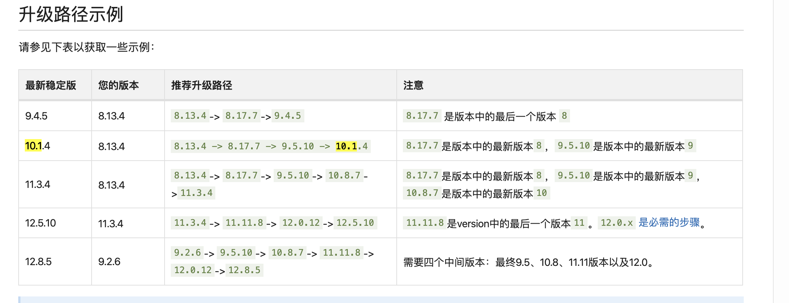

# Gitlab 升级

需要处理 Gitlab 升级的工作。

前同事的部署文档：http://asset.bbdops.com/software/info/e1d4c131-1a30-442c-a15f-c6c84100d79a （仅内网）

目前的版本是 `10.1.2` ，最新版本是 `12.8.5`

官方升级文档：https://docs.gitlab.com/ee/policy/maintenance.html#upgrade-recommendations


## 查看版本号

```bash
$ cat /opt/gitlab/embedded/service/gitlab-rails/VERSION
10.1.2
```


## 升级版本策略

根据官方升级文档：



决定升级路线是 ： `10.1.2`  ->  `10.8.7`  -> `11.11.8` ->  `12.0.12`  -> `12.8.5` 。共四次升级。


## 升级思路及准备

现在生产环境旁边建一相同版本的测试环境，将数据迁移到测试环境，然后在测试环境进行升级，测试环境升级完成后再进行生产环境的升级。

升级过程中，需要关闭服务，需要提前发邮件约定好。

需要准备好安装包，可以在 https://mirrors.tuna.tsinghua.edu.cn/gitlab-ce/yum/el7/ 查找特定版本号的 rpm 包。也可以配置好源，然后用 yum 安装指定版本。

万一生产环境升级失败，服务启动失败，可以直接改 DNS 将测试环境变为生产环境。


## 升级到 10.8.7

先关闭服务：

```bash
$ sudo gitlab-ctl stop unicorn
$ sudo gitlab-ctl stop sidekiq
$ sudo gitlab-ctl stop nginx
```

创建数据备份：

````bash
$ sudo gitlab-rake gitlab:backup:create
````

安装 10.8.7 版本：

```bash
$ sudo yum install gitlab-ce-10.8.7-ce.0.el7.x86_64
```

重新建立配置：

```bash
$ sudo gitlab-ctl reconfigure
```

重启：

```bash
$ sudo gitlab-ctl restart
```

查看状态：

```bash
$ sudo gitlab-ctl status
```

查看版本号：

```bash
$ cat /opt/gitlab/embedded/service/gitlab-rails/VERSION
10.8.7
```

网页也能打开并登录，万事大吉。


## 升级到 11.11.8

步骤和上述一致，安装版本换成 11.11.8：

```bash
$ sudo yum install gitlab-ce-11.11.8-ce.0.el7.x86_64
```

稳定，没毛病。

查看版本号：

```bash
$ cat /opt/gitlab/embedded/service/gitlab-rails/VERSION
11.11.8
```


## 升级到 12.0.12

按照上面的套路再升级：

```bash
$ sudo yum install gitlab-ce-12.0.12-ce.0.el7.x86_64
```

查看版本号：

```bash
$ cat /opt/gitlab/embedded/service/gitlab-rails/VERSION
12.0.12
```

依旧没毛病。


## 升级到 12.8.5

```bash
$ sudo yum install gitlab-ce-12.8.5-ce.0.el7.x86_64
```


