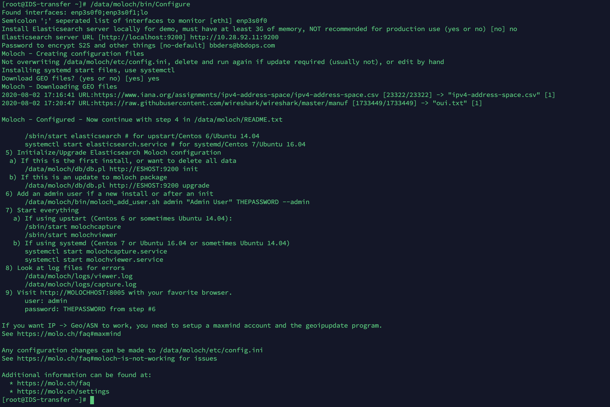

# Moloch 安装

Moloch 官网：https://molo.ch/

Moloch 官方文档：https://molo.ch/learn

moloch不支持32位系统，LInux 内核4.X 有助于抓包性能提升。CentOS8 自带的是 4.18.0 版本的内核。


## rpm 安装 Moloch

在官方网站中可以下载到 CentOS 8 的 rpm 安装包，但是安装包直接安装不上，需要执行以下步骤：

```bash
yum install -y perl-libwww-perl 
yum install -y perl-JSON 
rpm --install libyaml-devel-0.1.7-5.el8.x86_64.rpm
rpm --install perl-LWP-Protocol-https-6.07-4.el8.noarch.rpm 
rpm --install moloch-2.3.2-1.x86_64.rpm
```

Moloch 安装在了 `/data/moloch/` 中。


## 配置 Moloch

运行以下命令配置 Moloch：

```bash
yum install wget -y
/data/moloch/bin/Configure
```

配置过程如下：



初始化 Elasicsearch 数据库：

```bash
/data/moloch/db/db.pl http://10.28.92.11:9200 init
```

过程如下：


设置 admin 用户密码：

```bash
/data/moloch/bin/moloch_add_user.sh admin "Admin User" bbders@bbdops.com --admin
```

在 `/data/moloch/db/daily.sh` 中，可以设置数据的删除周期，比如我这里设置：

```
ESHOSTPORT=10.28.92.11:9200
RETAINNUMDAYS=180
```

然后运行下面命令写入定时任务：

```
crontab -e
```

写入以下内容：

```
00 01 * * * /data/moloch/db/daily.sh >> /data/moloch/logs/daily.log 2>&1
```

然后使用 `crontab -l` 查看是否生效。

在 `/data/moloch/etc/config.ini` 中，可以调整 pcap 删除周期和 pcap 包存放位置：

```
freeSpaceG = 20%
pcapDir = /data1/moloch/raw
```

当可用空间小于 20% 时开始删除 pcap 文件。


## 启动 Moloch

molochcapture 用于收集数据，molochviewer 用于展示数据。

```bash
systemctl start molochcapture.service
systemctl enable molochcapture.service

systemctl start molochviewer.service 
systemctl enable molochviewer.service
```

防火墙开启 8005 端口

浏览器访问：http://10.28.93.11:8005

输入用户名 admin，密码 bbders@bbdops.com


