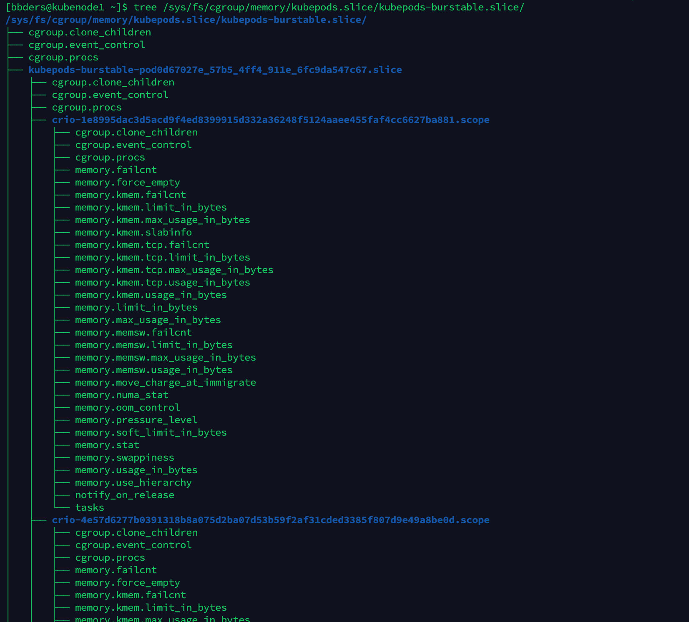

# Cgroup 详解

linux cgroup全称linux control group ,是linux内核的一个功能，用来限 制、控制与分离一个进程组群的资源（如cpu、内存、磁盘输入输出等）。这个项目最早是由Google的工程师在2006年发起（主要是Paul Menage和Rohit Seth），最早的名称为进程容器（process containers）。在2007年时，因为在Linux内核中，容器（container）这个名词太过广泛，为避免混乱，被重命名为cgroup。


## cgroup 概念

cgroup 中，除了它本身的概念，还有 Hierarchy（层级结构） 和 subsystem（子系统） 的概念


#### cgroups 层级结构（Hierarchy）

hierarchy 把一组cgroup串成一个层级结构，这样的树便是一个hierarchy，通过这种结构，Cgroups可以做到继承。


#### subsystem 子系统

典型的子系统介绍如下：

1. cpu 子系统，主要限制进程的 cpu 使用率。
2. cpuacct 子系统，可以统计 cgroups 中的进程的 cpu 使用报告。
3. cpuset 子系统，可以为 cgroups 中的进程分配单独的 cpu 节点或者内存节点。
4. memory 子系统，可以限制进程的 memory 使用量。
5. blkio 子系统，可以限制进程的块设备 io。
6. devices 子系统，可以控制进程能够访问某些设备。
7. net_cls 子系统，可以标记 cgroups 中进程的网络数据包，然后可以使用 tc 模块（traffic control）对数据包进行控制。
8. freezer 子系统，可以挂起或者恢复 cgroups 中的进程。
9. ns 子系统，可以使不同 cgroups 下面的进程使用不同的 namespace。

查看系统中默认挂载的子系统：

```bash
$ sudo yum install libcgroup-tools
$ lssubsys -a
cpuset
cpu,cpuacct
blkio
memory
devices
freezer
net_cls,net_prio
perf_event
hugetlb
pids
rdma
$ cat /proc/cgroups
```

在 `/sys/fs/cgroup` 目录下也有各个子系统的目录。

这里面每一个子系统都需要与内核的其他模块配合来完成资源的控制，比如对 cpu 资源的限制是通过进程调度模块根据 cpu 子系统的配置来完成的；对内存资源的限制则是内存模块根据 memory 子系统的配置来完成的，而对网络数据包的控制则需要 Traffic Control 子系统来配合完成。


#### 三个概念的关系

- 系统创建hierarchy 之后，所有的进程都会加入这个hierarchy的cgroup的根节点。在这个cgroup根节点是hierarchy默认创建的。
- 一个subsystem只能附加到一个hierarchy上面。
- 一个进程可以作为多个cgroup的成员，但是cgroup必须在不同的hierarchy中。
- 一个进程fork的子进程和父进程在同一个cgroup中也可以根据需要移到其他cgroup中。


## cgroups文件系统

Linux 使用了多种数据结构在内核中实现了 cgroups 的配置，关联了进程和 cgroups 节点，那么 Linux 又是如何让用户态的进程使用到 cgroups 的功能呢？ Linux内核有一个很强大的模块叫 VFS (Virtual File System)。 VFS 能够把具体文件系统的细节隐藏起来，给用户态进程提供一个统一的文件系统 API 接口。 cgroups 也是通过 VFS 把功能暴露给用户态的，cgroups 与 VFS 之间的衔接部分称之为 cgroups 文件系统。

使用 `df -h` 时会看到 Cgroup 文件系统：

```
$ df -h
Filesystem      Size  Used Avail Use% Mounted on
devtmpfs         16G     0   16G   0% /dev
tmpfs            16G     0   16G   0% /dev/shm
tmpfs            16G  688K   16G   1% /run
tmpfs            16G     0   16G   0% /sys/fs/cgroup
/dev/vda2        40G   37G  2.7G  94% /
/dev/vda1       509M  372M  138M  74% /boot
/dev/vde        197G  7.4G  180G   4% /mnt/vde
tmpfs           3.2G     0  3.2G   0% /run/user/1003
```

查看 `/sys/fs` 下的文件系统：

```
$ ls /sys/fs/
bpf  cgroup  ext4  pstore  xfs
```


#### cgroups文件系统挂载及使用

1. Linux中，用户可以使用mount命令挂载 cgroups 文件系统（hierarchy）：

```bash
$ mkdir cgroup-test
$ sudo mount -t cgroup -o none,name=cgroup1 cgroup1 ./cgroup-test/
$ ls ./cgroup-test/
cgroup.clone_children  cgroup.procs  cgroup.sane_behavior  notify_on_release  release_agent  tasks
```

这些文件就是这个hierarchy中cgroup根节点的配置项，上面这些文件含义如下。

- cgroup.clone_children, cpuset的subsystem会读取这个文件的配置，如果值是1(默认值0)，子cgroup才会继承父cgroup的cpuset配置。
- cgroup.procs 是树中当前结点cgroup的进程组id，现在的位置是在根节点，这个文件中会有现在系统中所有进程组的ID。
- notify_on_release和release_agent会在一起使用。notify_on_release标识当这个cgroup最后一个进程退出的时候是否执行了 release_agent;release_agent则是一个路径，通常用作进程退出后自动清理掉不再使用的cgroup。
- tasks标识该cgroup下面的进程ID，如果把一个进程ID写到tasks中便会将相应的进程加入到这个cgroup中。

2. 然后创建刚才建立的hierarchy上cgroup根节点中扩展出的两个子cgroup。

   ```bash
   $ cd ./cgroup-test/
   $ sudo mkdir cgroup1
   $ sudo mkdir cgroup2
   $ sudo tree
   .
   ├── cgroup1
   │   ├── cgroup.clone_children
   │   ├── cgroup.procs
   │   ├── notify_on_release
   │   └── tasks
   ├── cgroup2
   │   ├── cgroup.clone_children
   │   ├── cgroup.procs
   │   ├── notify_on_release
   │   └── tasks
   ├── cgroup.clone_children
   ├── cgroup.procs
   ├── cgroup.sane_behavior
   ├── notify_on_release
   ├── release_agent
   └── tasks
   ```

   可以看到创建子文件夹的同时，Kernel会标记这个cgroup的子cgroup，他们会继承父cgroup的属性。

3. 在cgroup中添加和移动进程 一个进程在Cgroups的hierarchy中，只能在一个cgroup节点上存在，系统所有进程都会默认在根节点上存在，可以将进程移动到其他节点上，只需要将 进程ID移动到cgroup节点的tasks文件即可。

   ```bash
   $ cd ./cgroup1
   $ echo $$
   2310355
   $ sudo ssh -c "echo $$ > tasks"
   $ cat tasks
   $ cat /proc/2310355/cgroup 
   ```

   结果如下：

   ```
   24:name=cgroup1:/cgroup1
   12:freezer:/
   11:perf_event:/
   10:cpuset:/
   9:memory:/user.slice/user-1000.slice/session-22.scope
   8:devices:/user.slice
   7:rdma:/
   6:blkio:/user.slice
   5:pids:/user.slice/user-1000.slice/session-22.scope
   4:net_cls,net_prio:/
   3:hugetlb:/
   2:cpu,cpuacct:/user.slice/user-1000.slice/session-22.scope
   1:name=systemd:/user.slice/user-1000.slice/session-22.scope
   0::/
   ```

   第一行中，可以看到已经生效了。

   > $$ 是当前进程的 PID，可以通过 `ps -l` 命令观察对比

 

## cgroup 限制内存实践

上面的hierarchy没有关联到任何的subsystem，所以没有限制占用的系统资源。

查看 memory 子系统的挂载位置：

```bash
$ sudo mount | grep memory
cgroup on /sys/fs/cgroup/memory type cgroup (rw,nosuid,nodev,noexec,relatime,memory)
```

启动一个 stress 进程（stress 命令主要用来模拟系统负载较高时的场景）：

```bash
$ sudo yum install stress
$ sudo stress --vm-bytes 200m --vm-keep -m 1 #启动一个占用内存 200MB 的进程
stress: info: [2331912] dispatching hogs: 0 cpu, 0 io, 1 vm, 0 hdd
```

这时发现 stress 进程可以运行。

创建 `/sys/fs/cgroup/memory/test` 目录

```bash
$ sudo mkdir /sys/fs/cgroup/memory/test
$ cd /sys/fs/cgroup/memory/test
$ sudo sh -c "echo 100m > memory.limit_in_bytes" 
$ sudo sh -c "echo $$ > tasks"
```

上边的操作限制了当前 bash 只能用 100m 内存。

再次在当前 bash 运行一个消耗 200m 内存的 stress 进程会报错：

```bash
$ sudo stress --vm-bytes 200m --vm-keep -m 1
stress: info: [2336036] dispatching hogs: 0 cpu, 0 io, 1 vm, 0 hdd
stress: FAIL: [2336036] (415) <-- worker 2336037 got signal 9
stress: WARN: [2336036] (417) now reaping child worker processes
stress: FAIL: [2336036] (421) kill error: No such process
stress: FAIL: [2336036] (451) failed run completed in 0s
```

这样就创建成功，并添加了内存使用的限制。

> 查看创建的目录：
>
> 
>
> 创建目录后，会自动生成这些文件。
>
> 其中带 memsw 的表示虚拟内存，不带 memsw 的仅包括物理内存。其中，limit_in_bytes 是用来限制内存使用的，其他的则是统计报告。
>
> **memory.memsw.limit_in_bytes**：内存＋swap空间使用的总量限制。 **memory.limit_in_bytes**：内存使用量限制。
>
> memory.memsw.limit_in_bytes 必须大于或等于 memory.limit_in_byte。


## cgconfig 服务

在 centos7 中，可以安装一个 cgconfig 服务：

```bash
$ sudo yum install libcgroup libcgroup-tools
$ systemctl enable cgconfig
$ systemctl start cgconfig
$ systemctl status cgconfig
```

通过配置 `/etc/cgconfig.conf` 文件，再重启 cgconfig 服务就可以实现配置 cgroup 了。


## 容器是怎么使用 cgroup 的

我这里有两种容器环境，一种是 Docker 的，一种是 CRI-O 的。下面以内存控制为例，来看下两种容器技术的实现效果。


#### Docker 容器与 cgroup

使用 `docker run -m` 来控制容器使用的内存。

Docker 容器的内存限制放在了 `/sys/fs/cgroup/memory/docker` 目录下，比如：


从这里面可以看到每个容器id都有一个子目录。

```bash
$ cat /sys/fs/cgroup/memory/docker/0ce46bd40d68ec8ddadeb9a19ebfc25f841d4af1a8b73ac04b34c97196908998/memory.limit_in_bytes 
9223372036854771712
cat /sys/fs/cgroup/memory/docker/0ce46bd40d68ec8ddadeb9a19ebfc25f841d4af1a8b73ac04b34c97196908998/cgroup.procs 
2678
```


#### CRI-O 容器与 cgroup

CRI-O 是被设计面向 Kubernetes 的，所以在一些目录名中就有浓浓的 k8s 风格。

CRI-O 容器的内存限制放在了 `/sys/fs/cgroup/memory/kubepods.slice` 目录下，这一层目录下，又根据 QoS 创建了三个子目录 `kubepods-besteffort.slice`、`kubepods-burstable.slice`、`kubepods-guaranteed.sice` 分别表示三种不同 QoS Class的内存限制。



可以看到依次又分了 Pod 和容器。

关于 QoS ： [Kubernetes调度与资源管理.md](../云原生/Kubernetes/架构及原理/Kubernetes调度与资源管理.md) 


