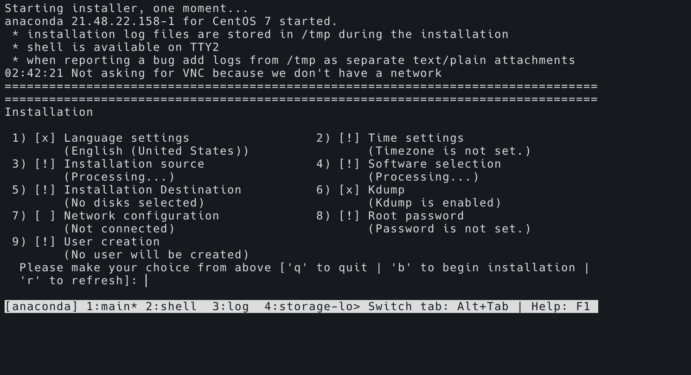
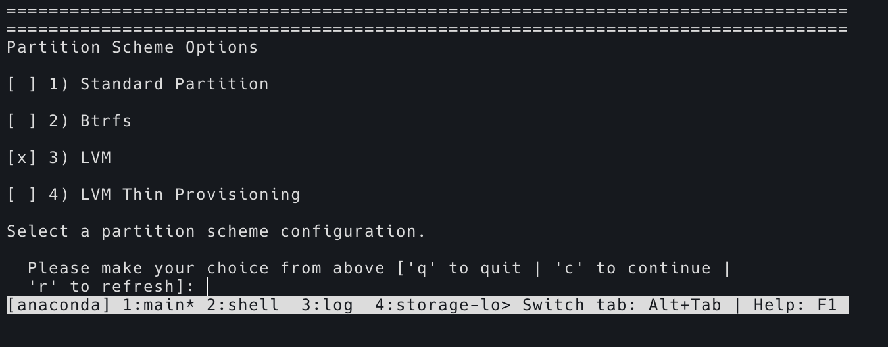

在一台物理 PC 上安装了一台不带桌面的 CentOS，准备来学习下制作系统镜像和 KVM，然后连同学习下 Linux 下的网络知识。


## 检查

先查看 CPU 是否支持虚拟化：

```bash
$ egrep -c '(vmx|svm)' /proc/cpuinfo
```

如果返回值大于 0 说明支持虚拟化。

如果没启用虚拟化，需要在 BIOS 中打开。

查看内核模块：

```bash
$ lsmod | grep kvm
```


## 安装

```bash
$ yum install qemu-kvm libvirt virt-install
```

- qemu-kvm: KVM 模块
- libvirt: 虚拟管理模块
- virt-install: 虚拟机命令行安装工具

启动进程：

```bash
$ systemctl start libvirtd
$ systemctl enable libvirtd
```


## 配置网络

添加一个网桥：

```bash
$ vim /etc/sysconfig/network-scripts/ifcfg-br0
```

内容如下：

```
DEVICE=br0
TYPE=Bridge
ONBOOT=yes
NM_CONTROLLED=yes
BOOTPROTO=static
IPADDR=192.168.98.120
NETMASK=255.255.255.0
GATEWAY=192.168.98.1
DNS1=10.28.100.100
```

配置物理网卡：

```bash
$ vim /etc/sysconfig/network-scripts/ifcfg-enp2s0
```

内容如下：

```
TYPE=Ethernet
DEVICE=enp2s0
ONBOOT=yes
UUID=d4e8208e-a35b-4944-87e7-c4203a00f8eb
BRIDGE=br0
NM_CONTROLLED=yes
```

注意网卡配置文件里面的内容，每一行的结尾不要有其他空格等字符。

重启网络：

```bash
$ systemctl restart network
```

查看网络：

```bash
$ ip addr
$ brctl show
$ ping www.baidu.com
```


## 命令行安装虚拟机

准备一个 ISO，我这里准备的是 CentOS 7 的 Minimal 版的 ISO。

```bash
$ sudo mkdir -p /opt/vms
$ sudo virt-install --name=kvm008 --ram 2048 --vcpus=2 \
  --disk path=/opt/vms/kvm008.qcow2,size=10,format=qcow2,bus=virtio \
  --location=/opt/My_CentOS7.iso \
  --network bridge=br0,model=virtio \
  --graphics=none --console=pty,target_type=serial \
  --extra-args="console=tty0 console=ttyS0"
```

- --name 指定虚拟机名称
- --ram 内存大小 单位 MB
- --vcpus 虚拟CPU数量
- --disk 系统存放地址，size=10 表示硬盘有 10 G。
- --location ISO 镜像地址
-  --network 使用的网桥
- --graphics 关闭图形桌面


然后就开始刷开机日志了，之后开始安装：



输入 1：


先点一下回车，再输入 16，然后进入下一个界面，再输入 1，选择 US 即可。

然后输入 2 进入时区设置：


之后再选择 Asia （亚洲），再选 ShangHai。

重新进入主界面，这时选择 **5** 进入系统安装位置


这里可以看到 前面创建的虚拟机 10G，输入 **C** 下一步:


这里默认为 **2**，使用全部空间，输入 **C** 进入下一步:



这里默认为 **3**，使用LVM分区，输入 **C** 进入下一步。

重新返回主界面 ，输入 **8** 设置 Root 密码。我这里设置为 123456

密码设置完成后，返回到主界面，按 b 进入安装界面。

看到日志：

```
Installation complete.  Press return to quit
```

说明完成了，按回车键。全部完成后，如下图所示：


输入 root，密码为 123456，进入命令行。

使用 `ip a` 发现网卡没有 IP 地址，修改 `/etc/sysconfig/network-scripts/ifcfg-eth0` 文件，将里面的 `ONBOOT` 改成 yes，再重启网络：

```bash
$ systemctl restart network
```

就可以了，测试访问一下外网：

```bash
$ ping www.baidu.com
```

可以访问，牛逼。

Ctrl + ] 退出虚拟机。


## 虚拟机常用操作

在宿主机上，查看虚拟机列表：

```bash
$ sudo virsh list
```

返回如下：

```
 Id    名称                         状态
----------------------------------------------------
 5     kvm001                         running
 7     kvm002                         running
```

重新进入虚拟机：

```bash
$ sudo virsh console 5
```


