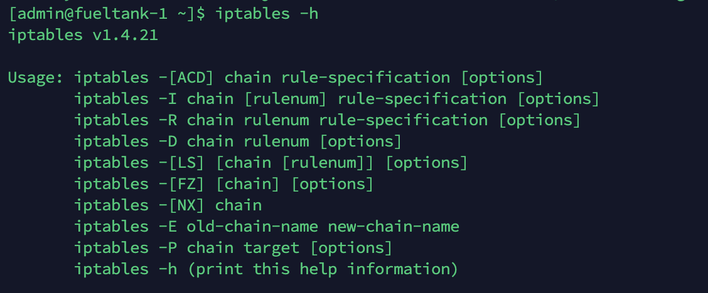
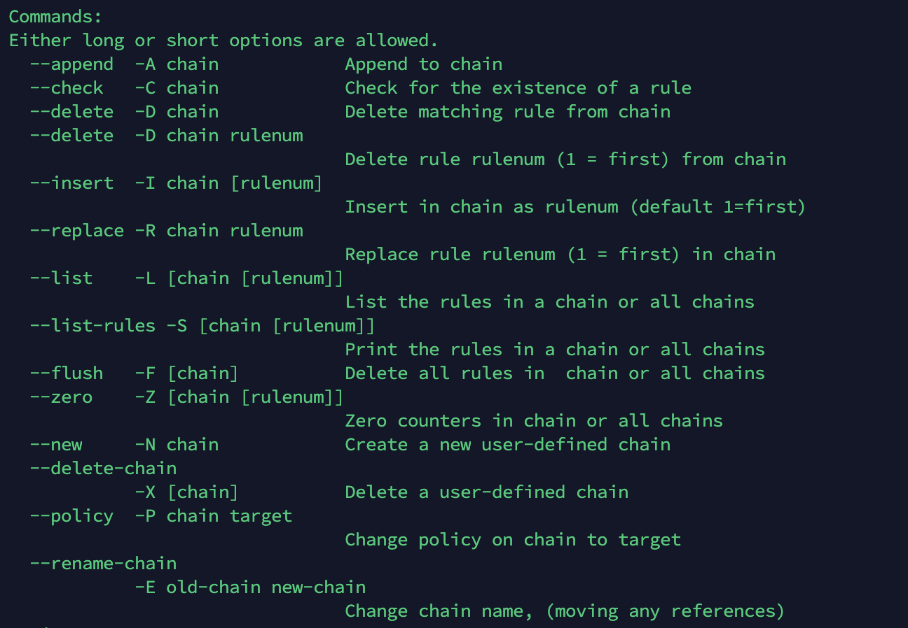
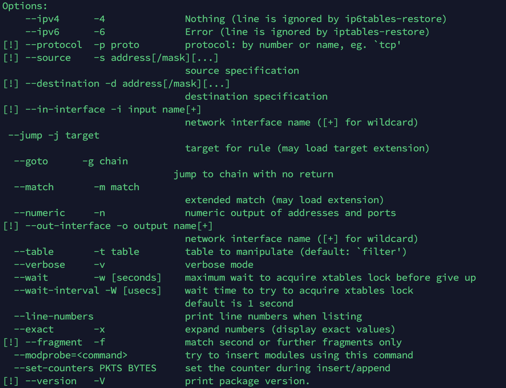

# iptables 教程

iptables的原理主要是对数据包的控制，看下图：


- 当一个数据包进入网卡时，会先进入 PREROUTING 链，这时内核根据数据包的目的 IP 确定是否转发出去。
- 如果数据包是本机的，就会到达 INPUT 链，进入本机。
- 如果不是本机的，就会走 FORWARD 链转发规则，符合规则的就会通过 POSTROUTING 链输出。
- 本机的程序包发送数据时会经过 OUTPUT链，接着到 POSTROUTING 链输出。


---


## 规则、表、链

### 规则（**rules**）

规则就是网络管理员或管理程序预定义的条件，规则一般的定义为“如果数据包头符合这样的条件，就这样处理这个数据包”。规则存储在内核空间的信息包过滤表中，这些规则分别指定了源地址、目的地址、传输协议（如TCP、UDP、ICMP）和服务类型（如HTTP、FTP和SMTP）等。当数据包与规则匹配时，iptables就根据规则所定义的方法来处理这些数据包，如放行（accept）、拒绝（reject）和丢弃（drop）等。配置防火墙的主要工作就是添加、修改和删除这些规则。

### **链（chains）**

链（chains）是数据包传播的路径，每一条链其实就是众多规则中的一个检查清单，每一条链中可以有一条或数条规则。当一个数据包到达一个链时，iptables就会从链中第一条规则开始检查，看该数据包是否满足规则所定义的条件。如果满足，系统就会根据该条规则所定义的方法处理该数据包；否则iptables将继续检查下一条规则，如果该数据包不符合链中任一条规则，iptables就会根据该链预先定义的默认策略来处理数据包。

### **表（tables）**

表（tables）提供特定的功能，iptables内置了4个表，即raw表、filter表、nat表和mangle表，分别用于实现包过滤，网络地址转换和包重构的功能。上面的图中的每个链中都标明了可以存在哪些表，下面的图做了汇总：


### raw 表

raw 表只使用在PREROUTING链和OUTPUT链上,因为优先级最高，从而可以对收到的数据包在连接跟踪前进行处理。一但用户使用了RAW表,在 某个链上,RAW表处理完后,将跳过NAT表和 ip_conntrack处理,即不再做地址转换和数据包的链接跟踪处理了.

### filter 表

主要用于过滤数据包，该表根据系统管理员预定义的一组规则过滤符合条件的数据包。对于防火墙而言，主要利用在filter表中指定的规则来实现对数据包的过滤。Filter表是默认的表，如果没有指定哪个表，iptables 就默认使用filter表来执行所有命令，filter表包含了INPUT链（处理进入的数据包），RORWARD链（处理转发的数据包），OUTPUT链（处理本地生成的数据包）在filter表中只能允许对数据包进行接受，丢弃的操作，而无法对数据包进行更改

### nat 表

主要用于网络地址转换NAT，该表可以实现一对一，一对多，多对多等NAT 工作，iptables就是使用该表实现共享上网的，NAT表包含了PREROUTING链（修改即将到来的数据包），POSTROUTING链（修改即将出去的数据包），OUTPUT链（修改路由之前本地生成的数据包）

### mangle 表

主要用于对指定数据包进行更改，在内核版本2.4.18 后的linux版本中该表包含的链为：INPUT链（处理进入的数据包），RORWARD链（处理转发的数据包），OUTPUT链（处理本地生成的数据包）POSTROUTING链（修改即将出去的数据包），PREROUTING链（修改即将到来的数据包），即存在所有的链上。


**规则表之间的优先顺序：**

raw > mangle > nat > filter


---


## 三种数据流向

iptables 中只有三种数据流向：**入站数据流向**、**转发数据流向**、**出站数据流向**

### 入站数据流向

从外界到达防火墙的数据包，先被PREROUTING规则链处理（是否修改数据包地址等），之后会进行 **路由选择**（判断该数据包应该发往何处），如果数据包 的目标主机是本机，那么内核将其传给INPUT链进行处理（决定是否允许通 过等），通过以后再交给系统上层的应用程序（比如Apache服务器）进行响应。

### 转发数据流向

来自外界的数据包到达防火墙后，首先被PREROUTING规则链处理，之后会进行 **路由选择**，如果数据包的目标地址是其它外部地址，则内核将其传递给FORWARD链进行处理（是否转发或拦截），然后再交给POSTROUTING规则链（是否修改数据包的地 址等）进行处理。

### 出站数据流向

防火墙本机向外部地址发送的数据包（比如在防火墙主机中测试公网DNS服务器时），首先被OUTPUT规则链处理，之后进行 **路由选择** ，然后传递给POSTROUTING规则链（是否修改数据包的地址等）进行处理。


## 处理规则

处理动作除了 ACCEPT、REJECT、DROP、REDIRECT 和MASQUERADE 以外，还多出 LOG、ULOG、DNAT、SNAT、MIRROR、QUEUE、RETURN、TOS、TTL、MARK等，其中某些处理动作不会中断过滤程序，某些处理动作则会中断同一规则链的过滤，并依照前述流程继续进行下一个规则链的过滤。

下面说一下常用的规则。

**REJECT** 拦阻该数据包，并返回数据包通知对方，可以返回的数据包有几个选择：ICMP port-unreachable、ICMP echo-reply 或是tcp-reset（这个数据包包会要求对方关闭联机），进行完此处理动作后，将不再比对其它规则，直接中断过滤程序。 范例如下：

```bash
$ iptables -A  INPUT -p TCP --dport 22 -j REJECT --reject-with ICMP echo-reply
```

**DROP** 丢弃数据包不予处理，进行完此处理动作后，将不再比对其它规则，直接中断过滤程序。

**REDIRECT** 将封包重新导向到另一个端口（PNAT），进行完此处理动作后，将会继续比对其它规则。这个功能可以用来实作透明代理 或用来保护web 服务器。例如：

```bash
$ iptables -t nat -A PREROUTING -p tcp --dport 80 -j REDIRECT--to-ports 8081
```

**MASQUERADE** 改写封包来源IP为防火墙的IP，可以指定port 对应的范围，进行完此处理动作后，直接跳往下一个规则链（mangle:postrouting）。这个功能与 SNAT 略有不同，当进行IP 伪装时，不需指定要伪装成哪个 IP，IP 会从网卡直接读取，当使用拨接连线时，IP 通常是由 ISP 公司的 DHCP服务器指派的，这个时候 MASQUERADE 特别有用。范例如下：

```bash
$ iptables -t nat -A POSTROUTING -p TCP -j MASQUERADE --to-ports 21000-31000
```

**LOG** 将数据包相关信息纪录在 /var/log 中，详细位置请查阅 /etc/syslog.conf 配置文件，进行完此处理动作后，将会继续比对其它规则。例如：

```bash
$ iptables -A INPUT -p tcp -j LOG --log-prefix "input packet"
```

**SNAT** 改写封包来源 IP 为某特定 IP 或 IP 范围，可以指定 port 对应的范围，进行完此处理动作后，将直接跳往下一个规则炼（mangle:postrouting）。范例如下：

```bash
$ iptables -t nat -A POSTROUTING -p tcp-o eth0 -j SNAT --to-source 192.168.10.15-192.168.10.160:2100-3200
```

**MIRROR**  镜像数据包，也就是将来源 IP与目的地IP对调后，将数据包返回，进行完此处理动作后，将会中断过滤程序。

**QUEUE** 中断过滤程序，将封包放入队列，交给其它程序处理。透过自行开发的处理程序，可以进行其它应用，例如：计算联机费用.......等。

**RETURN** 结束在目前规则链中的过滤程序，返回主规则链继续过滤，如果把自订规则炼看成是一个子程序，那么这个动作，就相当于提早结束子程序并返回到主程序中。

**MARK** 将封包标上某个代号，以便提供作为后续过滤的条件判断依据，进行完此处理动作后，将会继续比对其它规则。范例如下：

```bash
$ iptables -t mangle -A PREROUTING -p tcp --dport 22 -j MARK --set-mark 22
```


---


## iptables 命令 

运行 `iptables -h` 可以查看命令介绍。

主要使用方法 如下：



iptables 命令主要分为 Commands 和 Options

Commands 有：



可以看到，基本上都是对规则或对链的增删改查。

Options 有：



主要是用于指定各项参数。注意 -t 参数，默认是 filter。另外还有 -j ，这个参数除了能表示规则之外还能表示自定义链！！！

-x 用户控制显示的字节单位。


---


## 规则文件

IPv4规则信息会保存到/etc/sysconfig/iptables 文件中，IPv6 规则保存到/etc/sysconfig/ip6tables 文件中。 必须执行 service iptables save 命令才会保存，保存后系统重启后会自动加载。

使用命令创建规则后，仅仅会保存在内存中，服务重启后就没了，所以要执行 service iptables save 命令保存。

或者这样子自定义文件：

```bash
$ sudo iptables-save > file
$ sudo iptables-restore < file
```


---


## iptables-save 输出格式详解

这个格式也是 /etc/sysconfig/iptables 文件中使用的格式，很好理解，看一遍博客学会了：https://www.cnblogs.com/sixloop/p/iptables-save-help.html


---


## 自定义链

https://www.zsythink.net/archives/1625


