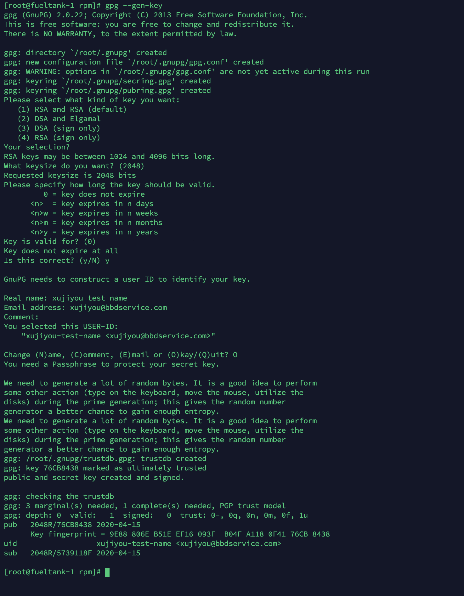

# yum 离线源的配置

Yum 安装命令：

```bash
$ sudo yum install createrepo
```

生成一个目录，并创建库：

```bash
$ sudo mkdir /mnt/vde/rpm
$ cd /mnt/vde/rpm
$ createrepo .
```

这会在当前目录下创建一个 `repodata` 目录。

这样，rpm包存放的目录就可以作为yum源目录使用了（后面说明如何使用），可以将这个目录打包后，放到其他地方也可以使用。

打包：

```bash
$ tar -zcvf rpm.tar.gz rpm/
```

【注】：如果提示找不到createrepo命令，可以使用yum install createrepo安装该程序。如果无法联网安装，需要自行到网上下载rpm包安装，尤其是还要下载一些依赖包，例如createrepo-0.9.9-23.el7.noarch版本就依赖于以下包：

```
$ yum deplist createrepo
Loaded plugins: fastestmirror, priorities
Loading mirror speeds from cached hostfile
 * elrepo: mirrors.neusoft.edu.cn
 * remi-safe: mirrors.tuna.tsinghua.edu.cn
9 packages excluded due to repository priority protections
package: createrepo.noarch 0.9.9-28.el7
  dependency: /bin/sh
   provider: bash.x86_64 4.2.46-33.el7
  dependency: /usr/bin/python
   provider: python.x86_64 2.7.5-86.el7
  dependency: deltarpm
   provider: deltarpm.x86_64 3.6-3.el7
  dependency: libxml2-python
   provider: libxml2-python.x86_64 2.9.1-6.el7_2.3
  dependency: pyliblzma
   provider: pyliblzma.x86_64 0.5.3-11.el7
  dependency: python >= 2.1
   provider: python.x86_64 2.7.5-86.el7
  dependency: python(abi) = 2.7
   provider: python.x86_64 2.7.5-86.el7
  dependency: python-deltarpm
   provider: python-deltarpm.x86_64 3.6-3.el7
  dependency: rpm >= 4.1.1
   provider: rpm.x86_64 4.11.3-40.el7
  dependency: rpm-python
   provider: rpm-python.x86_64 4.11.3-40.el7
  dependency: yum >= 3.4.3-4
   provider: yum.noarch 3.4.3-163.el7.centos
  dependency: yum-metadata-parser
   provider: yum-metadata-parser.x86_64 1.1.4-10.el7
```


---


在 `repodata` 的同一级目录下，创建一个 `Packages` 目录，用来放各种 rpm 文件，目录结构如下：

```
$ ls 
__mnt_vde_rpm  Packages  repodata
```

`__mnt_vde_rpm ` 这个目录是自己生成的，不用管。

这里我下载了一个 jdk 的 RPM 包，名为 `jdk-8u241-linux-x64.rpm` ，这个 RPM 包没有其他依赖，将 rpm 文件放到这个 `Packages` 目录下后，然后更新 `repodata`：

```bash
$ createrepo --update .
```

验证：

```bash
$ verifytree /mnt/vde/rpm
```

然后创建 repo 文件：

```bash
$ vim /etc/yum.repos.d/local.repo
[rpm]
name=rpm_package
baseurl=file:///mnt/vde/rpm
gpgcheck=0
enabled=1
```

gpgcheck设置为0，则不需要认证签名。

创建完成后，更新缓存

```bash
$ yum clean all # 可不执行
$ yum makecache
```

查看 repo 列表：

```bash
$ yum repolist
```

会发现上面方括号中定义的 `rpm` 已经出现在列表中了，注意后面软件的数量要和 `Packages` 中的数量一致。

使用 yum 安装来测试一下，这里使用 `--enablerepo` 来指定 repo 库：

```bash
$ yum install jdk --enablerepo=rpm
```


---


## 配置 HTTP 服务

配置了 HTTP 服务之后，内网多台服务器都可以使用了。

配置方法，先下载几个 rpm 包：

```bash
$ wget http://mirror.centos.org/centos/7/os/x86_64/Packages/apr-1.4.8-5.el7.x86_64.rpm
$ wget http://mirror.centos.org/centos/7/os/x86_64/Packages/apr-util-1.5.2-6.el7.x86_64.rpm
$ wget https://buildlogs.centos.org/c7.01.00/httpd/20150312150148/2.4.6-31.el7.centos.x86_64/httpd-tools-2.4.6-31.el7.centos.x86_64.rpm
$ wget http://mirror.centos.org/centos/7/os/x86_64/Packages/mailcap-2.1.41-2.el7.noarch.rpm
$ wget https://buildlogs.centos.org/c7.01.00/httpd/20150312150148/2.4.6-31.el7.centos.x86_64/httpd-2.4.6-31.el7.centos.x86_64.rpm
```

注意这里 httpd 版本只能是 `2.4.6-31`， 其他版本的话依赖也变了。全部包如下：

- apr-1.4.8-5.el7.x86_64.rpm
- apr-util-1.5.2-6.el7.x86_64.rpm
- httpd-tools-2.4.6-31.el7.centos.x86_64.rpm
- mailcap-2.1.41-2.el7.noarch.rpm
- httpd-2.4.6-31.el7.centos.x86_64.rpm

按照上边的套路，把 rpm 包加入到上边的目录，然后 yum 安装即可：

```bash
$ yum install httpd --enablerepo=rpm
```

配置文件是 `/etc/httpd/conf/httpd.conf`，我这里测试需要，把 80 端口改成 81。

然后启动：

```bash
$ systemctl enable httpd
$ systemctl start httpd
```

然后创建一个软链接到 httpd 的数据目录：

```bash
$ ln -s /mnt/vde/rpm /var/www/html/rpm
```

然后修改刚才的 local.repo :

```bash
$ vim /etc/yum.repos.d/local.repo
[rpm]
name=rpm_package
baseurl=http://localhost:81/rpm
gpgcheck=0
enabled=1
```

测试一下 :

```bash
$ yum install jdk --enablerepo=rpm
```

OK，搞定。


## 签名认证

上面忽略了签名认证，这里添加上。以下使用 root 账户操作

安装随机数工具并启动：

```bash
$ sudo yum install rng-tools -y
$ sudo  service rngd start
```

先生成证书和私钥，命令：

```bash
$ sudo gpg --gen-key
```

过程如下：



中间需要输入密码，输入两次即可。

查看公钥：

```bash
$ gpg --list-key
/root/.gnupg/pubring.gpg
------------------------
pub   2048R/76CB8438 2020-04-15
uid                  xujiyou-test-name <xujiyou@bbdservice.com>
sub   2048R/5739118F 2020-04-15
```

安装 rpm 签名命令：

```bash
$ sudo yum install rpm-sign -y
```

编辑文件 `/root/.rpmmacros`：

```bash
$ sudo vim /root/.rpmmacros
```

文件内容如下：

```
%_signature gpg
%_gpg_name xujiyou-test-name repo xujiyou@bbdservice.com
```

对 rpm 包进行签名：

```bash
$ rpm --resign jdk-8u241-linux-x64.rpm
```

需要输入刚才的密码。

导出公钥到文本文件：

```bash
$ gpg --export -a xujiyou@bbdservice.com > RPM-GPG-KEY-TESTREPO
```

查看 rpm 数据库中的公钥：

```bash
$ rpm -q gpg-pubkey
```

导入刚刚生成的公钥：

```bash
$ rpm --import RPM-GPG-KEY-TESTREPO
```

再次查看 rpm 数据库中的公钥，发现多了一个：

```bash
$ rpm -q gpg-pubkey
```

检查刚才进行了签名的软件包：

```bash
$ rpm -K jdk-8u241-linux-x64.rpm
```

将公钥放到 web 服务器上

```bash
$ cp /root/RPM-GPG-KEY-TESTREPO /mnt/vde/rpm/
$ ls /var/www/html/rpm/
```

上面已经在 `/mnt/vde/rpm/` 和 `/var/www/html/rpm/` 之间做了软链接

更新仓库：

```bash
$ createrepo --update .
```

修改 repo 文件为：

```
[rpm]
name=rpm_package
baseurl=http://fueltank-1:81/rpm
gpgcheck=1
enabled=1
gpgkey=http://fueltank-1:81/rpm/RPM-GPG-KEY-TESTREPO
```

gpgcheck 为 1 ，表示验证签名。

测试安装：

````bash
$ yum install jdk --enablerepo=rpm
````

(可选)客户端导入公钥

```bash
$ sudo rpm --import http://fueltank-1:81/rpm/RPM-GPG-KEY-TESTREPO
```

大功告成。