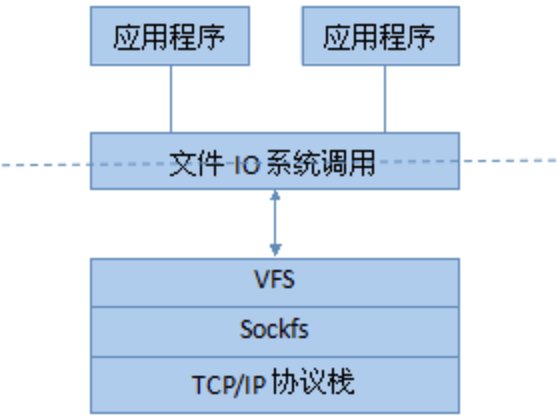
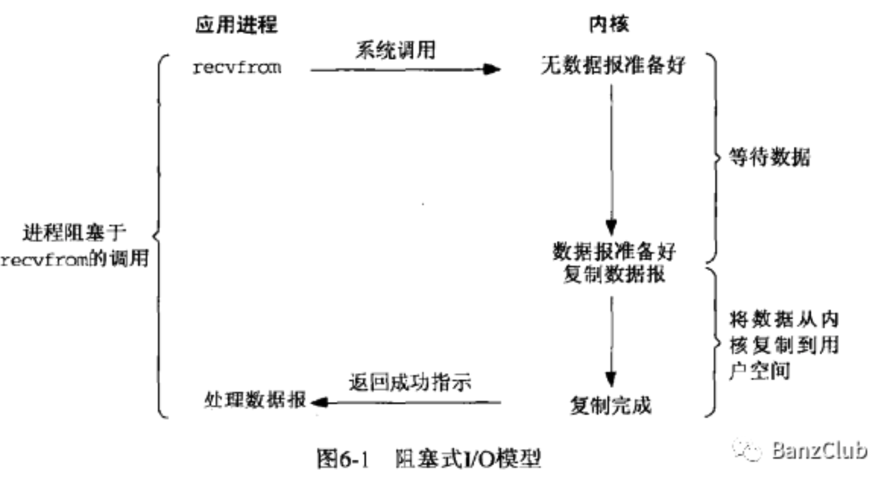
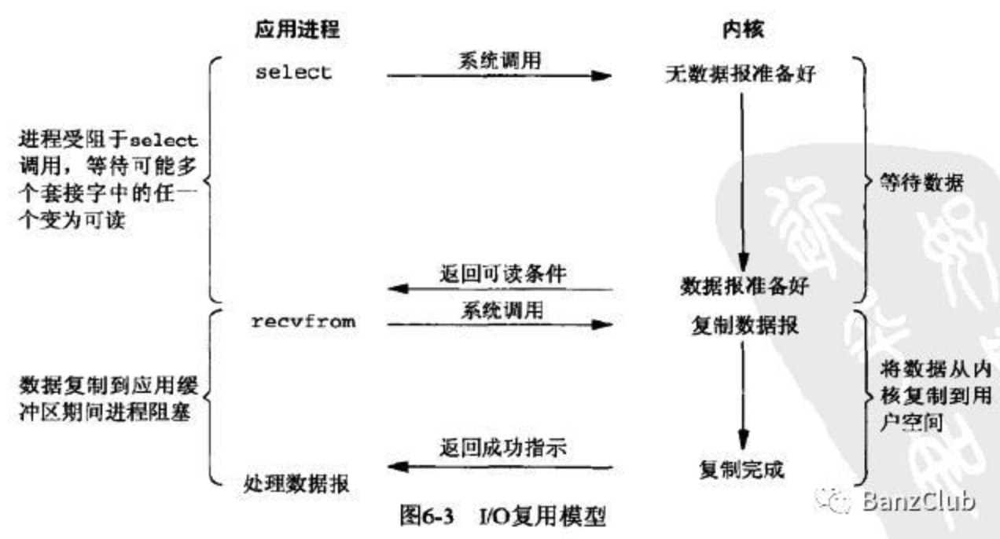

# Linux 网络 IO 详解

## Socket

在操作系统中，所有的I/O设备（磁盘、外设、网络等）都被模型化为文件，所有的输入和输出动作都被当成相应的文件的读和写来执行，这些文件通过操作系统的VFS机制（虚拟文件系统），以文件系统形式挂载在Linux内核中，对外提供一致的文件操作接口，由VFS根据不同的文件类型，执行不同的操作。如操作系统的Ext3、Ext4、NTFS、FAT等文件系统，进程的所有文件操作都是通过VFS来适配不同的文件系统，完成实际的文件操作。

在网络通信中，为了适配各种网络协议的复杂性，而使操作系统能够统一操作网络中的数据，在网络与进程间增加了一个抽象层，即套接字（socket）。客户端和服务器通过使用套接字接口建立连接，连接以文件描述符形式提供给进程，套接字接口提供了打开和关闭套接字描述符的函数，客户端和服务器通过读写这些描述符来实现彼此间的通信。所以，socket是一种特殊的文件。

## 网络IO模型

I/O操作的输入：

1. 进程向内核发起一个系统调用（read、readv、recv、recvfrom、recvmsg）；
2. 内核收到系统调用，通知I/O设备读取数据；
3. 设备将数据载入内核缓冲区；
4. 内核缓冲区接到数据后，复制到用户进程的缓冲区；
5. 进程缓冲区得到数据，通知内核；
6. 内核将控制权交给应用进程，进程继续下一步操作；

输出：

1. 进程向内核发起一个系统调用（write、writev、send、sendto、sendmsg）；
2. 内核收到系统调用，内核将数据从应用进程的缓冲区到内核缓冲区（或设备缓冲区，如Socket缓冲区）；
3. 内核将控制权交给应用进程，由设备执行下一步操作（如磁盘将数据写到磁盘；网卡将数据通过网络发出）；

操作系统对于这些I/O操作有几种特定的处理方式，也就是I/O模型，包括阻塞式I/O、非阻塞式I/O、I/O复用、信号驱动式I/O、异步I/O。

#### 阻塞式I/O

当进程发起一个系统调用时，到返回处理数据结果过程中，进程阻塞于这个系统调用的函数，如：调用系统的接收函数（recvfrom），从设备准备数据到系统缓冲区，到数据从内核拷贝到进程用户空间过程，进程都处于阻塞状态。

#### 非阻塞式I/O

非阻塞I/O与阻塞I/O不同的是，进程不会在内核准备数据过程中阻塞，而是如果内核没有准备好数据时，直接返回EWOULDBLOCK错误，然后进程一直轮询访问内核，直到内核准备好数据。

#### IO多路复用

I/O复用提供一种机制，可以通过新的系统调用，实现进程一次多个I/O操作，并通过监听每一个I/O操作的数据准备情况，如果某个I/O的数据准备完成，则内核会通知进程，可以进行某一个的I/O操作。操作系统提供的这种I/O复用的调用函数有select、poll、epoll。

进程虽然受阻于 select、但是可以监听很多 socket，如果进程只专注于处理网络数据，这种模型就非常适合，实际中，也有很多软件使用这种IO复用。

这种依赖于操作系统的 select、poll、epoll 的实现。

#### 信号驱动式I/O

一般并不会用。

#### 异步IO

异步IO就是AIO。相对于同步I/O，异步I/O在进程发出异步请求之后，无论内核是否准备好数据，系统调用都会直接返回给用户进程，内核准备好数据之后，向进程复制数据，然后发送通知给进程，由进程继续操作，整个过程都是非阻塞的。

如果内核不给进程发信号，就差不多相当于非阻塞式IO，内核不给通知，就需要进程自己去轮询。

异步IO的好处还有直接把内核缓冲区的数据复制到用户空间，复制完成后才通知用户进程，这一点在非阻塞式IO是需要用户进程使用系统调用去做的。

现在Linux 上，没有比较完美的异步文件IO 方案，很多方案都有缺陷或限制，比如有的不能利用操作系统的缓冲区，有的不能利用 sendfile 实现零拷贝等。

#### 对比

