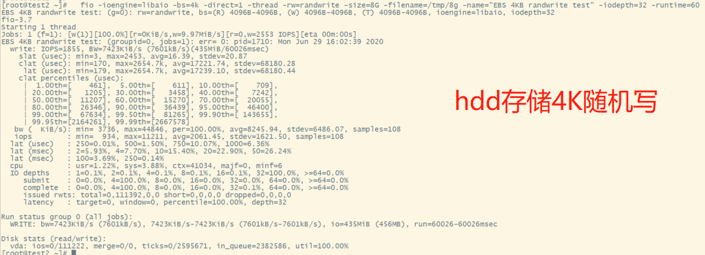
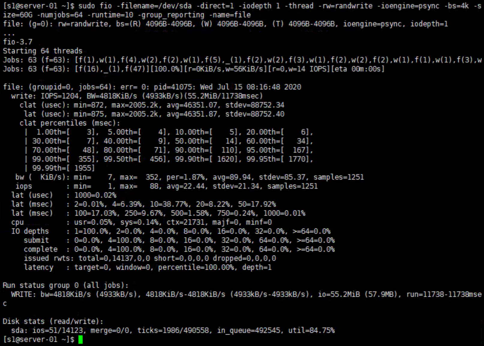

SSD 的4k随机写：


HDD 的 4k 随机写：




安装工具：

```bash
$ yum install fio -y 
```


4k随机写：

```bash
$ fio -filename=/dev/sda1 -direct=1 -iodepth 1 -thread -rw=randwrite -ioengine=psync -bs=4k -size=60G -numjobs=64 -runtime=10 -group_reporting -name=file
```

我这块是 NVMe 的 SSD，超级强悍。


下面这块是机械硬盘：




## 参数详解

 filename=/dev/sda1：测试文件名称，通常选择需要测试的盘的data目录
 direct=1：测试过程绕过机器自带的buffer。使测试结果更真实
 rw=randwrite：测试随机写的I/O
 rw=randrw：测试随机写和读的I/O
 rw=randread：测试随机读的I/O
 bs=4k：单次io的块文件大小为4k
 bsrange=512-2048：同上，提定数据块的大小范围
 size=60g：本次的测试文件大小为60g，以每次4k的io进行测试
 numjobs=64：本次的测试线程为64
 runtime=10：测试时间为10秒，如果不写则一直将5g文件分4k每次写完为止
 ioengine=psync：io引擎使用pync方式
 rwmixwrite=30：在混合读写的模式下，写占30%
 group_reporting：关于显示结果的，汇总每个进程的信息。
 此外
 lockmem=1g：只使用1g内存进行测试
 zero_buffers：用0初始化系统buffer
 nrfiles=8：每个进程生成文件的数量。

> numjobs 指定的线程数量会影响测试结果，虽然结果并不是线性增长的。


## 输出详解

IOPS 即每秒IO操作数，BW 带宽。

slat 意为 submission latency，即IO提交延时。
usec 为时间单位，纳秒。
该行统计IO生成到提交到内核之间的延时，min为所有最小延时，max为最大延时.


## 覆盖文件的问题

上边的 filename 可以指定一个块设备，也可以指定块设备挂载到目录下的一个文件，可以新建一个文件，供 fio 进行测试，这样就不用担心数据覆盖的问题了。比如：

```bash
$ fio -filename=/data2/test/test.txt -direct=1 -iodepth 1 -thread -rw=randwrite -ioengine=psync -bs=4k -size=8G -numjobs=64 -runtime=10 -group_reporting -name=file
```


