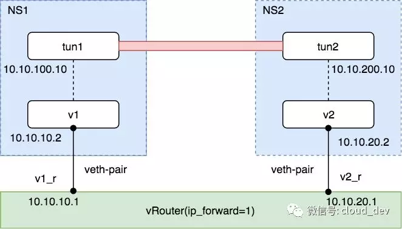

 tun 是一个网络层的设备，也被叫做点对点设备，之所以叫这个名字，是因为 tun 常常被用来做隧道通信（tunnel）。

## IP 隧道

Linux 原生支持多种三层隧道，其底层实现原理都是基于 tun 设备。我们可以通过命令 `ip tunnel help` 查看 IP 隧道的相关操作。


可以看到，Linux 原生一共支持 5 种 IP 隧道。

- `ipip`：即 `IPv4 in IPv4`，在 IPv4 报文的基础上再封装一个 IPv4 报文。
- `gre`：即通用路由封装（`Generic Routing Encapsulation`），定义了在任意一种网络层协议上封装其他任意一种网络层协议的机制，IPv4 和 IPv6 都适用。
- `sit`：和 `ipip` 类似，不同的是 `sit` 是用 IPv4 报文封装 IPv6 报文，即 `IPv6 over IPv4`。
- `isatap`：即站内自动隧道寻址协议（`Intra-Site Automatic Tunnel Addressing Protocol`），和 `sit` 类似，也是用于 IPv6 的隧道封装。
- `vti`：即虚拟隧道接口（`Virtual Tunnel Interface`），是 cisco 提出的一种 `IPsec` 隧道技术。


## 实践 IPIP 隧道

加载 ipip 模块：

```bash
$ modprobe ipip
$ lsmod | grep ipip
```

加载 `ipip` 模块后，就可以创建隧道了，方法是先创建一个 tun 设备，然后将该 tun 设备绑定为一个 `ipip` 隧道即可。

安装前提是  [Linux路由.md](Linux路由.md) 已经做完了。

实验拓扑如下：




然后创建 tun 设备，并设置为 `ipip` 隧道。

 1) 在 ns1 上创建 tun1 和 ipip tunnel

```bash
$ ip netns exec ns1 ip tunnel add tun1 mode ipip remote 10.10.20.2 local 10.10.10.2
$ ip netns exec ns1 ip l s tun1 up 
$ ip netns exec ns1 ip a a 10.10.100.10 peer 10.10.200.10 dev tun1 #设置 IP 地址和对端的 IP 地址
```

上面的命令是在 NS1 上创建 tun 设备 tun1，并设置隧道模式为 `ipip`，然后还需要设置隧道端点，用 `remote` 和 `local` 表示，这是 **隧道外层 IP**，对应的还有 **隧道内层 IP**，用 `ip addr xx peer xx` 配置。大体的示意图如下所示:


完成后如下图所示：


注意这里的 link/ipip 这里的是隧道 外层 IP，即要额外加入报头的 IP 信息。

inet xx peer 是隧道内层 IP，即被包在内部的 IP。


同理，也在 NS2 上做如上配置：

2) 在 ns2 上创建 tun2 和 ipip tunnel

```bash
$ ip netns exec ns2 ip tunnel add tun2 mode ipip remote 10.10.10.2 local 10.10.20.2
$ ip netns exec ns2 ip l s tun2 up
$ ip netns exec ns2 ip a a 10.10.200.10 peer 10.10.100.10 dev tun2
```

当做完上述配置，两个 tun 设备端点就可以互通了，如下：

```bash
$ ip netns exec ns1 ping 10.10.200.10 -c 4
```

我们试着来分析下上述这个过程。

1、首先 ping 命令构建一个 ICMP 请求包，ICMP 包封装在 IP 包中，源目的 IP 地址分别为 `tun1(10.10.100.10)` 和 `tun2(10.10.200.10)` 的地址。

2、由于 tun1 和 tun2 不在同一网段，所以会查路由表，当通过 `ip tunnel` 命令建立 `ipip` 隧道之后，会自动生成一条路由，如下，表明去往目的地 `10.10.200.10` 的路由直接从 tun1 出去:

```
$ ip netns exec ns1 route -n
```


3、由于配置了隧道端点，数据包出了 tun1，到达 v1，根据 `ipip` 隧道的配置，会封装上一层新的 IP 报头，源目的 IP 地址分别为 `v1(10.10.10.2)` 和 `v2(10.10.20.2)`。

4、v1 和 v2 同样不在一个网段，同样查路由表，发现去往 `10.10.20.0` 网段可以从 `10.10.10.1` 网关发出。

5、Linux 打开了 `ip_forward`，相当于一台路由器，`10.10.10.0` 和 `10.10.20.0` 是两条直连路由，所以直接查表转发，从 NS1 过渡到 NS2。

6、数据包到达 NS2 的 v2，解封装数据包，发现内层 IP 报文的目的 IP 地址是 `10.10.200.10`，这正是自己配置的 `ipip` 隧道的 tun2 地址，于是就将报文交给 tun2 设备。至此，tun1 的 ping 请求包就成功到达 tun2。

7、由于 ICMP 报文的传输特性，有去必有回，所以 NS2 上会构造 ICMP 响应包，并根据以上相同步骤封装和解封装数据包，直至到达 tun1，整个 ping 过程完成。


## 总结

现在的 Linux 内核原生支持 5 种隧道协议，它们底层实现都是采用 tun 虚拟设备。

我们熟知的各种 VPN 软件，其底层实现都离不开这 5 种隧道协议。

我们可以把上面的 `ipip` 改成其他隧道模式，其他不变，同样可以完成不同隧道的实验。


