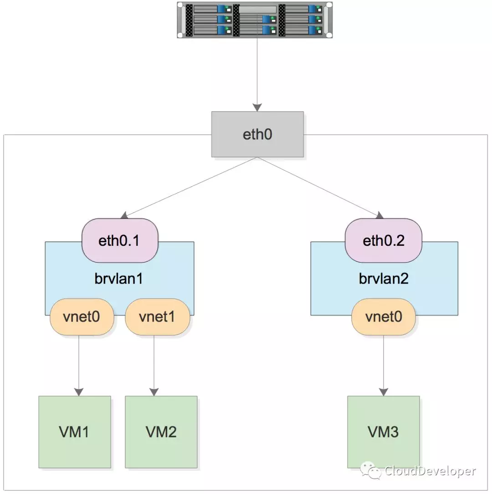

我的物理网卡名为 enp2s0，地址为 192.168.98.131/24，网关为 192.168.98.1。

最终要实现的架构图如下：



这是从网上找的图，名字与我测试使用的不一致。


## 在物理网卡上创建 VLAN

vlan的定义不再多说，只需记住将数据包打上vlan标签的端口叫做access，而将不处理标签转发数据包的端口叫做trunk.

linux的vlan就是由不同的网桥实现，如下所示

安装工具：

```bash
$ yum install epel-release #不安装epel源找不到vconfig
$ yum install vconfig
$ sudo modprobe 8021q
```

创建 VLAN：

```
$ vconfig add enp2s0 10
$ vconfig add enp2s0 20
$ ifconfig enp2s0.10 192.168.10.1 netmask 255.255.255.0 up
$ ifconfig enp2s0.20 192.168.20.1 netmask 255.255.255.0 up
```


## 创建两个网桥

创建两个网桥，分别连接到 两个 Vlan 上。

创建第一个网桥：

```bash
$ brctl addbr brvlan10
$ brctl addif brvlan10 enp2s0.10
$ ifconfig enp2s0.10 0.0.0.0
$ ifconfig brvlan10 192.168.10.1 netmask 255.255.255.0
```

创建第二个网桥：

```bash
$ brctl addbr brvlan20
$ brctl addif brvlan20 enp2s0.20
$ ifconfig enp2s0.20 0.0.0.0
$ ifconfig brvlan20 192.168.20.1 netmask 255.255.255.0
```

查看网桥及其接口列表：

```bash
$ brctl show
```


## 创建三个虚拟机

参照教程： [KVM安装.md](../KVM/KVM安装.md) 

创建三个虚拟机，两个连到 brvlan10 上，一个连到 brvlan20 上：

```bash
$ sudo virt-install --name=kvm001 --ram 2048 --vcpus=2 \
  --disk path=/opt/vms/kvm001.qcow2,size=10,format=qcow2,bus=virtio \
  --location=/opt/CentOS-7-x86_64-Minimal-2003.iso\
  --network bridge=brvlan10,model=virtio \
  --graphics=none --console=pty,target_type=serial \
  --extra-args="console=tty0 console=ttyS0"
$ sudo virt-install --name=kvm002 --ram 2048 --vcpus=2 \
  --disk path=/opt/vms/kvm002.qcow2,size=10,format=qcow2,bus=virtio \
  --location=/opt/CentOS-7-x86_64-Minimal-2003.iso\
  --network bridge=brvlan10,model=virtio \
  --graphics=none --console=pty,target_type=serial \
  --extra-args="console=tty0 console=ttyS0"
$ sudo virt-install --name=kvm003 --ram 2048 --vcpus=2 \
  --disk path=/opt/vms/kvm003.qcow2,size=10,format=qcow2,bus=virtio \
  --location=/opt/CentOS-7-x86_64-Minimal-2003.iso\
  --network bridge=brvlan20,model=virtio \
  --graphics=none --console=pty,target_type=serial \
  --extra-args="console=tty0 console=ttyS0"
```

由于没有 DHCP 服务器，需要给每个虚拟机分别设置 IP 地址：

```bash
$ ip addr add 192.168.10.2/24 dev eth0
$ ping 192.168.10.1
```

```bash
$ ip addr add 192.168.10.3/24 dev eth0
$ ping 192.168.10.1
$ ping 192.168.10.2
```

```bash
$ ip addr add 192.168.20.2/24 dev eth0
$ ping 192.168.20.1
```

三台虚拟机互相 ping 一下，发现 kvm001 与 kvm002 能互相 ping 通，但是与 kvm003 互相 ping 不通，这就说明 VLAN 起作用了。

在宿主机上查看网桥接口：

```
$ brctl show
bridge name	bridge id		        STP enabled	  interfaces
brvlan10		8000.408d5c90faef	  no		        enp2s0.10
							                                vnet0
							                                vnet1
brvlan20		8000.408d5c90faef	  no		        enp2s0.20
							                                vnet2
virbr0		  8000.525400771f3d	  yes		        virbr0-nic
```

可以看到网桥上挂着的 网卡。

查看虚拟机的网卡：

```bash
$ virsh domiflist kvm001
```


## 修改网段

上面的 brvlan10 和 brvlan20 的网段不一样，这里改成一样的，再测试：

```bash
$ ifconfig brvlan10 192.168.30.1 netmask 255.255.255.0 # 在宿主机执行
$ ifconfig brvlan20 192.168.30.2 netmask 255.255.255.0 # 在宿主机执行

$ ip addr add 192.168.30.3/24 dev eth0 # 在 kvm001 上执行
$ ip addr add 192.168.30.4/24 dev eth0 # 在 kvm002 上执行
$ ip addr add 192.168.30.5/24 dev eth0 # 在 kvm003 上执行
```

将三个虚拟机改到同一个网段之下 kvm001 和 kvm002 也 ping 不通 kvm003，说明 VLAN 是生效的！


