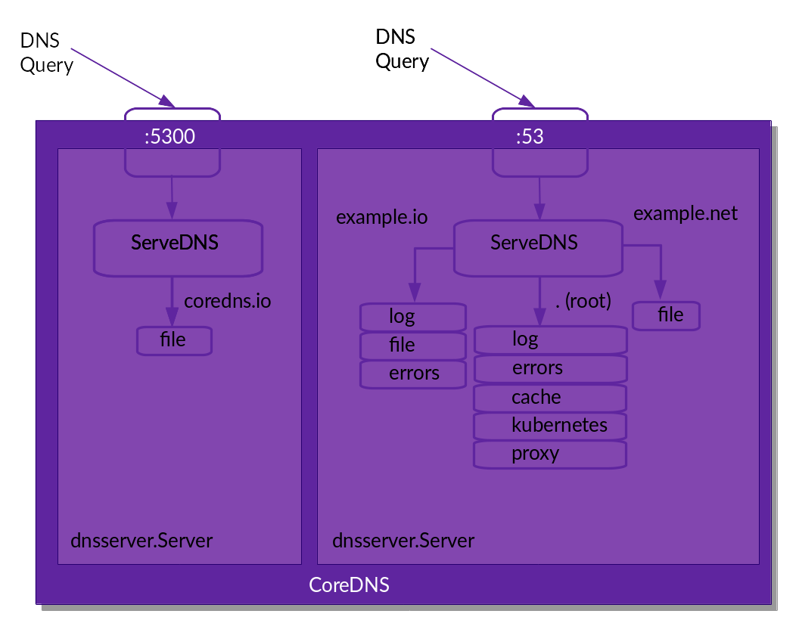

# CoreDNS 官方文档

CoreDNS 的官方文档还是比较简单的，只有一页。

文档地址：https://coredns.io/manual/toc/

CoreDNS 是 go 语言写的 DNS 服务器，它非常灵活，几乎将所有功能都外包给了插件。

目前，默认的CoreDNS安装中包含大约30个插件。

CoreDNS 内部的插件列表在这里：https://coredns.io/plugins/

如果想编写插件，需要了解 Go，并深入了解 DNS 工作原理。编写插件的教程：https://coredns.io/2017/03/01/how-to-add-plugins-to-coredns/

## 安装

本地的话可以直接下载二进制文件，下载地址：https://github.com/coredns/coredns/releases/

下载下来之后放入到 PATH 路径之中就可以使用了。

测试：

一旦有了二进制文件，便可以使用 -plugins 选项列出所有可用的插件：

```bash
$ coredns -plugins
Server types:
  dns

Caddyfile loaders:
  flag
  default

Other plugins:
  dns.acl
  dns.any
  dns.auto
  dns.autopath
  dns.azure
  dns.bind
  dns.bufsize
  dns.cache
  dns.cancel
  dns.chaos
  dns.clouddns
  dns.debug
  dns.dnssec
  dns.dnstap
  dns.erratic
  dns.errors
  dns.etcd
  dns.federation
  dns.file
  dns.forward
  dns.grpc
  dns.health
  dns.hosts
  dns.k8s_external
  dns.kubernetes
  dns.loadbalance
  dns.log
  dns.loop
  dns.metadata
  dns.nsid
  dns.pprof
  dns.prometheus
  dns.ready
  dns.reload
  dns.rewrite
  dns.root
  dns.route53
  dns.secondary
  dns.sign
  dns.template
  dns.tls
  dns.trace
  dns.transfer
  dns.whoami
  on
```

如果没有 Corefile 文件，CoreDNS 将加载 whoami 插件，测试一下：

```bash
$ coredns -dns.port=1053
.:1053
CoreDNS-1.6.6
darwin/amd64, go1.13.5, 6a7a75e
```

查询：

```bash
$ dig @localhost -p 1053 a whoami.example.org

; <<>> DiG 9.10.6 <<>> @localhost -p 1053 a whoami.example.org
; (2 servers found)
;; global options: +cmd
;; Got answer:
;; ->>HEADER<<- opcode: QUERY, status: NOERROR, id: 49305
;; flags: qr aa rd; QUERY: 1, ANSWER: 0, AUTHORITY: 0, ADDITIONAL: 3
;; WARNING: recursion requested but not available

;; OPT PSEUDOSECTION:
; EDNS: version: 0, flags:; udp: 4096
;; QUESTION SECTION:
;whoami.example.org.            IN      A

;; ADDITIONAL SECTION:
whoami.example.org.     0       IN      AAAA    ::1
_udp.whoami.example.org. 0      IN      SRV     0 0 62203 .

;; Query time: 0 msec
;; SERVER: ::1#1053(::1)
;; WHEN: Fri Feb 28 11:07:14 CST 2020
;; MSG SIZE  rcvd: 135
```


## 插件

1. 当配置多个域名配置监听一个端口时，它将根据最长的后缀匹配规则进行匹配。例如，如果有两台服务器，一台用于`example.org`，一台用于`a.example.org`，而查询是针对的`www.a.example.org`，它将被路由到后者。
2. 找到对应的服务器后，它将根据配置的插件进行路由，顺序定义在 [`plugin.cfg`](https://github.com/coredns/coredns/blob/master/plugin.cfg) 。
3. 每个插件将检查查询并确定是否应处理该查询

如果插件决定不处理查询，则仅调用链中的下一个插件。如果链中的最后一个插件决定不处理查询，则CoreDNS会将SERVFAIL返回给客户端。

大多数用户使用*Corefile*来配置CoreDNS。当CoreDNS启动`-conf`且未给出标志时，它将`Corefile`在当前目录中查找命名的文件。该文件由一个或多个服务器块组成。每个服务器块列出一个或多个插件。这些插件可以进一步使用指令进行配置。

Corefile *中*插件的顺序*并不确定*插件链的顺序。插件的执行顺序由中的顺序决定`plugin.cfg`。

Corefile中的注释以开头`#`。然后将该行的其余部分视为注释。

```
CoreDNS在其配置中支持环境变量替换。它们可以在Corefile中的任何位置使用。语法是`{$ENV_VAR}`（``也支持类似Windows的语法 ）。CoreDNS在解析Corefile时替换了变量的内容。
```


若要导入其他配置文件，可以使用 import 插件。

### 可重复使用的代码段

使用方式如下：

```
# define a snippet
(snip) {
    prometheus
    log
    errors
}

. {
    whoami
    import snip
}
```


## 配置文件写法

server 块：

````
. {
    # Plugins defined here.
}
````

这个块使用了 `.` ，此块可以处理所有可能的查询。

块可以选择要监听的端口，默认端口为 53：

```
.:1053 {
    # Plugins defined here.
}
```

注意：如果您为服务器明确定义了侦听端口，*则不能*使用该`-dns.port`选项覆盖它 。

两个相同名称的块不能使用同一个端口,以下代码将会出现错误：

```
.:1054 {

}

.:1054 {

}
```


### 指定协议

当前，CoreDNS接受四种不同的协议：DNS，基于TLS的DNS（DoT），基于HTTP / 2的DNS（DoH）和基于gRPC的DNS。

可以通过在方案名称前添加区域名称来指定服务器在服务器配置中应接受的内容：

- `dns://` 用于纯DNS（如果未指定方案，则为默认值）。
- `tls://`有关基于TLS的DNS的信息，请参阅[RFC 7858](https://tools.ietf.org/html/rfc7858)。
- `https://`有关基于HTTPS的DNS的信息，请参阅[RFC 8484](https://tools.ietf.org/html/rfc8484)。
- `grpc://` 通过gRPC的DNS。


### 使用插件

在块中，可以使用插件：

```
. {
    chaos
}
```

将这段代码写入 Corefile，然后在当前目录运行 `coredns -dns.port=1053`

测试：

```bash
$ dig @localhost -p 1053 CH version.bind TXT

; <<>> DiG 9.10.6 <<>> @localhost -p 1053 CH version.bind TXT
; (2 servers found)
;; global options: +cmd
;; Got answer:
;; ->>HEADER<<- opcode: QUERY, status: REFUSED, id: 16558
;; flags: qr rd; QUERY: 1, ANSWER: 0, AUTHORITY: 0, ADDITIONAL: 1
;; WARNING: recursion requested but not available

;; OPT PSEUDOSECTION:
; EDNS: version: 0, flags:; udp: 4096
;; QUESTION SECTION:
;version.bind.			CH	TXT

;; Query time: 0 msec
;; SERVER: ::1#1053(::1)
;; WHEN: Fri Feb 28 11:33:30 CST 2020
;; MSG SIZE  rcvd: 41
```

插件也可以指定参数：

```
. {
    chaos CoreDNS-001 info@coredns.io
}
```

也可以指定插件块：

```
. {
    plugin {
       # Plugin Block
    }
}
```


## 实例

编写 Corefile 如下：

```
coredns.io:5300 {
    file db.coredns.io
}

example.io:53 {
    log
    errors
    file db.example.io
}

example.net:53 {
    file db.example.net
}

.:53 {
    kubernetes
    forward . 8.8.8.8
    log
    errors
    cache
}
```

当启动 CoreDNS 时，会像下面这样运行





## 外部插件

外部插件是未编译到默认CoreDNS中的插件。您可以轻松启用它们，但是您需要自己编译CoreDNS。

## 例子

Corefile：

```
example.org {
    file db.example.org
    log
}
```

创建 db.example.org 文件：

```
$ORIGIN example.org.
@	3600 IN	SOA sns.dns.icann.org. noc.dns.icann.org. (
				2017042745 ; serial
				7200       ; refresh (2 hours)
				3600       ; retry (1 hour)
				1209600    ; expire (2 weeks)
				3600       ; minimum (1 hour)
				)

	3600 IN NS a.iana-servers.net.
	3600 IN NS b.iana-servers.net.

www     IN A     127.0.0.1
        IN AAAA  ::1
```

运行：

```bash
$ coredns -dns.port=1053
```

访问：

```bash
$ dig -p 1053 @localhost www.example.org A
```


## 转发

```
. {
    forward . 8.8.8.8 9.9.9.9
    log
}
```


## 分类转发

```
. {
    forward example.org 8.8.8.8
    forward . /etc/resolv.conf
    log
}
```

或者：

```
example.org {
    forward . 8.8.8.8
    log
}

. {
    forward . /etc/resolv.conf
    log
}
```

