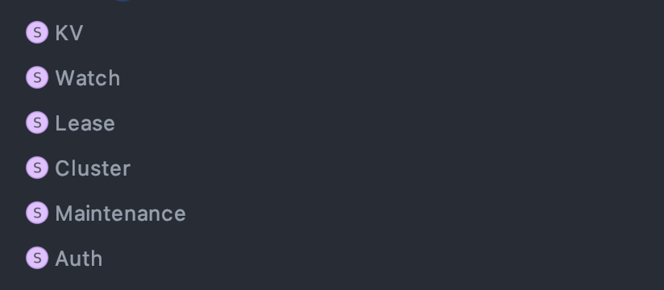

# Etcd API

etcd v3使用 [gRPC](https://www.grpc.io/)作为其消息传递协议。etcd项目包括一个基于gRPC的 [Go客户端](https://github.com/coreos/etcd/tree/master/clientv3)和一个命令行实用程序 [etcdctl](https://github.com/coreos/etcd/tree/master/etcdctl)，用于通过gRPC与etcd集群进行通信。对于不支持gRPC的语言，etcd提供了JSON [gRPC网关](https://github.com/grpc-ecosystem/grpc-gateway)。该网关提供一个RESTful代理，该代理将HTTP / JSON请求转换为gRPC消息。

详细查看：https://github.com/etcd-io/etcd/blob/master/Documentation/dev-guide/api_grpc_gateway.md

下面是两个使用 curl 访问 v3 版本 API 的示例：

```bash
$ curl -L http://localhost:2379/v3/kv/range   -X POST -d '{"key": "Zm9v"}'
$ curl -L http://localhost:2379/v3/kv/range   -X POST -d '{"key": "Zm9v", "range_end": "Zm9w"}' | json_pp
```


etcdctl 默认使用 V2 版本的 API ，可以通过设置环境变量来开启 V3 版本的 API：

```bash
$ export ETCDCTL_API=3
```

在本地直接使用 etcd 命令可以启动一个单机 etcd，我们使用这个单机 etcd 来学习其 API 

除了使用 curl 和 etcdctl 访问 etcd v3 API，还可以通过编程语言来访问，具体可看： [etcd-golang客户端.md](etcd-golang客户端.md) 


---


既然 etcd v3 版本的 API 都是 gRPC 服务，那就从 proto 文件下手，来探索 etcd v3 API。

下载 etcd 源代码。找到 `etcdserver/etcdserverpb/rpc.proto` 文件。

通过 goland 来查看这个 proto 文件的结构，可以看到：



一共有 6 个 Service。

下面先来看 KV 服务，其中定义了最基本最常用的 RPC 方法：

```protobuf
service KV {
  // Range gets the keys in the range from the key-value store.
  rpc Range(RangeRequest) returns (RangeResponse) {
      option (google.api.http) = {
        post: "/v3/kv/range"
        body: "*"
    };
  }

  // Put puts the given key into the key-value store.
  // A put request increments the revision of the key-value store
  // and generates one event in the event history.
  rpc Put(PutRequest) returns (PutResponse) {
      option (google.api.http) = {
        post: "/v3/kv/put"
        body: "*"
    };
  }

  // DeleteRange deletes the given range from the key-value store.
  // A delete request increments the revision of the key-value store
  // and generates a delete event in the event history for every deleted key.
  rpc DeleteRange(DeleteRangeRequest) returns (DeleteRangeResponse) {
      option (google.api.http) = {
        post: "/v3/kv/deleterange"
        body: "*"
    };
  }

  // Txn processes multiple requests in a single transaction.
  // A txn request increments the revision of the key-value store
  // and generates events with the same revision for every completed request.
  // It is not allowed to modify the same key several times within one txn.
  rpc Txn(TxnRequest) returns (TxnResponse) {
      option (google.api.http) = {
        post: "/v3/kv/txn"
        body: "*"
    };
  }

  // Compact compacts the event history in the etcd key-value store. The key-value
  // store should be periodically compacted or the event history will continue to grow
  // indefinitely.
  rpc Compact(CompactionRequest) returns (CompactionResponse) {
      option (google.api.http) = {
        post: "/v3/kv/compaction"
        body: "*"
    };
  }
}
```

可以看到一个 5 个方法。除此之外，还可以看到 URL 路径及方法

在这个 `rpc.proto` 文件的相同目录下，有一个 `rpc.pb.go` 文件，这个文件是 protoc 生成的，里面有一个 `KVServer` 接口：

```go
type KVServer interface {
	// Range gets the keys in the range from the key-value store.
	Range(context.Context, *RangeRequest) (*RangeResponse, error)
	// Put puts the given key into the key-value store.
	// A put request increments the revision of the key-value store
	// and generates one event in the event history.
	Put(context.Context, *PutRequest) (*PutResponse, error)
	// DeleteRange deletes the given range from the key-value store.
	// A delete request increments the revision of the key-value store
	// and generates a delete event in the event history for every deleted key.
	DeleteRange(context.Context, *DeleteRangeRequest) (*DeleteRangeResponse, error)
	// Txn processes multiple requests in a single transaction.
	// A txn request increments the revision of the key-value store
	// and generates events with the same revision for every completed request.
	// It is not allowed to modify the same key several times within one txn.
	Txn(context.Context, *TxnRequest) (*TxnResponse, error)
	// Compact compacts the event history in the etcd key-value store. The key-value
	// store should be periodically compacted or the event history will continue to grow
	// indefinitely.
	Compact(context.Context, *CompactionRequest) (*CompactionResponse, error)
}
```

在 Goland 里面按住 ctrl + h 可以查看接口的实现。

这个接口的实现在 `etcdserver/api/v3rpc/key.go` 目录下，有一个名为 `kvServer` 的结构体。

这个结构体提供了 5 个方法的实现。具体实现就不看了，太多了。

只是学习 API 的话，只看各种 Request 和 Response 结构体就可以了。