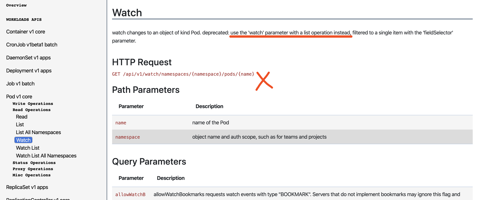

# Kubernetes API 学习（一）- 介绍

Kubernetes 版本为 1.17.3

我想根据官方的 API 源码，API 官方文档，kubectl 工具，curl 等工具来从头到尾的学习一下 Kubernetes API。

API 源码地址：https://github.com/kubernetes/api

API 官方文档：https://kubernetes.io/docs/reference/generated/kubernetes-api/v1.17/

另外，API 的源码也存在与 Kubernetes 源码的 `pkg/apis`  和 `staging/src/k8s.io/api/`包下。

kubectl 获取集群所有的资源对象：

```bash
$ kubectl api-resources
```

kubectl 获取所有k8s的资源对象的版本：

```bash
$ kubectl api-versions | grep k8s
```

也可以通过 curl 获取资源对象的版本：

```
GET /apis
```

关于 API 分类，可以直接看源码中的包分类，如下：


 每个包中，只需关注 `types.go` 和 `register.go` 即可。


这里记录一下错误：

```
GET /api/v1/namespaces/kube-system/pods
```

使用浏览器访问以上 URL 时出错：

```
pods is forbidden: User "system:serviceaccount:default:default" cannot list resource "pods" in API group "" in the namespace "kube-system"
```

default 用户没有权限，怎么办呢？给default加权限呗（生产别这么干）

default-role-binding.yaml：

```yaml
apiVersion: rbac.authorization.k8s.io/v1beta1
kind: ClusterRoleBinding
metadata:
  name: default-role-binding
subjects:
  - kind: ServiceAccount
    # Reference to upper's `metadata.name`
    name: default
    # Reference to upper's `metadata.namespace`
    namespace: default
roleRef:
  kind: ClusterRole
  name: cluster-admin
  apiGroup: rbac.authorization.k8s.io
```

注意这里的 namespace 虽然是 default，但是依然有权限访问其他 namespace，  添加：

```bash
$ kubectl apply -f default-role-binding.yaml
```

然后再用浏览器访问就可以了。这给默认用户加入了所有权限，浏览器访问就方便了。


另外还需要注意，如果需要 watch 一个资源，可以在 URL 参数重加 watch，而不是在地址中加 /watch：

