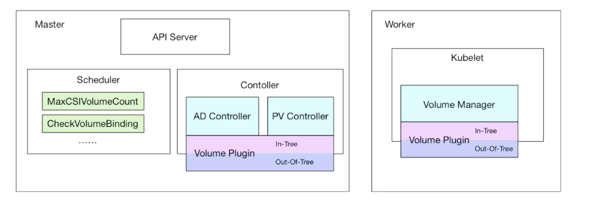

# CSI 工作方式

CSI 是 Kubernetes 中一个比较新的概念，用于对接储存系统。

## 学习资源

CSI 公开课地址：https://edu.aliyun.com/lesson_1651_13092?spm=5176.254948.1387840.13.2c0acad2WRrabG#_13092

CSI 的文档库地址：https://github.com/container-storage-interface/spec

CSI Kubernetes 官方文档：https://kubernetes-csi.github.io/docs/

## Kubernetes 挂载 Volume 过程

下面来梳理一下从一个 PVC 创建，到实际使用的过程。调用过程如下图所示。

首先，根据 List - Watch 机制，kubelet、kube-controller-manager、kube-schduler 一直都在监听 kube-apiserver。

1. 创建一个带有 PVC 的 Pod （使用动态储存卷）
2. kube-controller-manager  中的 PV Controller 监听到 kube-apiserver 中有新的处于待绑定状态的 PVC 对象后，会调用 Volume Plugin（in -tree 或 out-of-tree）创建储存卷，并创建与之对应的 PV 对象。
3. Kube-scheduer 根据 Pod 配置，节点状态，PV 配置等信息，把 Pod 调度到某个节点上。
4. Kube-controller-manager 中的 AD Controller 发现 Pod 和 PV 处于待挂载状态，调用 Volume Plugin（in-tree 或 out-of-tree），将设备挂载到目标节点上，比如 /dev/rbd0，
5. 在 Pod 实际运行的节点上，kubelet 等待挂载完成后，通过 Volume Plugin 把 /dev/rbd0 挂载到指定目录，比如： /var/lib/kubelet/pods/532a00db-251d-4569-8ada-984380b05b1b/volumes/kubernetes.io~csi/pvc-cdc47d0c-23b5-495e-911f-037cc031d0d4/mount
6. kubelet 被告知目录挂载完毕后，启动 Pod 中的容器，用 Docker -v (bind) 的方式将已经挂载到本地的卷映射到容器中！

## Kubernetes 储存架构

架构图如下：

挂载过程：Provision -> Attach -> Mount

卸载过程：Unmount -> Detach -> Delete

组件作用：

- PV Controller：负责 PV/PVC 的绑定，生命周期管理，并根据需求进行数据卷的 Provision/Delete 操作
- AD Controller：负责设备的 Attach/Detach 操作，将设备挂载到目标节点
- Volume Manager：管理卷的 Mount/Unmount 操作，卷设备的格式化等
- Volume Plugins：扩展各种储存类型的卷管理能力，实现第三方的各种操作能力与 Kubernetes 储存系统结合 
- Scheduler：实现 Pod 调度能力，储存相关的调度器实现了针对储存卷配置进行调度

