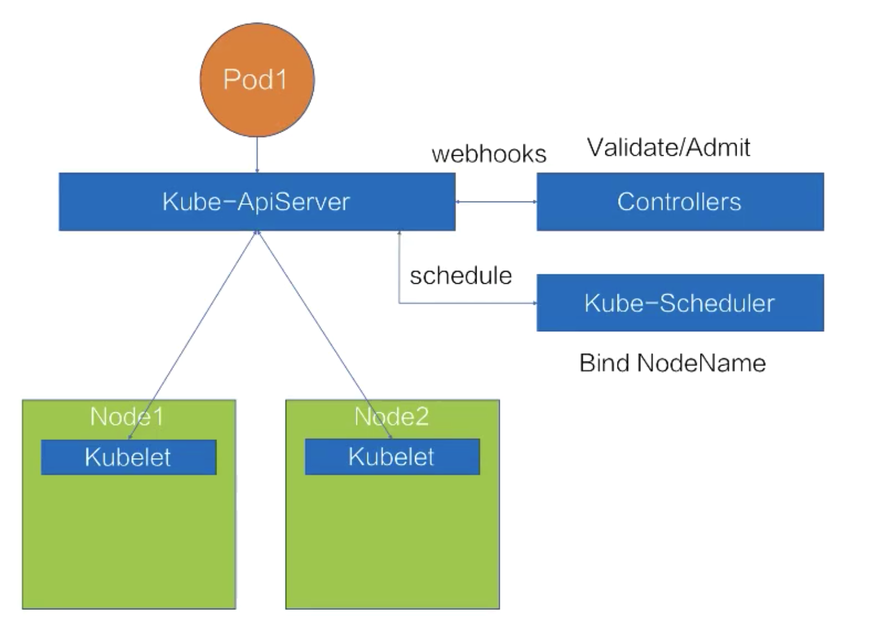

# Kubernetes 调度与资源管理

公开课地址：https://edu.aliyun.com/lesson_1651_13090?spm=5176.10731542.0.0.33d720beJkvduZ#_13090

## Kubernetes 调度过程

调度过程 = 把 Pod 放到合适的 Node 上。

那怎么定义合适？

- 满足 Pod 资源要求
- 满足 Pod 特殊关系要求
- 满足 Node 限制条件的要求
- 集群资源的合理利用

## Kubernetes 基础调度能力

- 资源调度 - 满足 Pod 资源要求
  - Resources: CPU/Memory/Storage/GPU/FGPA
  - QoS: Guaranteed/Burstable/BestEffot
  - Resource Quota
- 关系调度 - 满足 Pod/Node 的特殊关系/条件要求
  - PodAffinity/PodAntiAffinity: Pod 与 Pod 之间的关系
  - NodeSelector/NodeAffinity: 由 Pod 决定适合自己的 Node
  - Taint/Tolerations: 限制调度到某些 Node

## 资源调度

#### 资源配置方法

Pod 的资源类型：

- CPU
- Memory
- ephemeral-storage
- Extended-resource: nvmdia.com/gpu

CPU 和 Memory 很常见，关于 扩展资源见： [为节点发布扩展资源-为容器分派扩展资源.md](../动手操作/为节点发布扩展资源-为容器分派扩展资源.md) 

#### 如何满足资源需求

- request 和 limit
- Pod QoS（Quality of Service）
  - Guaranteed - 高，保障
  - Burstable - 中，弹性
  - BestEffort - 低，尽力而为

关于 QoS 参考： [配置Pod的服务质量.md](../动手操作/配置Pod的服务质量.md) 

QoS Class 是隐性的，不能显示的指定，而是通过 request 和 limit 的组合来自动映射 QoS Class 的。

#### QoS

文档地址：https://kubernetes.io/zh/docs/tasks/configure-pod-container/quality-service-pod/

- 对于 QoS 类为 Guaranteed 的 Pod：
  - Pod 中的每个容器必须指定内存请求和内存限制，并且两者要相等。
  - Pod 中的每个容器必须指定 CPU 请求和 CPU 限制，并且两者要相等。

- 如果满足下面条件，将会指定 Pod 的 QoS 类为 Burstable：
  - Pod 不符合 Guaranteed QoS 类的标准。
  - Pod 中至少一个容器具有内存或 CPU 请求。
- 对于 QoS 类为 BestEffort 的 Pod，Pod 中的容器必须没有设置内存和 CPU 限制或请求。

个人理解：

Guaranteed 保障，就是保障资源一定到位。

Burstable 弹性，就是给一个最低值和最大值，资源需求在中间浮动

BestEffort 尽力而为就是尽最大努力保证资源够用，直至把所有资源耗尽。

## 不同 QoS 的表现

## Kubernetes 高级调度能力

PodPriority/Preemtion 优先级和抢占

