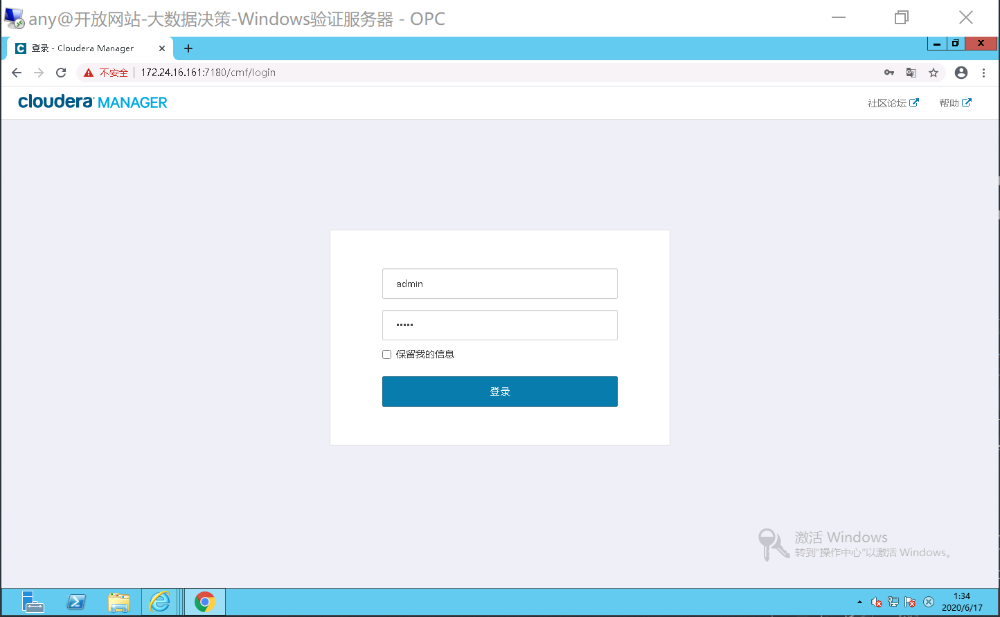
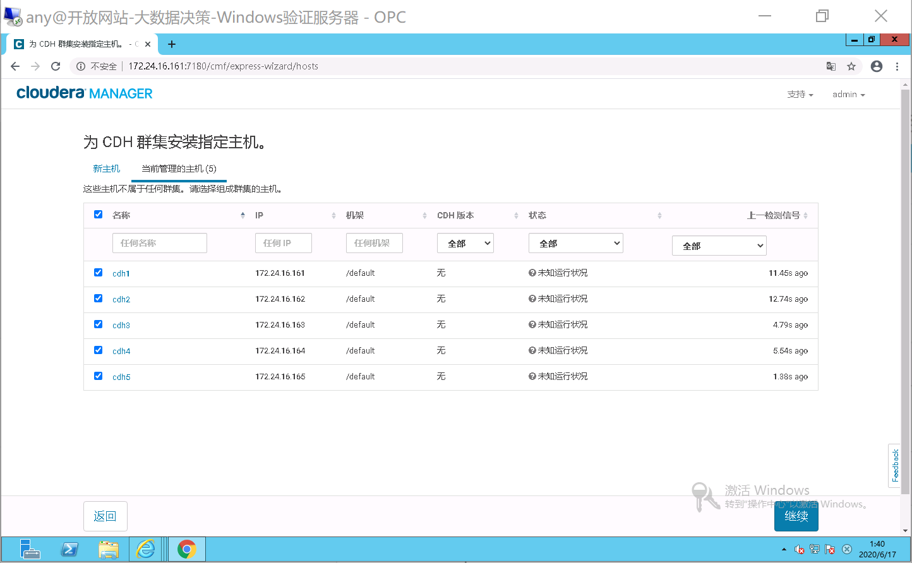
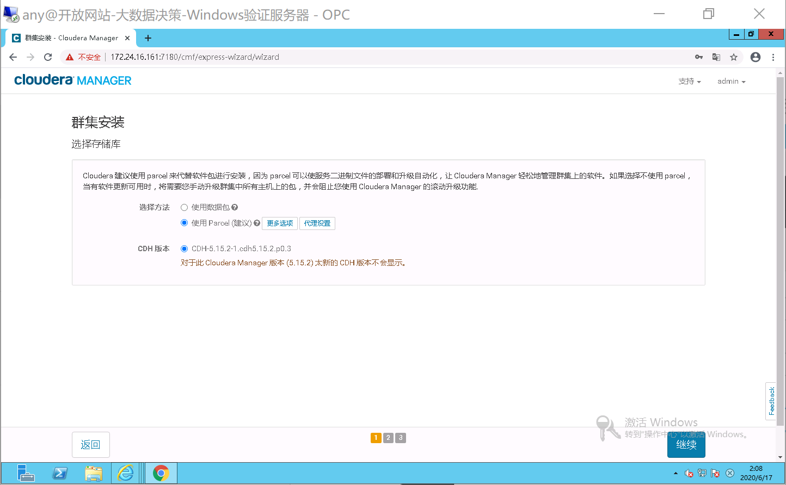
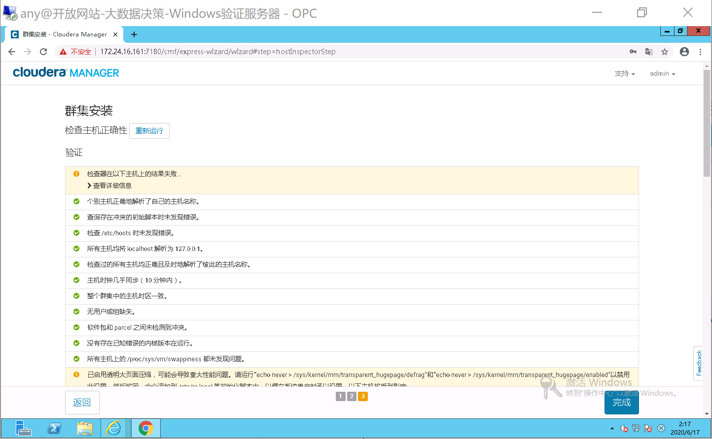
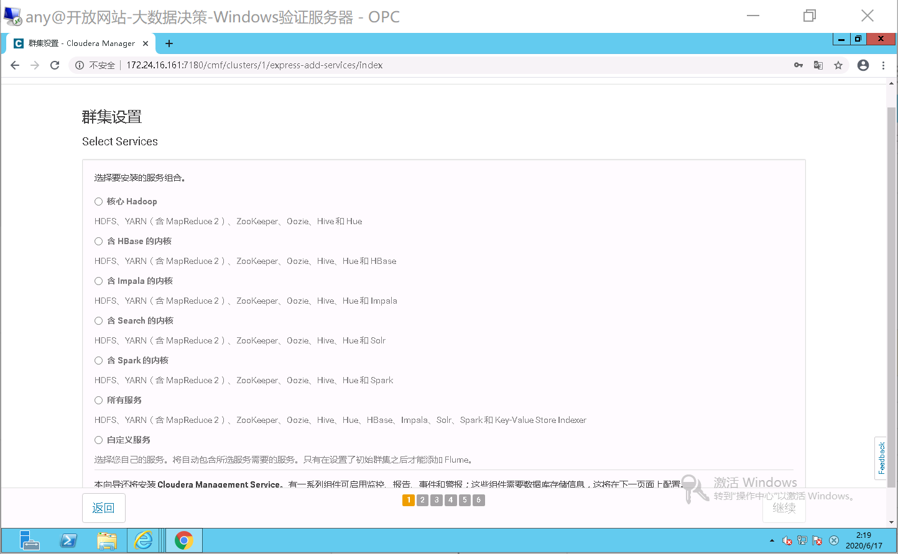
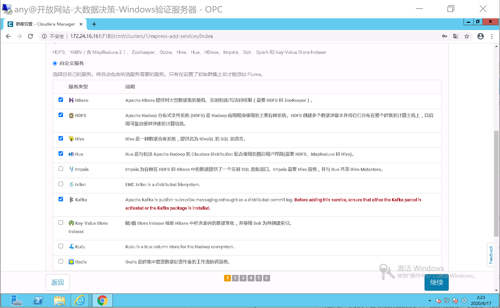
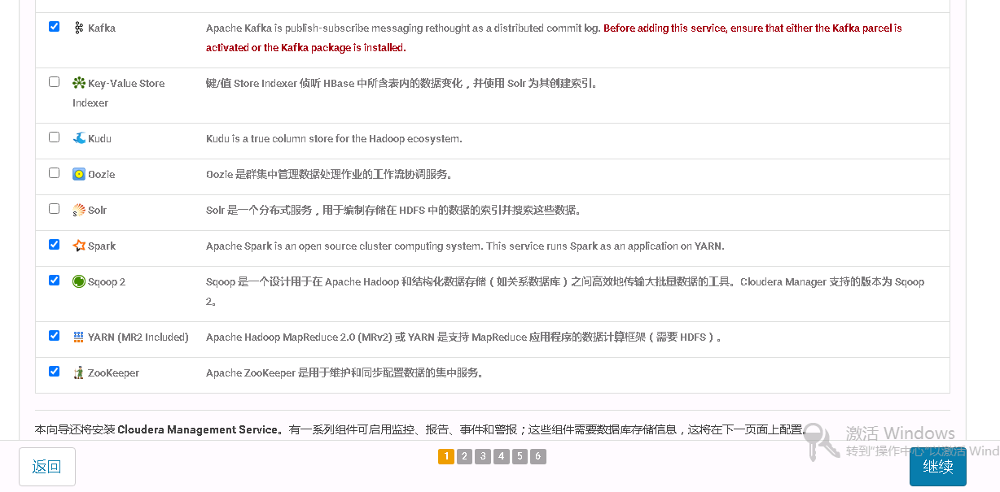
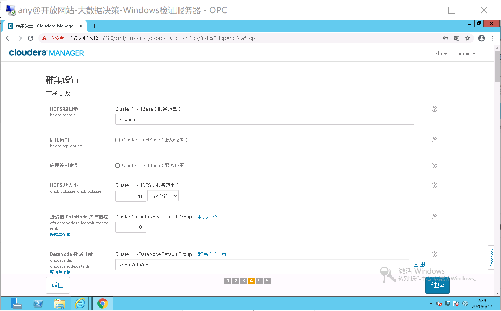

CDH 5.15

## 初始化

关闭防火墙：

```
sudo systemctl stop firewalld
sudo systemctl disable firewalld
```

设置 SWAP:

```
echo vm.swappiness = 10 >> /etc/sysctl.conf
sysctl -w vm.swappiness=10
```

关闭SELinux：

```
sudo setenforce 0
sed -i "s/SELINUX=enforce/SELINUX=disabled/g /etc/selinux/config 
```

JDK部署略，hosts配置略。


## MySQL 配置

查看初始密码：

```
grep 'temporary password'  /var/log/mysqld.log
```

登录：

```
mysql -uroot -P 3316 --socket=/data1/logs/mysql/mysql.sock -p
```

修改密码：

```
mysql> ALTER USER root@localhost identified by 'BBDERS1@bbdops.com';
```

配置数据库：

```mysql
# 创建用于cloudera运行的mysql数据库cmf
mysql> create database cmf  default character set utf8;
mysql> grant all on cmf.* to 'cmf'@'%' identified by 'CMF1@password';
mysql> grant all on cmf.* to 'cmf'@'localhost' identified by 'CMF1@password';

# 创建其他组件的mysql数据库
mysql> create database hive  default character set utf8;
mysql> grant all on hive.* to 'hive'@'%' identified by 'HIVE1@password';
mysql> grant all on hive.* to 'hive'@'localhost' identified by 'HIVE1@password';

mysql> create database oozie  default character set utf8;
mysql> mysql> grant all on oozie.* to 'oozie'@'%' identified by 'OOZIE1@password';
mysql> grant all on oozie.* to 'oozie'@'localhost' identified by 'OOZIE1@password';

mysql> create database hue  default character set utf8;
mysql> grant all on hue.* to 'hue'@'%' identified by 'HUE1@password';
mysql> grant all on hue.* to 'hue'@'localhost' identified by 'HUE1@password';

mysql> SET @@GLOBAL.ENFORCE_GTID_CONSISTENCY = off;
```


## 配置源

编写 `/etc/yum.repo.d/cm.repo`，内容如下：

```
[cloudera-cm]
# Packages for Cloudera's Distribution for cm, Version 5, on RedHat     or CentOS 7 x86_64
name=Cloudera's Distribution for cm, Version 5
baseurl=http://apps1/cm/5/
gpgkey = http://apps1/cm/RPM-GPG-KEY-cloudera
gpgcheck = 1
```

下载 java 链接mysql的jar 包：

```
wget https://cdn.mysql.com//Downloads/Connector-J/mysql-connector-java-5.1.47.tar.gz
tar -zxvf mysql-connector-java-5.1.47.tar.gz
mkdir /usr/share/java
cp mysql-connector-java-5.1.47/mysql-connector-java-5.1.47-bin.jar /usr/share/java/mysql-connector-java.jar
```


## 安装cm

```
yum install cloudera-manager-server -y
```

初始化数据库：

```
sudo /usr/share/cmf/schema/scm_prepare_database.sh mysql --host db --port 3316 cmf cmf CMF1@password
```

启动cm：

```
yum install psmisc -y
# yum install -y mysql-connector-java（适用于cm5.x版本）。
 systemctl start cloudera-scm-server
 systemctl enable cloudera-scm-server
```


## 安装 CM-agent

```bash
sudo yum install cloudera-manager-agent -y
sudo sed -i "s/server_host=localhost/server_host=cdh1/g" /etc/cloudera-scm-agent/config.ini
sudo systemctl start cloudera-scm-agent
sudo systemctl enable cloudera-scm-agent
sudo systemctl status cloudera-scm-agent
```

在每个节点上都要装 cm-agent。


## 准备 Parcel 包

下载 对应版本的 Parcel 包，里面包含了很多大数据组件，把这个包放到本地源中，注意文件权限问题。


## 安装大数据组件

登录 CDH，用户名及密码为：admin/admin



同意协议：


选择免费版：


进入欢迎界面，点击继续：


选择主机：


点击当前管理的主机，点击全选，再点继续：



等待一会。选择 parcel 包：


点击更多选项：


配置好 parcel 的所在地址。配好之后，就可以点击继续了：



等待集群安装完成：


全部完成后，界面如下，点击继续：


验证机器正确性：



黄色的是警告，可以忽略，如果有强迫症可以根据提示进行解决，我这里点击完成。

选择服务：



我这里根据需求，选择了自定义服务：





集群设置：


设置数据库，数据库在上面已经创建完成了，这里配置连接，完成后点击继续：


集群设置，默认设置，点击继续：



等待集群设置完成后，点击继续。

由于错误太多，只能单独一个一个地解决，最终完成如下：


然后需要单独安装 Kafka 和 Spark2


## Spark2 安装

参考[https://www.sysit.cn/blog/post/sysit/cloudera%E5%AE%89%E8%A3%85spark2.1](https://www.sysit.cn/blog/post/sysit/cloudera安装spark2.1)

在 http://archive.cloudera.com/spark2/ 中下载 Spark2 的包。

将 parcel 包放入本地源中。


## kafka 安装

kafka 与 Spark2 的安装套路基本一致，kafka 可以省略 csd 的配置。


## 结果

最后结果如下：

