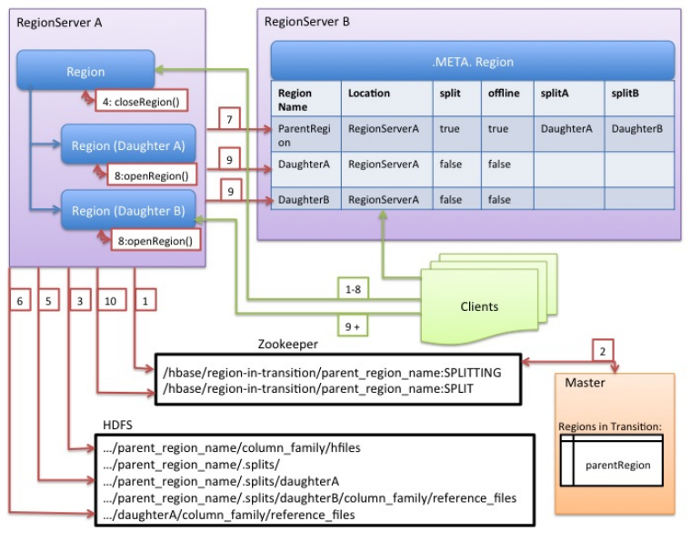

# HBase 官方架构

官方文档：https://hbase.apache.org/book.html#_architecture

HBase是一种“ NoSQL”数据库。 “ NoSQL”是一个通用术语，表示该数据库不是支持SQL作为其主要访问语言的RDBMS，但是NoSQL数据库的类型很多：BerkeleyDB是本地NoSQL数据库的一个示例，而HBase在很大程度上分布式数据库。从技术上讲，HBase实际上比“数据库”更像是“数据存储”，因为它缺少您在RDBMS中发现的许多功能，例如类型列，二级索引，触发器和高级查询语言等。

但是，HBase具有支持线性和模块化缩放的许多功能。 HBase群集通过添加在商品类服务器上托管的RegionServer来扩展。例如，如果群集从10个RegionServer扩展到20个，则在存储和处理能力方面都会翻倍。 RDBMS可以很好地扩展，但只能扩展到一个点-特别是单个数据库服务器的大小-为了获得最佳性能，需要专用的硬件和存储设备。注意的HBase功能包括：

- 高度一致的读/写：HBase不是“最终一致”的数据存储。这使得它非常适合诸如高速计数器聚合之类的任务。
- 自动分片：HBase表通过区域分布在群集上，并且随着数据的增长，区域会自动拆分和重新分布。
- 自动RegionServer故障转移
- Hadoop / HDFS集成：HBase开箱即用地支持HDFS作为其分布式文件系统。
- MapReduce：HBase支持通过MapReduce大规模并行化处理，以将HBase用作源和接收器。
- Java客户端API：HBase支持易于使用的Java API进行编程访问。
- Thrift / REST API：HBase还为非Java前端支持Thrift和REST。
- 块缓存和Bloom过滤器：HBase支持块缓存和Bloom过滤器，以进行大量查询优化。
- 运维管理：HBase提供了内置的网页，以提供运营见解以及JMX指标。

---

HBase并非适合所有问题。

首先，请确保您有足够的数据。如果您有数亿或数十亿行，那么HBase是一个很好的选择。如果您只有数千行/百万行，则使用传统的RDBMS可能是一个更好的选择，原因是您的所有数据都可能在单个节点（或两个节点）上结束，而集群的其余部分可能处于停顿状态闲。

其次，确保没有RDBMS提供的所有其他功能（例如，类型化的列，二级索引，事务，高级查询语言等），您就可以生存。不能简单地通过更改将基于RDBMS构建的应用程序“移植”到HBase。例如JDBC驱动程序。考虑从RDBMS迁移到HBase，作为与端口相对的完整重新设计。

第三，确保您有足够的硬件。甚至少于5个数据节点（由于诸如HDFS块复制（默认值为3）之类的东西）以及一个NameNode的情况，HDFS也不能很好地完成工作。

HBase在笔记本电脑上可以很好地独立运行-但这仅应视为开发配置。

---

HDFS是一个分布式文件系统，非常适合存储大文件。它的文档指出，它不是通用文件系统，并且不提供文件中的快速个人记录查找。另一方面，HBase构建在HDFS之上，并为大型表提供快速记录查找（和更新）。有时这可能是概念上的混乱点。 HBase在内部将数据放入HDFS上存在的索引“ StoreFiles”中，以进行高速查找。有关HBase如何实现其目标的更多信息，请参见数据模型和本章的其余部分。


## 目录表

目录表 `hbase:meta` 作为 HBase 表存在，并已从 HBase Shell 的 list 命令中过滤掉，但实际上是一个表，与其他任何表一样。


#### hbase:meta

`hbase:meta`表（以前的版本叫 .META.），保存了 HBase 中的所有 regions，并且 hbase:meta 的位置是储存在 ZooKeeper 中的 。

hbase:meta 的结构如下：

**Key**

- Key 的格式为 `[table],[region start key],[region id]`

**Values**

- `info:regioninfo`（[HRegionInfo](https://hbase.apache.org/apidocs/org/apache/hadoop/hbase/HRegionInfo.html) 实例的序列化）
- `info:server`（RegionServer 的地址信息）
- `info:serverstartcode`（RegionServer 的启动时间）

当表正在拆分时，将创建另外两个列，分别为`info:splitA`和 `info:splitB` 。这些列代表两个子区域。这些列的值也是序列化的HRegionInfo实例。分割区域后，最终将删除此行。

运行以下命令查看这个表：

```
hbase(main)> scan 'hbase:meta'
```


## Client

HBase客户端找到正在服务的特定行范围的RegionServer。它通过查询 hbase:meta 表来做到这一点。找到所需的 Region 后，客户端将联系服务该 Region 的RegionServer，而不是通过 Master，并发出读取或写入请求。此信息被缓存在客户端中，因此后续请求无需经过查找过程。如果由主负载平衡器重新分配了区域，或者由于RegionServer已经失效，则客户端将重新查询目录表以确定用户区域的新位置。

有关主服务器对HBase客户端通信的影响的更多信息，请参见[Runtime Impact](https://hbase.apache.org/book.html#master.runtime) 。

管理功能通过[Admin](https://hbase.apache.org/apidocs/org/apache/hadoop/hbase/client/Admin.html)实例完成


#### 客户端连接

参考：https://hbase.apache.org/book.html#client_dependencies

如果以独立模式运行HBase，则无需配置任何内容即可让客户端正常工作，只要它们都在同一台计算机上即可。

从版本3.0.0开始，默认的连接注册表已切换到基于 Master 的实现。参考 https://hbase.apache.org/book.html#client.masterregistry 。根据您的HBase版本，以下是预期的最小客户端配置。

**在 2.x.y 版本之前**

在2.x.y版本中，默认的连接注册表基于ZooKeeper作为真实的来源。这意味着客户端总是查找ZooKeeper znode来获取所需的元数据。例如，如果活动的主节点崩溃并且选择了新的主节点，则客户端会查找主znode来获取活动的主地址（类似于元位置）。这意味着客户端需要访问ZooKeeper，并且需要知道ZooKeeper集成信息，然后才能执行任何操作。可以在客户端配置xml中进行如下配置：

```xml
<?xml version="1.0"?>
<?xml-stylesheet type="text/xsl" href="configuration.xsl"?>
<configuration>
  <property>
    <name>hbase.zookeeper.quorum</name>
    <value>example1,example2,example3</value>
    <description> Zookeeper ensemble information</description>
  </property>
</configuration>
```

**3.0.0 标准版**

在 Hbase 3.0 中，默认实现已切换到基于 Master 的连接注册表。通过此实现，客户端始终可以与活动或备用主RPC端点联系，以获取连接注册表信息。这意味着客户端在执行任何操作之前应该有权访问活动和主端点列表。可以在客户端配置xml中进行如下配置：

```xml
<?xml version="1.0"?>
<?xml-stylesheet type="text/xsl" href="configuration.xsl"?>
<configuration>
  <property>
    <name>hbase.masters</name>
    <value>example1,example2,example3</value>
    <description>List of master rpc end points for the hbase cluster.</description>
  </property>
</configuration>
```

hbase.masters的配置值是用逗号分隔的host:port值列表。如果未指定端口值，则默认为16000。

通常，此配置保留在hbase-site.xml中，并由客户端从CLASSPATH中拾取。

如果正在配置要运行HBase客户端的IDE，则应在类路径中包含 conf/ 目录，以便可以找到hbase-site.xml设置（或添加src/test/resources来选择使用的hbase-site.xml通过测试）。

对于使用Maven的Java应用程序，建议在连接到集群时包括hbase-shaded-client模块依赖项：

```xml
<dependency>
  <groupId>org.apache.hbase</groupId>
  <artifactId>hbase-shaded-client</artifactId>
  <version>2.0.0</version>
</dependency>
```


#### Java 客户端连接

例如，以编程方式为集群设置ZooKeeper集成，请执行以下操作：

```java
Configuration config = HBaseConfiguration.create();
config.set("hbase.zookeeper.quorum", "localhost");  // Until 2.x.y versions
// ---- or ----
config.set("hbase.masters", "localhost:1234"); // Starting 3.0.0 version
```


## Client Request Filters

可以使用在RegionServer上应用的筛选器来配置Get和Scan实例。

过滤器可能会造成混乱，因为类型很多，最好通过了解过滤器功能组来进行过滤。


## Master

`HMaster` 是 Master 服务的实现，Master 服务器负责监视群集中的所有RegionServer实例，并且是所有元数据更改的接口。在分布式群集中，主服务器相当于NameNode。


#### Startup

如果在多 Master 服务器环境中运行，则所有 Master 服务器都将竞争运行集群。如果活动的主服务器失去了在ZooKeeper中的租约（或主服务器关闭），则剩余的主服务器将争夺主服务器角色。


#### Runtime Impact

常见的分发列表问题涉及当主服务器崩溃时，HBase群集会崩溃。此信息已在3.0中更改。


#### 2.x.y 版本之前

因为 HBase 客户端直接与 RegionServer 通信，所以群集仍可以在“稳定状态”下运行。此外，根据目录表，hbase:meta 作为 HBase 表存在，并且不驻留在 Master 数据库中。但是，Master 服务器控制着关键功能，例如 RegionServer 故障转移和完成区域划分。因此，尽管在没有 Master 的情况下群集仍可以短时间运行，但应该尽快重新启动Master。


#### 3.0.0 版本之后

- 建立连接至少需要一个活动 Master 服务器或备用 Mastter 服务器，而以前所需的所有客户端都是ZooKeeper集成。
- 主机现在处于读/写操作的关键路径中。例如，如果元数据 region 调到了其他 region server，则客户端需要主服务器来获取新位置。之前，是通过直接从 ZooKeeper 获取此信息来完成的。
- 现在，Master 将具有比以前更高的连接负载。因此，服务器端配置可能需要根据负载进行调整。

总体而言，启用此功能后，Master 正常运行时间要求会更高，客户端操作才能通过。


#### Interface

HMasterInterface 公开的方法主要是面向元数据的方法：

- Table (createTable, modifyTable, removeTable, enable, disable)
- ColumnFamily (addColumn, modifyColumn, removeColumn)
- Region (move, assign, unassign) 例如，当调用Admin方法disableTable时，它由主服务器提供服务。


#### 进程

Master 服务器运行几个后台线程：

- **LoadBalancer**

  周期性地，当没有过渡 regions 时，负载均衡器将运行并移动区域，以平衡集群的负载。请参阅[Balancer](https://hbase.apache.org/book.html#balancer_config)以配置此属性。

  参考：[Region-RegionServer Assignment](https://hbase.apache.org/book.html#regions.arch.assignment) 

- **CatalogJanitor**

  定期检查并清理 hbase:meta 表。

- **MasterProcWAL**

  在hbase-2.3.0中，MasterProcWAL被过程存储实现替换；

  HMaster 将管理操作及其运行状态（例如，崩溃服务器的处理，表创建和其他DDL）记录到过程存储中。WAL存储在MasterProcWALs目录下。Master WAL与RegionServer WAL不同。Master WAL保持不变，我们可以运行状态机，该状态机可在Master故障中保持弹性。例如，如果 HMaster 在创建表的过程中遇到问题并失败，则下一个活动的HMaster可以接管上一个中断的HMaster，并完成操作。从hbase-2.0.0开始，引入了新的AssignmentManager（AKA AMv2），HMaster处理区域分配操作，服务器崩溃处理，平衡等操作，全部通过AMv2保留所有状态并转换为MasterProcWAL，而不是ZooKeeper，例如我们在hbase-1.x中进行。

  参考：https://hbase.apache.org/book.html#amv2


## RegionServer

HRegionServer是RegionServer实现。它负责服务和管理 regions。在分布式群集中，RegionServer相当于DataNode。

#### 进程

- **CompactSplitThread**

  检查是否有数据损坏并处理较小的压缩。

- **MajorCompactionChecker**

  检查压缩

- **MemStoreFlusher**

  定期将 MemStore 中的内存中写入刷新到 StoreFiles。

- **LogRoller**

  定期检查RegionServer的WAL。


#### 块缓存

HBase 提供了两种不同的 BlockCache 实现来缓存从 HDFS 读取的数据：默认的堆上LruBlockCache和BucketCache（通常是堆外）。


#### RegionServer拆分实现

当写入请求由 region server 处理时，它们会堆积在一个称为 memstore 的内存存储系统中。内存存储填满后，其内容将作为其他存储文件写入磁盘。此事件称为内存存储刷新。随着存储文件的累积，RegionServer 将把它们压缩为更少，更大的文件。每次刷新或压缩完成后，该区域中存储的数据量已更改。 RegionServer 会查询 region 拆分策略以确定该区域是否太大或由于其他特定于策略的原因而被拆分。如果策略建议，则将区域划分请求加入队列。

从逻辑上讲，分割 region 的过程很简单。我们在 region 的键空间中找到了一个合适的点，该区域应将区域分成两半，然后在该点将 region 的数据分为两个新 region。但是，该过程的细节并不简单。发生拆分时，新创建的子 region 不会立即将所有数据重写到新文件中。而是，它们创建类似于符号链接文件的小文件，称为参考文件，这些文件根据拆分点指向父存储文件的顶部或底部。参考文件的使用与常规数据文件一样，但是只考虑了一半的记录。仅当没有更多对父区域的不可变数据文件的引用时，才可以分割区域。这些参考文件将通过压缩逐步清除，因此该区域将停止引用其父文件，并且可以进一步拆分。

尽管分割 region 是RegionServer的本地决定，但是分割过程本身必须与许多参与者协调。 RegionServer在拆分之前和之后通知 Master 服务器，更新.META表，以便客户端可以发现新的子 region ，并重新排列 HDFS 中的目录结构和数据文件。拆分是一个多任务过程。为了在发生错误时启用回滚，RegionServer会保留有关执行状态的内存日志。 RegionServer拆分过程中说明了RegionServer执行拆分的步骤。

每个步骤均标有其步骤编号。来自RegionServers或Master的操作以红色显示，而来自客户端的操作以绿色显示：



看上去还挺容易懂的，不具体介绍了。


#### Write Ahead Log (WAL)

预写日志（WAL）将对HBase中数据的所有更改记录到基于文件的存储中。在正常操作下，不需要WAL，因为数据更改从MemStore移到StoreFiles。但是，如果在刷新MemStore之前RegionServer崩溃或变得不可用，则WAL确保可以重播对数据的更改。如果写入WAL失败，则修改数据的整个操作将失败。

HBase使用WAL接口的实现。通常，每个RegionServer仅存在一个WAL实例。携带hbase:meta的RegionServer是一个例外。元表将获得自己的专用WAL。 RegionServer将Puts和Deletes记录到其WAL，然后将它们记录到受影响的这些Mutation MemStore。

> HLog
>
> 在2.0之前的版本中，HBase中WAL的接口称为HLog。在0.94中，HLog是WAL实例的名称。您可能会在针对这些较早版本量身定制的文档中找到对HLog的引用。

WAL保存在 HDFS 的 /hbase/WALs/ 目录中，每个 region 都有子目录。


## Regions

Regions是表的可用性和分布的基本元素，并且由每个列族的存储组成。对象的层次结构如下：

```
Table                    (HBase table)
    Region               (Regions for the table)
        Store            (Store per ColumnFamily for each Region for the table)
            MemStore     (MemStore for each Store for each Region for the table)
            StoreFile    (StoreFiles for each Store for each Region for the table)
                Block    (Blocks within a StoreFile within a Store for each Region for the table)
```

有关写入HDFS时HBase文件的描述，参考：[Browsing HDFS for HBase Objects](https://hbase.apache.org/book.html#trouble.namenode.hbase.objects).


