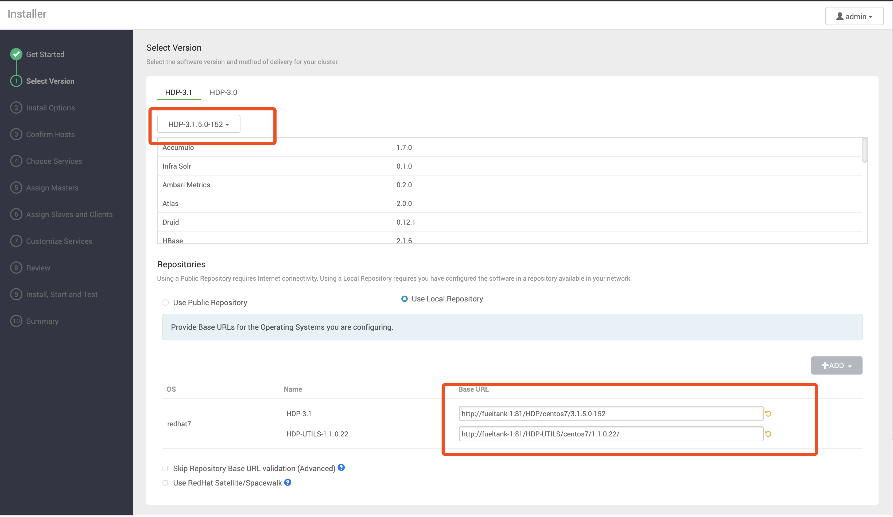

# HDP 离线安装

HDP 3.1.5 下载地址：https://docs.cloudera.com/HDPDocuments/Ambari-2.7.5.0/bk_ambari-installation/content/hdp_315_repositories.html

3.1.5 要订阅用户的账号。。。。。。

HDP 3.1.0 下载地址：https://docs.cloudera.com/HDPDocuments/Ambari-2.7.3.0/bk_ambari-installation/content/hdp_31_repositories.html

3.1.0 的不需要。

Ambari 安装官方教程：https://docs.cloudera.com/HDPDocuments/Ambari-2.7.5.0/bk_ambari-installation/content/ch_Getting_Ready.html

Ambari 安装大神教程：[https://www.sysit.cn/blog/post/sysit/CentOS7.3%E5%AE%89%E8%A3%85Ambari%E5%8F%8A%E4%BD%BF%E7%94%A8HDP%E9%83%A8%E7%BD%B2hadoop%E9%9B%86%E7%BE%A4%E6%9C%8D%E5%8A%A1](https://www.sysit.cn/blog/post/sysit/CentOS7.3安装Ambari及使用HDP部署hadoop集群服务)


----


## 安装 MySQL

安装教程： [MySQL离线环境主从搭建.md](../../数据存储/MySQL/MySQL离线环境主从搭建.md) 

## 配置 Ambari 源

本地源的配置见： [yum离线源的配置.md](../../Linux/yum/yum离线源的配置.md) 

解压 Ambari 的压缩包，因为根文件系统下储存不够，所以这里建立软连接：

```bash
$ ln -s /mnt/vde/HDP/ambari /var/www/html/ambari
```


编辑 `/etc/yum.repos.d/ambari.repo` 文件：

```
[ambari-2.7.5.0-72]
name=ambari Version - ambari-2.7.5.0-72
baseurl=http://fueltank-1:81/ambari/centos7/2.7.5.0-72/
gpgcheck=1
gpgkey=http://fueltank-1:81/ambari/centos7/2.7.5.0-72/RPM-GPG-KEY/RPM-GPG-KEY-Jenkins
enabled=1
priority=1
```

然后执行：

```bash
$ yum makecache
$ yum repolist
```


## 安装 Ambari Server

执行命令：

```bash
$ yum install ambari-server
```

配置：

```bash
$ ambari-server setup
```

下面是我的配置过程：

```
Using python  /usr/bin/python
Setup ambari-server
Checking SELinux...
SELinux status is 'disabled'
Customize user account for ambari-server daemon [y/n] (n)? 
Adjusting ambari-server permissions and ownership...
Checking firewall status...
Checking JDK...
[1] Oracle JDK 1.8 + Java Cryptography Extension (JCE) Policy Files 8
[2] Custom JDK
==============================================================================
Enter choice (1): 2
WARNING: JDK must be installed on all hosts and JAVA_HOME must be valid on all hosts.
WARNING: JCE Policy files are required for configuring Kerberos security. If you plan to use Kerberos,please make sure JCE Unlimited Strength Jurisdiction Policy Files are valid on all hosts.
Path to JAVA_HOME: /usr/java/jdk1.8.0_231-amd64/
Validating JDK on Ambari Server...done.
Check JDK version for Ambari Server...
JDK version found: 8
Minimum JDK version is 8 for Ambari. Skipping to setup different JDK for Ambari Server.
Checking GPL software agreement...
GPL License for LZO: https://www.gnu.org/licenses/old-licenses/gpl-2.0.en.html
Enable Ambari Server to download and install GPL Licensed LZO packages [y/n] (n)? 
Completing setup...
Configuring database...
Enter advanced database configuration [y/n] (n)? 
Configuring database...
Default properties detected. Using built-in database.
Configuring ambari database...
Checking PostgreSQL...
Running initdb: This may take up to a minute.
Initializing database ... OK


About to start PostgreSQL
Configuring local database...
Configuring PostgreSQL...
Restarting PostgreSQL
Creating schema and user...
done.
Creating tables...
done.
Extracting system views...
ambari-admin-2.7.5.0.72.jar
....
Ambari repo file doesn't contain latest json url, skipping repoinfos modification
Adjusting ambari-server permissions and ownership...
Ambari Server 'setup' completed successfully.
```


## Ambari Agent安装

像上面那样配置完源后：

```bash
$ yum install ambari-agent
```

修改配置文件 `/etc/ambari-agent/conf/ambari-agent.ini ` ，将 hostname 改为 Ambari Server 的地址，我这里是 fueltank-1。

然后启动：

```bash
$ ambari-agent start
```


## 打开 Web 界面

浏览器打开：http://fueltank-1:8080/ ，用户名及密码为 admin/admin

#### 坑1: ambari 中没有对应的 HDP 版本

在 HDP 的包中，有一个 `HDP-3.1.5.0-152.xml` 文件，传上去就好了。


#### 本地源配置




