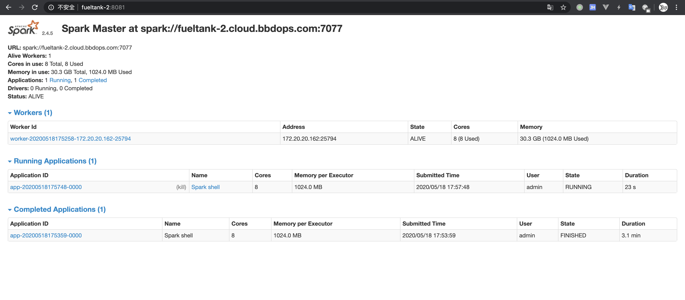

# Spark 高可用部署

首先下载 Spark 二进制文件：

```bash
$ wget https://mirror.bit.edu.cn/apache/spark/spark-2.4.5/spark-2.4.5-bin-hadoop2.7.tgz
```

解压并重命名：

```bash
$ tar zxvf spark-2.4.5-bin-hadoop2.7.tgz 
$ sudo mv spark-2.4.5-bin-hadoop2.7/ /opt/spark
```


## 配置修改

```bash
$ mv conf/spark-env.sh.template conf/spark-env.sh
```

添加如下配置：

```bash
export SPARK_DAEMON_JAVA_OPTS="-Dspark.deploy.recoveryMode=ZOOKEEPER  -Dspark.deploy.zookeeper.url=fueltank-1:2181,fueltank-2:2181,fueltank-3:2181  -Dspark.deploy.zookeeper.dir=/spark"
```


## 启动一个单点

启动 master：

```bash
$ ./sbin/start-all.sh 
```

`./sbin/start-all.sh ` 的内容如下：

```bash
if [ -z "${SPARK_HOME}" ]; then
  export SPARK_HOME="$(cd "`dirname "$0"`"/..; pwd)"
fi

# Load the Spark configuration
. "${SPARK_HOME}/sbin/spark-config.sh"

# Start Master
"${SPARK_HOME}/sbin"/start-master.sh

# Start Workers
"${SPARK_HOME}/sbin"/start-slaves.sh
```

返回如下：

```
starting org.apache.spark.deploy.master.Master, logging to /opt/spark/logs/spark-admin-org.apache.spark.deploy.master.Master-1-fueltank-1.cloud.bbdops.com.out
localhost: Warning: Permanently added 'localhost' (ECDSA) to the list of known hosts.
localhost: starting org.apache.spark.deploy.worker.Worker, logging to /opt/spark/logs/spark-admin-org.apache.spark.deploy.worker.Worker-1-fueltank-1.cloud.bbdops.com.out
```

在这个日志文件中，有一条日志，如下：

```
2020-05-18 17:06:44,977 INFO master.Master: Starting Spark master at spark://fueltank-1.cloud.bbdops.com:7077
```

打开界面 http://fueltank-1:8081/ 如下：


使用 spark-shell 连接 master：

```bash
$ MASTER=spark://fueltank-1.cloud.bbdops.com:7077 ./bin/spark-shell
```

如果这时候再执行：

```bash
$ ./sbin/stop-all.sh 
```

会发现 spark-shell 端掉了。


## Master 高可用

重新启动上面的 start-all.sh 之后。

再从另外一台机器上启动一个 Master：

```bash
$ ./sbin/start-master.sh
```

这时候再运行：

```bash
$ MASTER=spark://fueltank-1.cloud.bbdops.com:7077 ./bin/spark-shell
```

这时候再从第一台上停掉 master：

```
./sbin/stop-master.sh 
```

这时saprk-shell花费了30秒左右的时候切换到bigdata002 上的Master了。

并且通过 http://fueltank-2:8081/ 查看第二台的状态，已经变成 Alive 了。




**设计理念**

 为了解决Standalone模式下的Master的SPOF，Spark采用了ZooKeeper提供的选举功能。Spark并没有采用ZooKeeper原生的Java API，而是采用了Curator，一个对ZooKeeper进行了封装的框架。采用了Curator后，Spark不用管理与ZooKeeper的连接，这些对于Spark来说都是透明的。Spark仅仅使用了100行代码，就实现了Master的HA。


## 高可用部署

通过以上实践。可以使用 ZooKeeper 配置来保证 Master 的高可用。然后在启动 Slave ，即启动 Worker 节点时，使用以下方式启动：

```bash
$ ./sbin/start-slave.sh spark://fueltank-2.cloud.bbdops.com:7077
```

这样，就可以把 worker 节点连接到 master 了，即使这个master 挂了，这些 worker 节点也会连接到其他 master。这样就实现了高可用！！！


