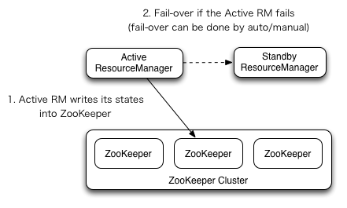

# ResourceManager启用HA

官方文档：https://hadoop.apache.org/docs/current/hadoop-yarn/hadoop-yarn-site/ResourceManagerHA.html

本指南概述了YARN ResourceManager的高可用性，并详细介绍了如何配置和使用此功能。 ResourceManager（RM）负责跟踪集群中的资源，并调度应用程序（例如MapReduce作业）。在Hadoop 2.4之前，ResourceManager是YARN群集中的单点故障。高可用性功能以“活动/备用ResourceManager”对的形式添加了冗余，以消除此单点故障。


## 架构



#### RM 故障转移

ResourceManager HA通过Active / Standby体系结构实现-在任何时间点，RM之一都是Active，并且一个或多个RM处于Standby模式，等待Active发生任何故障。启用自动故障转移后，从管理员（通过CLI）或集成的故障转移控制器来触发转换为活动的触发。


## 手动转换和故障转移

如果未启用自动故障转移，则管理员必须手动将其中一个RM转换为Active。要从一个RM到另一个RM进行故障转移，他们应该先将Active-RM转换为Standby，然后将Standby-RM转换为Active。所有这些都可以使用“ yarn rmadmin” CLI完成。


## 自动故障转移

RM可以选择嵌入基于Zookeeper的ActiveStandbyElector，以确定哪个RM应该是Active。当Active发生故障或无响应时，另一个RM将自动被选为Active，然后接管。请注意，不需要像HDFS那样运行单独的ZKFC守护程序，因为嵌入在RM中的ActiveStandbyElector充当故障检测器和领导者选举者，而不是单独的ZKFC守护进程。


## RM在故障转移时的 Client、ApplicationMaster 和 NodeManager

当有多个RM时，客户端和节点使用的配置（yarn-site.xml）应该列出所有RM。客户端，ApplicationMaster（AM）和NodeManager（NM）尝试以循环方式连接到RM，直到它们到达活动RM。如果Active发生故障，则它们将继续轮询，直到命中“新” Active。此默认重试逻辑实现为org.apache.hadoop.yarn.client.ConfiguredRMFailoverProxyProvider。您可以通过实现org.apache.hadoop.yarn.client.RMFailoverProxyProvider并将yarn.client.failover-proxy-provider的值设置为类名来覆盖逻辑。在非ha模式下运行时，请改为设置yarn.client.failover-no-ha-proxy-provider的值。


## 恢复 RM 状态

启用ResourceManager重新启动后，被提升为活动状态的RM会加载RM内部状态，并根据RM重新启动功能，尽可能从先前的活动状态停止运行。将为先前提交给RM的每个托管应用程序产生一个新尝试。应用程序可以定期检查点以避免丢失任何工作。状态存储必须在两个活动/备用RM中均可见。当前，有两种用于持久性的RMStateStore实现-FileSystemRMStateStore和ZKRMStateStore。 ZKRMStateStore隐式允许在任何时间点对单个RM进行写访问，因此是建议在HA群集中使用的存储。使用ZKRMStateStore时，无需使用单独的防护机制来解决潜在的裂脑情况，在这种情况下，多个RM可以潜在地充当主动角色。使用ZKRMStateStore时，建议不要在Zookeeper群集上设置“ zookeeper.DigestAuthenticationProvider.superDigest”属性，以确保Zookeeper管理员无法访问YARN应用程序/用户凭证信息。


## 部署

#### 配置

| Configuration Properties                                | Description                                                  |
| :------------------------------------------------------ | :----------------------------------------------------------- |
| `hadoop.zk.address`                                     | Address of the ZK-quorum. Used both for the state-store and embedded leader-election. |
| `yarn.resourcemanager.ha.enabled`                       | Enable RM HA.                                                |
| `yarn.resourcemanager.ha.rm-ids`                        | List of logical IDs for the RMs. e.g., “rm1,rm2”.            |
| `yarn.resourcemanager.hostname.`*rm-id*                 | For each *rm-id*, specify the hostname the RM corresponds to. Alternately, one could set each of the RM’s service addresses. |
| `yarn.resourcemanager.address.`*rm-id*                  | For each *rm-id*, specify host:port for clients to submit jobs. If set, overrides the hostname set in `yarn.resourcemanager.hostname.`*rm-id*. |
| `yarn.resourcemanager.scheduler.address.`*rm-id*        | For each *rm-id*, specify scheduler host:port for ApplicationMasters to obtain resources. If set, overrides the hostname set in `yarn.resourcemanager.hostname.`*rm-id*. |
| `yarn.resourcemanager.resource-tracker.address.`*rm-id* | For each *rm-id*, specify host:port for NodeManagers to connect. If set, overrides the hostname set in `yarn.resourcemanager.hostname.`*rm-id*. |
| `yarn.resourcemanager.admin.address.`*rm-id*            | For each *rm-id*, specify host:port for administrative commands. If set, overrides the hostname set in `yarn.resourcemanager.hostname.`*rm-id*. |
| `yarn.resourcemanager.webapp.address.`*rm-id*           | For each *rm-id*, specify host:port of the RM web application corresponds to. You do not need this if you set `yarn.http.policy` to `HTTPS_ONLY`. If set, overrides the hostname set in `yarn.resourcemanager.hostname.`*rm-id*. |
| `yarn.resourcemanager.webapp.https.address.`*rm-id*     | For each *rm-id*, specify host:port of the RM https web application corresponds to. You do not need this if you set `yarn.http.policy` to `HTTP_ONLY`. If set, overrides the hostname set in `yarn.resourcemanager.hostname.`*rm-id*. |
| `yarn.resourcemanager.ha.id`                            | Identifies the RM in the ensemble. This is optional; however, if set, admins have to ensure that all the RMs have their own IDs in the config. |
| `yarn.resourcemanager.ha.automatic-failover.enabled`    | 启用自动故障转移；默认情况下，仅在启用HA时才启用它。         |
| `yarn.resourcemanager.ha.automatic-failover.embedded`   | Use embedded leader-elector to pick the Active RM, when automatic failover is enabled. By default, it is enabled only when HA is enabled. |
| `yarn.resourcemanager.cluster-id`                       | Identifies the cluster. Used by the elector to ensure an RM doesn’t take over as Active for another cluster. |
| `yarn.client.failover-proxy-provider`                   | The class to be used by Clients, AMs and NMs to failover to the Active RM. |
| `yarn.client.failover-no-ha-proxy-provider`             | The class to be used by Clients, AMs and NMs to failover to the Active RM, when not running in HA mode |
| `yarn.client.failover-max-attempts`                     | The max number of times FailoverProxyProvider should attempt failover. |
| `yarn.client.failover-sleep-base-ms`                    | The sleep base (in milliseconds) to be used for calculating the exponential delay between failovers. |
| `yarn.client.failover-sleep-max-ms`                     | The maximum sleep time (in milliseconds) between failovers.  |
| `yarn.client.failover-retries`                          | The number of retries per attempt to connect to a ResourceManager. |
| `yarn.client.failover-retries-on-socket-timeouts`       | The number of retries per attempt to connect to a ResourceManager on socket timeouts. |


示例配置：

```xml
<property>
  <name>yarn.resourcemanager.ha.enabled</name>
  <value>true</value>
</property>
<property>
  <name>yarn.resourcemanager.cluster-id</name>
  <value>cluster1</value>
</property>
<property>
  <name>yarn.resourcemanager.ha.rm-ids</name>
  <value>rm1,rm2</value>
</property>
<property>
  <name>yarn.resourcemanager.hostname.rm1</name>
  <value>master1</value>
</property>
<property>
  <name>yarn.resourcemanager.hostname.rm2</name>
  <value>master2</value>
</property>
<property>
  <name>yarn.resourcemanager.webapp.address.rm1</name>
  <value>master1:8088</value>
</property>
<property>
  <name>yarn.resourcemanager.webapp.address.rm2</name>
  <value>master2:8088</value>
</property>
<property>
  <name>hadoop.zk.address</name>
  <value>zk1:2181,zk2:2181,zk3:2181</value>
</property>
```


#### 管理命令

yarn rmadmin 具有一些HA特定的命令选项，用于检查RM的运行状况/状态，并过渡到活动/待机状态。 HA的命令将使用yarn.resourcemanager.ha.rm-ids 设置的RM服务ID作为参数。

```bash
 $ yarn rmadmin -getServiceState rm1
 $ yarn rmadmin -getServiceState rm2
```

如果启用了自动故障转移，则不能使用手动转换命令。尽管您可以通过–forcemanual标志覆盖此设置，但需要谨慎：

```bash
$ yarn rmadmin -transitionToStandby rm1
```

#### WebUI

假设备用RM已启动并正在运行，备用服务器将自动将所有Web请求重定向到活动服务器，“关于”页面除外。

#### 负载均衡

如果您正在负载平衡器（例如Azure或AWS）后面运行一组ResourceManager，并且希望负载平衡器指向活动RM，则可以使用/ isActive HTTP端点作为运行状况探测器。如果RM处于活动HA状态，则http：// RM_HOSTNAME / isActive将返回200状态代码响应，否则返回405。


