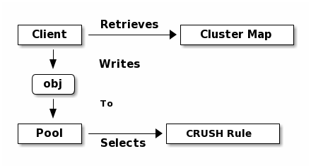
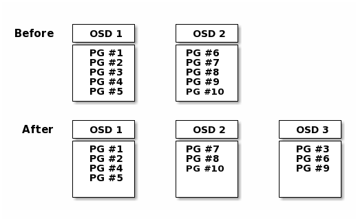
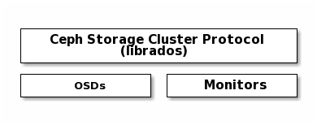
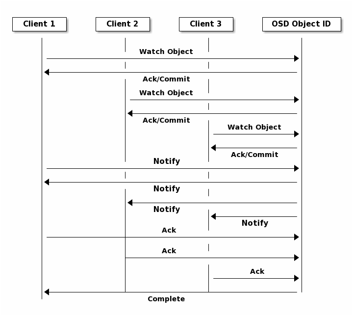
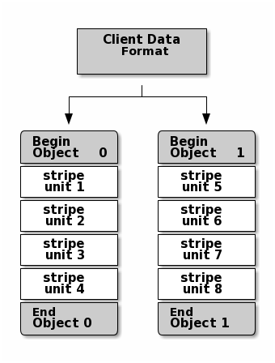
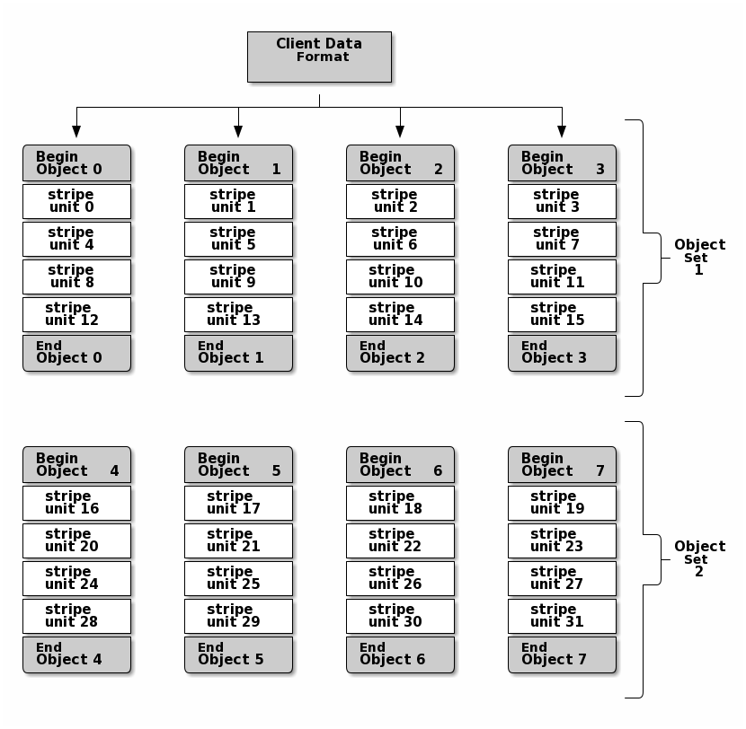
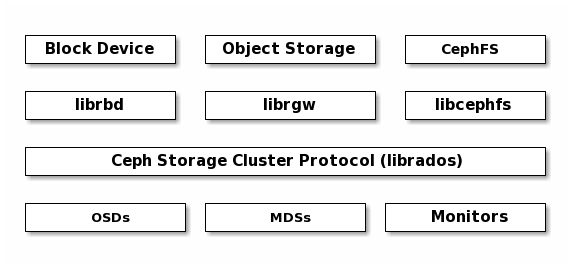
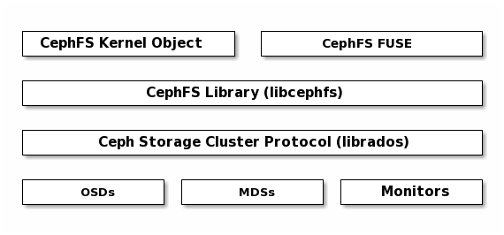

# Ceph 架构

官方文档：https://ceph.readthedocs.io/en/latest/architecture/

Ceph 可以在一个系统中同时提供对象储存、块储存、文件系统。Ceph 高度可靠、易于管理，并且是免费的。Ceph 的强大功能可以改变公司的基础设施和提供强大的管理数据的能力。Ceph 提供了非凡的可扩展性，可以顶住成千上万的客户端和 PB 到 EB 级别的数据。一个 Ceph 节点利用商业硬件和几个守护进程，一个 Ceph 集群可以容纳大量节点，它们互相通信以动态复制和重新分配数据。

结构图：

Ceph提供了一个基于RADOS的无限扩展的Ceph存储集群。

RADOS论文：https://ceph.com/wp-content/uploads/2016/08/weil-rados-pdsw07.pdf

一个 Ceph 集群包含两种类型的守护进程：

- Monitor
- OSD

Monitor 维护了集群 Map 的主副本，需要部署多个 Monitor 来保证高可用性，Monitor 的一致性算法是 Paxos，储存集群的客户端从 Monitor 中获取集群 Map。

OSD 守护进程检查自身状态和其他 OSD 的状态，并向 Monitor 报告。

储存集群的客户端和 OSD 都通过 CRUSH 算法来计算数据位置，Ceph 的高级功能包括通过 librados 提供本地接口，以及在 librados 之上构建许多服务接口。

## 数据存储

无论是通过Ceph块设备，Ceph对象存储，Ceph文件系统还是使用librados创建的自定义实现，Ceph存储群集都会从Ceph客户端接收数据，并将其存储为对象。每个对象对应于文件系统中的一个文件，该文件存储在对象存储设备中。 Ceph OSD守护程序处理存储磁盘上的读/写操作。

OSD 中的对象是没有目录的，一个对象由一个标识符，二进制数据和一组 key-value 组成的元数据，语义完全取决于Ceph客户端。 例如，CephFS 使用元数据来存储文件属性，例如文件所有者，创建日期，上次修改日期等等。

> 对象ID在整个集群中都是唯一的，而不仅仅是本地文件系统。

## 高可用和可扩展

在传统架构中，客户与集中式组件（例如，网关，代理，API，Facade等）进行通信，该组件充当复杂子系统的单个入口点。 这对性能和可伸缩性都施加了限制，同时引入了单点故障（即，如果集中式组件出现故障，那么整个系统也会出现故障）。

Ceph消除了集中式网关，使客户端能够直接与Ceph OSD守护程序进行交互。 Ceph OSD守护程序在其他Ceph节点上创建对象副本，以确保数据安全和高可用性。 Ceph还使用 Monitor 集群来确保高可用性。 为了消除集中化，Ceph使用了一种称为CRUSH的算法。

## CRUSH

Ceph客户端和Ceph OSD守护程序都使用CRUSH算法来有效地计算有关对象位置的信息，而不必依赖中央查找表。 与旧方法相比，CRUSH提供了更好的数据管理机制，并且通过将工作干净地分配给群集中的所有客户端和OSD守护程序来实现大规模扩展。 CRUSH使用智能数据复制来确保弹性，该弹性更适合于超大规模存储。 以下各节提供有关CRUSH如何工作的其他详细信息。

CRUSH 论文：https://ceph.com/wp-content/uploads/2016/08/weil-crush-sc06.pdf

## 集群 Map

Ceph依赖于具有集群拓扑的 Ceph 客户端和 Ceph OSD 守护进程，其中包括 5。个 Map，这些映射被统称为“集群 Map”：

1. **Monitor Map:** 包含了`fsid`, 还包括每个监视器的位置，名称地址和端口。 它还指示当前时间，创建 Map 的时间以及上次更改的时间。要查看 monitor map, 清执行 `ceph mon dump`.
2. **OSD Map:** 包含了`fsid`，在最后一次创建和修改映射时，池列表，副本大小，PG号，OSD列表及其状态(e.g., `up`, `in`). 要查看OSD map, 请执行 `ceph osd dump`.
3. **PG Map:** 包含每个 Pool 中的PG版本，其时间戳，最后一个OSD映射时间，完整比率以及每个放置组的详细信息，例如PG ID，Up Set，Acting Set，PG的状态以及数据使用情况统计信息。
4. **CRUSH Map:** 包含存储设备列表，故障域层次结构（例如，设备，主机，机架，行，房间等），以及在存储数据时遍历层次结构的规则。要查看 CRUSH map, 请执行 `ceph osd getcrushmap -o {filename}`; 然后，通过执行 `crushtool -d {comp-crushmap-filename} -o {decomp-crushmap-filename}`。这样就可以通过 `cat` 来查看 CURSH Map 了.
5. **The MDS Map:** 包含当前MDS Map 时间， Map 创建时间和上次更改时间。 它还包含用于存储元数据的池，元数据服务器列表以及启用的元数据服务器。To view an MDS map, execute `ceph fs dump`.

每个 Map 都维护其操作状态更改的迭代历史记录。 Ceph Monitor 维护群集 Map 的主副本，包括群集成员，状态，更改以及Ceph存储群集的整体运行状况。

## Monitor 高可用

在Ceph客户端可以读取或写入数据之前，他们必须联系Ceph Monitor 以获取群集 Map 的最新副本。一个Ceph Storage Cluster可以在一个 Monitor 上运行； 但是，这会引入单点故障（即，如果 Monitoor 关闭，则Ceph客户端无法读取或写入数据）。

为了增加可靠性和容错能力，Ceph支持一系列 Monitor。 在 Monitor 群集中，延迟和其他故障可能导致一个或多个 Monitor 落在群集的当前状态之后。 因此，Ceph必须在各个 Monitor 实例之间就集群状态达成协议。 Ceph始终使用大多数 Monitor 和 Paxos 算法在监视器之间建立有关集群当前状态的共识。

## 认证高可用

为了识别用户并防止中间人攻击，Ceph 提供了其 cephx 身份验证系统来对用户和守护程序进行身份验证。

> cephx协议未解决传输中的数据加密（例如SSL / TLS）或静态加密。

Cephx 使用共享密钥进行身份验证，这意味着客户端和 Monitor 群集都具有客户端密钥的副本。 身份验证协议使得双方都可以彼此证明自己拥有密钥的副本，而无需实际透露它。 这提供了相互身份验证，这意味着群集确保用户拥有密钥，而用户确定群集具有密钥的副本。

Ceph 的可扩展性避免使用 Ceph 对象存储的集中接口，这意味着 Ceph 客户端必须能够直接与OSD进行交互。 为了保护数据，Ceph 提供了其 cephx 身份验证系统，该系统对操作 Ceph 客户端的用户进行身份验证。 cephx 协议以类似于 Kerberos 的方式运行。

用户调用 Ceph 客户端来联系 Monitor 。与 Kerberos 不同，每个 Monitor 都可以验证用户身份并分发密钥，因此在使用 cephx 时不会出现单点故障或瓶颈。Monitor 返回类似于 Kerberos 票证的身份验证数据结构，其中包含用于获取 Ceph 服务的会话密钥。此会话密钥本身已使用用户的永久秘密密钥加密，因此只有用户可以从 Monitor 请求服务。

然后，客户端使用会话密钥从 Monitor 请求其所需的服务，并且 Monitor 向客户端提供票证，该票证将向实际处理数据的 OSD 认证客户端。 Ceph 监视器和 OSD 共享一个密钥，因此客户端可以将 Monitor 提供的票证与群集中的任何OSD或元数据服务器一起使用。

与 Kerberos 一样，cephx 票证也会过期，因此攻击者无法使用密钥获得的过期票证或会话密钥。这种身份验证形式将防止有权访问通信介质的攻击者以其他用户的身份创建虚假消息，或更改其他用户的合法消息，只要该用户的密钥在到期前不被泄露即可。

要使用cephx，管理员必须首先设置用户。 在下图中，`client.admin` 用户从命令行调用 `ceph auth get-or-create-key` 来生成用户名和密钥。 Ceph 的 auth 子系统生成用户名和密钥，将其副本与监视器一起存储，然后将用户的密钥发送回 `client.admin` 用户。 这意味着客户端和监视器共享一个密钥。

> `client.admin` 用户必须以安全的方式向其他用户提供用户ID和密钥。

为了向 Monitor 进行身份验证，客户端将用户名传递给 Monitor ，监视器将生成会话密钥，并使用它与该用户名关联的密钥对其进行加密。 然后，Monitor 将加密的票证发送回客户端。 然后，客户端使用共享密钥解密有效负载以检索会话密钥。 会话密钥标识当前会话的用户。 然后，客户端代表由会话密钥签名的用户请求票证。 监视器生成票证，使用用户的密钥对其进行加密，然后将其发送回客户端。 客户端解密票证，并使用它对整个集群中的OSD和元数据服务器签署请求。

cephx 协议对客户端计算机和 Ceph 服务器之间正在进行的通信进行身份验证。 初始身份验证之后，在客户端和服务器之间发送的每条消息均使用票证进行签名，Monitor，OSD和元数据服务器可以使用其共享密钥进行验证。

此身份验证提供的保护在 Ceph 客户端和 Ceph 服务器主机之间。 身份验证不会扩展到 Ceph 客户端之外。 如果用户从远程主机访问 Ceph 客户端，则 Ceph 身份验证不会应用于用户主机和客户端主机之间的连接。

cephx配置： [Ceph认证配置.md](../Ceph配置/Ceph认证配置.md) 

用户管理： [Ceph用户管理.md](../管理 Ceph/Ceph用户管理.md) 

## 大规模的守护进程

在许多集群体系结构中，集群成员的主要目的是使集中式接口知道其可以访问哪些节点。 然后，集中式接口通过双重调度为客户端提供服务，这是PB到EB级的巨大瓶颈。

Ceph消除了瓶颈：Ceph的OSD守护进程和Ceph客户端都知道群集。 像Ceph客户端一样，每个Ceph OSD守护程序都知道集群中的其他Ceph OSD守护程序。 这使Ceph OSD守护程序可以直接与其他Ceph OSD守护程序和Ceph监视器进行交互。 此外，它使Ceph客户端可以直接与Ceph OSD守护程序进行交互。

Ceph客户端，Ceph监视器和Ceph OSD守护程序相互交互的能力意味着Ceph OSD守护程序可以利用Ceph节点的CPU和RAM轻松执行使集中式服务器陷入困境的任务。 利用这种计算能力的能力带来了几个主要好处：

1. OSD直接为客户端服务：由于任何网络设备都对其支持的并发连接数都有限制，因此集中式系统在大规模上的物理限制较低。通过使Ceph客户端直接联系Ceph OSD守护程序，Ceph可以同时提高性能和系统总容量，同时消除单点故障。 Ceph客户端可以在需要时维护会话，并使用特定的Ceph OSD守护进程而不是集中式服务器。
2. OSD成员状态：Ceph OSD守护程序加入集群并报告其状态。在最低级别，Ceph OSD守护程序状态为打开或关闭，反映了它是否正在运行并能够为Ceph客户端请求提供服务。如果Ceph OSD守护进程已关闭并且在Ceph存储群集中，则此状态可能表明Ceph OSD守护进程失败。如果Ceph OSD守护程序未运行（例如崩溃），则Ceph OSD守护程序无法通知Ceph监控器已关闭。 OSD定期将消息发送到Ceph监视器。如果Ceph监控器在一段可配置的时间后没有看到该消息，则将OSD标记为关闭。但是，此机制是故障安全的。通常，Ceph OSD守护程序将确定相邻的OSD是否已关闭，并将其报告给Ceph监视器。这确保了Ceph Monitors是轻量级进程。有关其他详细信息，请参见监视OSD和心跳。
3. 数据清理：作为保持数据一致性和整洁性的一部分，Ceph OSD守护进程可以清理对象。也就是说，Ceph OSD守护程序可以将其本地对象元数据与其存储在其他OSD上的副本进行比较。清理发生在每个展示位置组的基础上。清理（通常每天执行一次）会发现大小和其他元数据不匹配。 Ceph OSD守护进程还通过逐位比较对象中的数据与其校验和来执行更深层的清理。深度清理（通常每周执行一次）会发现驱动器上的坏扇区在轻微清理中并不明显。有关配置清理的详细信息，请参见数据清理。
4. 复制：与Ceph客户端一样，Ceph OSD守护程序也使用CRUSH算法，但是Ceph OSD守护程序使用它来计算对象副本的存储位置（并进行重新平衡）。在典型的写场景中，客户端使用CRUSH算法计算对象的存储位置，将对象映射到 Pool 和 PG，然后查看 CRUSH MAP 以识别放置组的主要OSD。

客户端将对象写入主OSD中标识的 PG。 然后，具有自己的CRUSH映射副本的主OSD标识用于复制目的的辅助OSD和第三OSD，并将对象复制到辅助OSD和第三OSD中的适当放置组（与其他副本一样多的OSD），一旦确认对象已成功存储就会响应客户端。

Ceph OSD守护程序具有执行数据复制的功能，可减轻Ceph客户端的职责，同时确保高数据可用性和数据安全性。

## 动态集群管理

在上边解释了 Ceph 如何使用CRUSH，集群感知和智能守护程序来扩展和维护高可用性。 Ceph设计的关键是自主，自我修复和智能的Ceph OSD守护程序。 让我们更深入地了解CRUSH如何使现代云存储基础架构能够放置数据，重新平衡集群并动态地从故障中恢复。

## Pool

Ceph存储系统支持“Pool”的概念，“Pool”是用于存储对象的逻辑分区。

Ceph客户端从Ceph Monitor检索集群 Map，并将对象写入 Pool 中。 Pool 的大小或副本数，CRUSH规则以及放置组的数量决定了Ceph将如何放置数据。

Pool 至少要设置以下参数 ：

- 对象访问权限
- PG 数量
- CRUSH 规则

## PG 映射到 OSD

每个 Pool 都有许多 PG。 CRUSH将PG动态映射到OSD。 当Ceph客户端存储对象时，CRUSH会将每个对象映射到一个放置组。

将对象映射到放置组会在Ceph OSD守护程序和Ceph客户端之间创建一个间接层。 Ceph存储集群必须能够增长（或缩小）并在其动态存储对象的地方重新平衡。 如果Ceph客户端“知道”哪个Ceph OSD守护程序具有哪个对象，那将在Ceph客户端和Ceph OSD守护程序之间建立紧密的联系。 相反，CRUSH算法将每个对象映射到一个 PG，然后将每个 PG 映射到一个或多个Ceph OSD守护程序。 当新的Ceph OSD守护进程和底层OSD设备联机时，此间接层允许Ceph动态重新平衡。 下图描述了CRUSH如何将对象映射到放置组，以及如何将放置组映射到OSD。

借助群集 Map 和CRUSH算法的副本，客户端可以准确计算在读取或写入特定对象时要使用的OSD。

## 计算 PG ID

当Ceph客户端连接到Ceph Monitor时，它将检索集群 Map 的最新副本。借助群集 Map，客户端可以了解群集中的所有 Monitor ，OSD和元数据服务器。但是，它对对象位置一无所知。

所以需要计算对象位置。

客户端所需的唯一输入是对象ID和 Pool 。很简单：Ceph将数据存储在 Pool（例如“ liverpool”）中。当客户要存储命名对象（例如“ john”，“ paul”，“ george”，“ ringo”等）时，它将使用对象名称，哈希码和其中的PG数量来计算 PG 和池名称。 Ceph客户端使用以下步骤来计算PG ID。

- 客户端输入池名称和对象ID。 （例如，pool =“ liverpool”，object-id =“ john”）
- Ceph获取对象ID并对其进行哈希处理。
- Ceph以PG的数量为模来计算哈希值。 （例如58）以获取PG ID。
- Ceph根据指定的池名称获取池ID（例如，“ liverpool” = 4）
- Ceph将池ID附加到PG ID（例如4.58）之前。

计算对象位置比通过会话获取对象位置查询要快得多。 CRUSH算法允许客户端计算应将对象存储在何处，并使客户端可以联系主OSD来存储或检索对象。

## PG 副本

在前面的部分中，注意到Ceph OSD守护程序会互相检查心跳并报告给Ceph Monitor。 Ceph OSD守护程序所做的另一件事称为“对等”，这是使存储一个放置组（PG）的所有OSD关于该PG中所有对象（及其元数据）的状态达成一致的过程。 实际上，Ceph OSD守护程序向Ceph监视器报告对等失败，对等问题通常可以解决。 但是，如果问题仍然存在，需要参考：https://ceph.readthedocs.io/en/latest/rados/troubleshooting/troubleshooting-pg/#placement-group-down-peering-failure。

Ceph存储集群旨在存储至少两个对象副本（即size = 2），这是数据安全的最低要求。为了获得高可用性，Ceph存储群集应存储一个对象的两个以上副本（例如，size = 3和 min size = 2），以便它可以在保持数据安全性的同时继续以降级状态运行。

没有专门命名Ceph OSD Daemons（例如osd.0，osd.1等），而是将它们称为Primary，Secondary等。按照惯例，主对象是行为集中的第一个OSD，并负责协调充当主对象的每个放置组的对等过程，并且是唯一的OSD，它将接受客户端发起的对象写入。给定的 PG ，在该 PG 中充当主要 PG 。

当一系列OSD负责一个放置组时，该系列OSD将它们称为 Acting Set。Acting Set 可以指代当前负责放置组的Ceph OSD守护进程，或者指某个时期负责特定放置组的Ceph OSD守护进程。

Acting Set的一部分的Ceph OSD守护进程可能并不总是启动的。当代理集中的OSD处于启动状态时，它是升级集中的一部分。 Up Set是一个重要的区别，因为当OSD失败时，Ceph可以将PG重新映射到其他Ceph OSD守护程序。

> 在包含osd.25，osd.32和osd.61的PG的代理集中，第一个OSD osd.25是主要对象。如果该OSD发生故障，则辅助数据库osd.32将成为主数据库，而osd.25将被从Up Set中删除。

## 重新平衡

当将Ceph OSD守护进程添加到Ceph存储群集时，群集 Map 将使用新的OSD更新。 再次参考计算PG ID，这将更改群集 Map 。 因此，它更改了对象放置，因为它更改了计算的输入。 下图描述了重新平衡过程（尽管相当粗略，因为它对大型集群的影响较小），其中一些但不是全部PG从现有OSD（OSD 1和OSD 2）迁移到新OSD（OSD 3） ）。 即使重新平衡，破碎也很稳定。 许多放置组仍保持其原始配置，并且每个OSD都增加了一些容量，因此重新平衡完成后，新OSD上不会出现负载峰值。

## 数据一致性

作为保持数据一致性和保持整洁的一部分，Ceph OSD还可以清理 PG 中的对象。 也就是说，Ceph OSD可以将一个 PG 中的对象元数据与其存储在其他OSD中的放置组中的副本进行比较。 清理（通常每天执行一次）会捕获OSD错误或文件系统错误。 OSD还可以通过逐位比较对象中的数据来执行更深入的清理。 深度清理（通常每周执行一次）会发现磁盘上的坏扇区在轻微清理中并不明显。

OSD 数据清理：https://ceph.readthedocs.io/en/latest/rados/configuration/osd-config-ref/#scrubbing

## 纠删码

纠删码 Pool 将每个对象存储为 K + M 个块。 它分为 K 个数据块和 M 个编码块。 将该池配置为具有 K + M 的大小，以便将每个块存储在代理集中的OSD中。 块的等级被存储为对象的属性。

例如，创建一个擦除编码池以使用五个OSD（K + M = 5），并维持其中两个OSD的丢失（M = 2）。

## 纠删码模式中的读取和写入

当将包含 ABCDEFGHI 的对象 NYAN 写入池时，纠删码功能只需将内容分为三部分即可将内容分为三个数据块：第一个包含ABC，第二个DEF和最后一个GHI。 如果内容长度不是K的倍数，则将填充内容。该函数还会创建两个编码块：第四个使用YXY，第五个使用QGC。 每个块都存储在代理集中的OSD中。 块存储在具有相同名称（NYAN）但位于不同OSD上的对象中。 除了名称之外，必须保留创建块的顺序并将其存储为对象（shard_t）的属性。 块1包含ABC并存储在OSD5上，而块4包含YXY并存储在OSD3上。

当从擦除编码池中读取对象 NYAN 时，解码功能将读取三个块：包含ABC的块1，包含GHI的块3和包含YXY的块4。 然后，它重建对象ABCDEFGHI的原始内容。 通知解码功能，缺少块2和5（它们称为“擦除”）。 由于OSD4耗尽，无法读取块5。 读取三个块后即可立即调用解码功能：OSD2是最慢的，并且未考虑其块。

## 缓存层

缓存层为Ceph客户端提供了更好的I / O性能，用于存储在后备存储层中的部分数据。 缓存层涉及创建配置为充当缓存层的相对较快/昂贵的存储设备（例如，固态驱动器）的 Pool ，以及配置为充当经济存储的擦除编码或相对较慢/更便宜的设备的后备池 层。 Ceph对象处理PG 的位置，并且分层代理确定何时将对象从缓存刷新到后备存储层。 因此，缓存层和后备存储层对Ceph客户端是完全透明的。

## Ceph 协议

Ceph客户端使用协议与Ceph存储群集进行交互。 Ceph将此功能打包到librados库中，以便您可以创建自己的自定义Ceph客户端。下图描述了基本架构。

## LIBRADOS

现代应用程序需要具有异步通信功能的简单对象存储接口。 Ceph存储集群提供了具有异步通信功能的简单对象存储接口。 该接口提供对整个集群中对象的直接、并行访问。这个接口包括：

- Pool 操作
- 快照和写时复制
- 读写对象、创建或删除对象、追加，截断对象内容
- 创建/设置/获取/删除 元数据

## 对象监控和通知

客户可以向对象注册函数，并使与主要OSD的会话保持打开状态。 客户端可以向所有观察者发送通知消息和有效负载，并在观察者收到通知时接收通知。 这使客户端可以将任何对象用作同步/通信通道。

## 数据条带化

存储设备具有吞吐量限制，这会影响性能和可伸缩性。 因此，存储系统通常支持条带化（在多个存储设备之间存储顺序的信息），以提高吞吐量和性能。 数据条带化的最常见形式来自RAID。 与Ceph的条带化最相似的RAID类型是RAID 0，即“条带化卷”。 Ceph的条带化提供RAID 0条带化的吞吐量，n路RAID镜像的可靠性和更快的恢复速度。

Ceph提供三种类型的客户端：Ceph块设备，Ceph文件系统和Ceph对象存储。 Ceph客户端将其数据从其提供给用户的表示格式（块设备映像，RESTful对象，CephFS文件系统目录）转换为对象，以存储在Ceph存储集群中。

> Ceph存储集群中Ceph存储的对象没有条带化。 Ceph对象存储，Ceph块设备和Ceph文件系统在多个Ceph存储集群对象上分条数据。 通过librados直接写入Ceph存储群集的Ceph客户端必须自己执行剥离（和并行I / O）才能获得这些好处。

最简单的Ceph条带化格式涉及1个对象的条带数。 Ceph客户端将条带单元写入Ceph存储群集对象，直到该对象达到最大容量，然后为另一个数据条带创建另一个对象。 条带化的最简单形式对于小型块设备映像，S3或Swift对象以及CephFS文件可能就足够了。 但是，这种简单的形式并没有充分利用Ceph跨展示位置组分布数据的功能，因此并不能大大提高性能。 下图描述了最简单的条带化形式：

如果您预期较大的图像大小，较大的S3或Swift对象（例如，视频）或较大的CephFS目录，则可以通过在一个对象集中的多个对象上剥离客户端数据来看到可观的读写性能改进。 当客户端将条带单元并行写入其对应的对象时，将产生显着的写入性能。 由于对象被映射到不同的放置组并进一步映射到不同的OSD，因此每次写入均以最大写入速度并行发生。 对单个磁盘的写操作将受到该设备的磁头移动（例如，每次搜索6毫秒）和带宽（例如100MB / s）的限制。 通过将写入分布在多个对象上（映射到不同的放置组和OSD），Ceph可以减少每个驱动器的搜索次数，并结合多个驱动器的吞吐量以实现更快的写入（或读取）速度。

> 条带化与对象副本无关。 由于CRUSH跨OSD复制对象，因此条带会自动复制。

在下图中，客户数据在由4个对象组成的对象集（下图中的对象集1）上进行条带化，其中第一个条带单元是对象0中的条带单元0，第四个条带单元是在对象0中的条带单元3。 对象3.写入第四个条带后，客户端确定对象集是否已满。 如果对象集不完整，客户端将再次开始将条带写入第一个对象（下图中的对象0）。 如果对象集已满，客户端将创建一个新的对象集（下图中的对象集2），并开始写入新对象集（对象中的对象4）中的第一个条带（条带单元16）。 下图）。

三个重要变量决定了Ceph如何划分数据：

- 对象大小：Ceph存储群集中的对象具有最大可配置大小（例如2MB，4MB等）。 对象大小应足够大以容纳许多条带单元，并且应为条带单元的倍数。
- 条纹宽度：条纹的单位大小可配置（例如64kb）。 Ceph客户端将它将写入对象的数据划分为大小相等的条带单元，最后一个条带单元除外。 条带宽度应为“对象大小”的一部分，以便一个对象可以包含许多条带单元。
- 条带计数：Ceph客户端在条带计数确定的一系列对象上写入条带单元序列。 对象系列称为对象集。 Ceph客户端写入对象集中的最后一个对象后，它将返回对象集中的第一个对象。

> 在将群集投入生产之前，请测试条带化配置的性能。 条带化数据并将其写入对象后，您将无法更改这些条带化参数。

一旦Ceph客户端将数据条带化为条带单位并将条带单位映射到对象，Ceph的CRUSH算法就将对象映射到放置组，并将放置组映射到Ceph OSD守护程序，然后将对象作为文件存储在存储磁盘上。

> 由于客户端写入单个池，因此将条带化为对象的所有数据映射到同一池中的放置组。 因此，他们使用相同的CRUSH映射和相同的访问控制。

# Ceph 客户端

Ceph 有大量的服务接口，最常见的三个包括：

- 块储存：Ceph块设备（又称RBD）服务提供具有快照和克隆功能的可调整大小的精简配置块设备。 Ceph在整个群集上对块设备进行条带化以实现高性能。 Ceph支持内核对象（KO）和直接使用librbd的QEMU管理程序-避免了虚拟化系统的内核对象开销。
- 对象储存：Ceph对象存储（又称RGW）服务为RESTful API提供了与Amazon S3和OpenStack Swift兼容的接口。
- 文件系统：Ceph文件系统（CephFS）服务提供了与POSIX兼容的文件系统，可与挂载一起使用或用作用户空间（FUSE）中的文件系统。

Ceph可以运行OSD，MDS的其他实例，并监视可扩展性和高可用性。 下图描述了高级体系结构。

## 对象储存

Ceph对象存储守护进程radosgw是一项FastCGI服务，它提供RESTful HTTP API来存储对象和元数据。 它以自己的数据格式位于Ceph存储群集的顶层，并维护自己的用户数据库，身份验证和访问控制。 RADOS网关使用统一的名称空间，这意味着您可以使用OpenStack Swift兼容的API或Amazon S3兼容的API。 例如，您可以在一个应用程序中使用兼容S3的API写入数据，然后在另一个应用程序中使用兼容Swift的API读取数据。

> S3 / Swift对象和存储群集对象的比较
>
> Ceph的对象存储区使用对象一词来描述其存储的数据。 S3和Swift对象与Ceph写入Ceph存储集群的对象不同。 Ceph对象存储对象被映射到Ceph存储集群对象。 S3和Swift对象不一定与存储集群中存储的对象以1：1方式对应。 S3或Swift对象可能映射到多个Ceph对象。

## 块储存

Ceph块设备在Ceph存储集群中的多个对象上划分块设备映像，其中每个对象都映射到一个放置组并进行分布，并且放置组分布在整个集群的各个ceph-osd守护程序中。

> 条带化使RBD块设备的性能比单个服务器更好！

精简配置的快照式Ceph块设备是虚拟化和云计算的一个有吸引力的选择。 在虚拟机场景中，人们通常在QEMU / KVM中使用rbd网络存储驱动程序部署Ceph块设备，其中主机使用librbd向客户端提供块设备服务。 许多云计算堆栈使用libvirt与管理程序集成。 您可以将精简配置的Ceph块设备与QEMU和libvirt一起使用，以在其他解决方案中支持OpenStack和CloudStack。

虽然我们目前不提供其他管理程序提供的librbd支持，但您也可以使用Ceph块设备内核对象为客户端提供块设备。 其他虚拟化技术（例如Xen）可以访问Ceph块设备内核对象。 这是通过命令行工具rbd完成的。

## 文件系统

Ceph文件系统（CephFS）提供了POSIX兼容文件系统作为服务，该系统位于基于对象的Ceph存储群集之上。 CephFS文件被映射到Ceph存储在Ceph存储集群中的对象。 Ceph客户端在用户空间（FUSE）中将CephFS文件系统挂载为内核对象或文件系统。

Ceph文件系统服务包括与Ceph存储群集一起部署的Ceph元数据服务器（MDS）。 MDS的目的是将所有文件系统元数据（目录，文件所有权，访问模式等）存储在元数据驻留在内存中的高可用性Ceph元数据服务器中。使用MDS（称为ceph-mds的守护程序）的原因是，简单的文件系统操作（例如列出目录或更改目录（ls，cd））会不必要地加重Ceph OSD守护程序的负担。因此，将元数据与数据分开意味着Ceph文件系统可以提供高性能服务，而不会增加Ceph存储集群的负担。

CephFS将元数据与数据分离，将元数据存储在MDS中，并将文件数据存储在Ceph存储群集中的一个或多个对象中。 Ceph文件系统旨在实现POSIX兼容性。 ceph-mds可以作为单个进程运行，也可以分发到多个物理机，以实现高可用性或可伸缩性。

- 高可用性：额外的ceph-mds实例可以处于备用状态，随时可以接管任何活动的失败的ceph-mds的职责。这很容易，因为所有数据（包括日志）都存储在RADOS上。过渡由ceph-mon自动触发。

- 可伸缩性：多个ceph-mds实例可以处于活动状态，它们会将目录树拆分为子树（和单个繁忙目录的分片），从而有效平衡所有活动服务器之间的负载。

备用和活动等的组合是可以的，例如，运行3个活动ceph-mds实例以进行扩展，并运行一个备用实例以实现高可用性。

