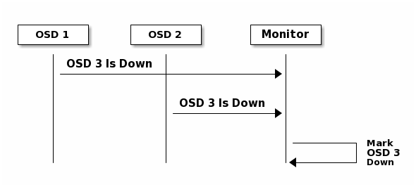
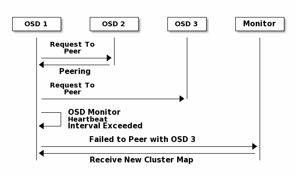

# Ceph 心跳配置

官方文档：https://ceph.readthedocs.io/en/latest/rados/configuration/mon-osd-interaction/

当执行诸如 ceph health 或 ceph -s 之类的命令时，Ceph Monitor 将报告 Ceph 存储集群的当前状态。Ceph Monitor 通过要求每个 Ceph OSD 守护程序提供报告，以及从 Ceph OSD 守护程序接收有关其相邻 Ceph OSD 守护程序状态的报告来了解 Ceph 存储集群。如果 Ceph Monitor 未收到报告，或者收到 Ceph 存储群集中的更改报告，则 Ceph Monitor 会更新Ceph群集 Map 的状态。

Ceph 为 Ceph Monitor / Ceph OSD Daemon 交互提供了合理的默认设置。但是，您可以覆盖默认设置。以下各节描述了 Ceph Monitor 和Ceph OSD 守护程序如何交互以监视 Ceph 存储群集。

每个 Ceph OSD 守护程序以不到每 6 秒一次的随机间隔检查其他 Ceph OSD 守护程序的心跳。如果相邻的 Ceph OSD 守护进程在 20 秒宽限期内未显示心跳，则 Ceph OSD 守护进程可能会考虑将相邻的 Ceph OSD 守护进程关闭并报告给 Ceph Monitor，后者将更新 Ceph 群集映射。可以通过在 Ceph 配置文件的 [mon] 和 [osd] 或 [global] 部分下添加 osd 心跳宽限期设置，或在运行时设置值来更改此宽限期。

## OSD 失联

默认情况下，来自不同主机的两个 Ceph OSD 守护进程必须先向 Ceph Monitor 报告另一个 Ceph OSD 守护进程已关闭，然后Ceph Monitor 才确认所报告的 Ceph OSD 守护进程已关闭。但是有可能所有报告故障的 OSD 都托管在机架中，而该交换机的开关损坏，无法连接到另一个OSD。为了避免这种错误警报，我们认为对等方报告了故障，将其作为整个集群上类似的落后集群的潜在“子集群”的代理。这显然并非在所有情况下都是正确的，但有时会帮助我们将宽限度校正本地化到不满意的系统子集。`mon osd reporter subtree level`用于按 CRUSH 映射中的对等方的祖先类型将对等方分组为“子集群”。默认情况下，只需要来自不同子树的两个报告即可报告另一个Ceph OSD守护进程。可以更改唯一子树的报告者数量以及将 Ceph OSD 守护程序报告给 Ceph Monitor 所需的公共祖先类型。通过在 Ceph 配置文件的 [mon] 部分下添加 `mon osd min down reporters` 和 `mon osd reporter subtree level` 设置，或在运行时设置值。

如果 Ceph OSD 守护程序无法在其 Ceph 配置文件（或群集映射）中定义的任何 Ceph OSD 守护程序建立对等关系，它将每30秒 ping Ceph Monitor 以获得群集映射的最新副本。您可以通过在 Ceph 配置文件的 [osd] 部分下添加 `osd mon heartbeat interval` 设置，或通过在运行时设置值来更改Ceph Monitor心跳间隔。

## 心跳配置

修改心跳设置时，应将它们包括在配置文件的 [global] 部分中。

#### Monitor 配置

`mon osd min up ratio`

- Description

  在 Ceph 将 Ceph OSD 守护进程标记为 down 之前， Ceph OSD 守护进程中为 up 的最小比率。

- Type：Double

- Default：`.3`

`mon osd min in ratio`

- Description

  在 OSD 被标记为 out 之前，Ceph OSD 中处于 in 状态的比例。

- Type：Double

- Default：`.75`

`mon osd laggy halflife`

- Description：延迟估算的秒数将衰减。
- Type：Integer
- Default：`60*60`

`mon osd laggy weight`

- Description：延迟估计中新样本的权重衰减。
- Type：Double
- Default：`0.3`

`mon osd laggy max interval`

- Description

  延迟估计中的laggy_interval的最大值（以秒为单位）。 Monitor使用一种自适应方法来评估某个OSD的laggy_interval。该值将用于计算该OSD的宽限时间。

- Type：Integer

- Default：300

`mon osd adjust heartbeat grace`

- Description：如果设置为true，则Ceph将基于延迟的估计进行缩放。
- Type：Boolean
- Default：`true`

`mon osd adjust down out interval`

- Description：如果设置为true，则Ceph将基于延迟的估计进行缩放。
- Type：Boolean
- Default：`true`

`mon osd auto mark in`

- Description

  Ceph 会将任何正在启动的 Ceph OSD 守护进程标记为 in。

- Type：Boolean

- Default：`false`

`mon osd auto mark auto out in`

- Description

  Ceph will mark booting Ceph OSD Daemons auto marked `out` of the Ceph Storage Cluster as `in` the cluster.

- Type：Boolean

- Default：`true`

`mon osd auto mark new in`

- Description

  Ceph will mark booting new Ceph OSD Daemons as `in` the Ceph Storage Cluster.

- Type：Boolean

- Default：`true`

`mon osd down out interval`

- Description

  The number of seconds Ceph waits before marking a Ceph OSD Daemon `down` and `out` if it doesn’t respond.

- Type：32-bit Integer

- Default：`600`

`mon osd down out subtree limit`

- Description

  The smallest [CRUSH](https://ceph.readthedocs.io/en/latest/glossary/#term-crush) unit type that Ceph will **not** automatically mark out. For instance, if set to `host` and if all OSDs of a host are down, Ceph will not automatically mark out these OSDs.

- Type：String

- Default：`rack`

`mon osd report timeout`

- Description

  The grace period in seconds before declaring unresponsive Ceph OSD Daemons `down`.

- Type：32-bit Integer

- Default：`900`

`mon osd min down reporters`

- Description

  The minimum number of Ceph OSD Daemons required to report a `down` Ceph OSD Daemon.

- Type：32-bit Integer

- Default：`2`

`mon osd reporter subtree level`

- Description

  In which level of parent bucket the reporters are counted. The OSDs send failure reports to monitor if they find its peer is not responsive. And monitor mark the reported OSD out and then down after a grace period.

- Type：String

- Default：`host`

#### OSD 配置

`osd heartbeat address`

- Description

  An Ceph OSD Daemon’s network address for heartbeats.

- Type：Address

- Default：The host address.

`osd heartbeat interval`

- Description

  How often an Ceph OSD Daemon pings its peers (in seconds).

- Type：32-bit Integer

- Default：`6`

`osd heartbeat grace`

- Description

  The elapsed time when a Ceph OSD Daemon hasn’t shown a heartbeat that the Ceph Storage Cluster considers it `down`. This setting has to be set in both the [mon] and [osd] or [global] section so that it is read by both the MON and OSD daemons.

- Type：32-bit Integer

- Default：`20`

`osd mon heartbeat interval`

- Description

  How often the Ceph OSD Daemon pings a Ceph Monitor if it has no Ceph OSD Daemon peers.

- Type：32-bit Integer

- Default：`30`

`osd mon heartbeat stat stale`

- Description

  Stop reporting on heartbeat ping times which haven’t been updated for this many seconds. Set to zero to disable this action.

- Type：32-bit Integer

- Default：`3600`

`osd mon report interval`

- Description

  The number of seconds a Ceph OSD Daemon may wait from startup or another reportable event before reporting to a Ceph Monitor.

- Type：32-bit Integer

- Default：`5`

`osd mon ack timeout`

- Description

  The number of seconds to wait for a Ceph Monitor to acknowledge a request for statistics.

- Type：32-bit Integer

- Default：`30`

