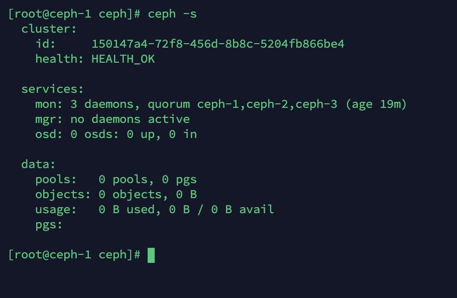
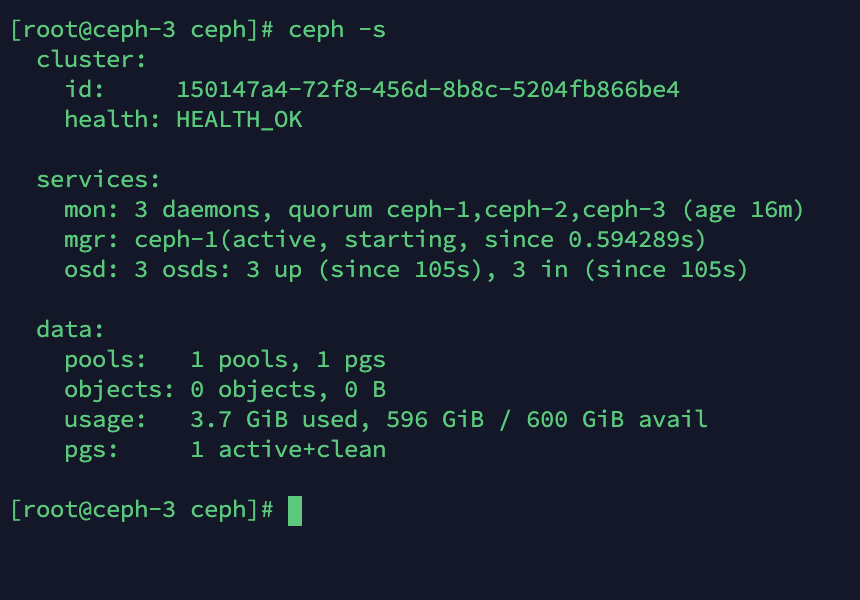

为了能够完整了解 Ceph 集群部署过程，我这里不采用 ceph-deploy 和 cephadm，而是采用手工通过 RPM 包管理工具进行部署。

参考：https://ceph.readthedocs.io/en/latest/install/install-storage-cluster/

参考：https://ceph.readthedocs.io/en/latest/install/manual-deployment/

---

## 下载安装软件包

一些方便部署的前置条件，包括配置 hosts、免密登录、关闭 firewalld、SELinux这些略过。

我的 `/etc/yum.repos.d/ceph.repo` 如下：

```
[ceph]
name=Ceph packages
baseurl=http://mirrors.163.com/ceph/rpm-15.2.3/el7/x86_64/
enabled=1
gpgcheck=1
priority=2
type=rpm-md
gpgkey=http://mirrors.163.com/ceph/keys/release.asc

[ceph-noarch]
name=Ceph noarch packages
baseurl=http://mirrors.163.com/ceph/rpm-15.2.3/el7/noarch/
enabled=1
gpgcheck=1
priority=2
type=rpm-md
gpgkey=http://mirrors.163.com/ceph/keys/release.asc

[ceph-source]
name=Ceph source packages
baseurl=http://mirrors.163.com/ceph/rpm-15.2.3/el7/SRPMS/
enabled=0
gpgcheck=1
priority=2
type=rpm-md
gpgkey=http://mirrors.163.com/ceph/keys/release.asc
```

安装软件：

```bash
$ sudo yum install snappy leveldb gdisk python-argparse gperftools-libs -y
$ sudo yum install ceph -y
```

会安装以下软件：


这里面没有对象网关，需单独安装：

```bash
$ yum -y install ceph-radosgw -y
```


---


## monitor 安装

monitor 即 ceph-mon

部署ceph第一步就是要把集群的monitors运行起来，ceph集群至少需要一个monitor才能正常运行，但是一般为了高可用，都会设置三个及以上的monitor，我们这里安装三个monitors共同组成集群的`monitor map`，monitors能够控制集群的多项行为，比如每个pool的副本数，每个OSD上的pg数，OSD进程间心跳间隔，是否启用认证(cephx)，…等，这些配置项都有默认值，我们可以根据需要调整优化。

根据文章开始分配，需要在三个节点(ceph-1、ceph-2、ceph-3)上各安装一个mon进程，三节点配置文件是一样的，因此可以在一个节点上配置完成后复制到其它节点上，monitors需要以下几项配置

- `fsid` 集群的唯一标识符，`ceph -s`命令显示的第一行
- `cluster name`可以随意指定，默认是`ceph`，默认的好处是我们在运行命令时不必明确指明集群名，但在有多个ceph集群的情况下，为了在命令行区分不同的集群(`ceph, us-west, us-east` ) ，可以使用集群名命名配置文件，比如`ceph.conf, us-west.conf,us-east.conf`，并且在命令行使用`ceph --cluster {cluster-name}`指定要操作的集群名
- `Monitor Name` 集群中的每个monitor进程都有唯一的name，一般是主机名，我们这里也是用hostnmae
- `Monitor Map` 安装Monitors需要生成`monitor map`，`monitor map`需要`fsid`，`cluster name`，和节点的hostname及其ip地址
- `Monitor Keyring` monitors之间通信需要key认证
- `Administrator Keyring` 命令行操作进群需要有合适的用户权限，默认使用`client.admin`用户，因此我们需要生成`client.admin`用户和它的key密钥


#### 配置文件

使用下面命令生成一个唯一 id：

```bash
$ uuidgen
150147a4-72f8-456d-8b8c-5204fb866be4
```

编写配置文件：

```bash
$ sudo vim /etc/ceph/ceph.conf
```

内容如下，最少需要设置下面几项参数

```properties
[global]
fsid = 150147a4-72f8-456d-8b8c-5204fb866be4
mon_initial_members = ceph-1,ceph-2,ceph-3
mon_host = 172.20.21.16,172.20.21.17,172.20.20.115
public network = 172.20.23.255/22
auth cluster required = cephx
auth service required = cephx
auth client required = cephx
osd journal size = 1024
osd pool default size = 3
osd pool default min size = 2
osd pool default pg num = 333
osd pool default pgp num = 333
osd crush chooseleaf type = 1
```

其他节点根据节点名进行修改。


#### 配置用户与 key

我的当前目录为 `/root/ceph `，并使用如下命令生成 Monitor 的密钥，用于多个 Monitor 间通信：

```bash
$ ceph-authtool --create-keyring /tmp/ceph.mon.keyring --gen-key -n mon. --cap mon 'allow *'
```

创建一个 client.admin 用户 :

```bash
$ ceph-authtool --create-keyring /etc/ceph/ceph.client.admin.keyring --gen-key -n client.admin --cap mon 'allow *' --cap osd 'allow *' --cap mds 'allow *' --cap mgr 'allow *'
```

生成用于集群初始化初始化的 cluster.bootstrap 密钥：

```bash
$ ceph-authtool --create-keyring /var/lib/ceph/bootstrap-osd/ceph.keyring --gen-key -n client.bootstrap-osd --cap mon 'profile bootstrap-osd' --cap mgr 'allow r'
```


导入Key，将三个密钥合成一个：

```bash
$ ceph-authtool /tmp/ceph.mon.keyring --import-keyring /etc/ceph/ceph.client.admin.keyring
$ ceph-authtool /tmp/ceph.mon.keyring --import-keyring /var/lib/ceph/bootstrap-osd/ceph.keyring
```

更改权限：

```bash
$ chown ceph:ceph /tmp/ceph.mon.keyring
```


#### 创建monitor map

上面说过，创建 monitor map 需要提供`fsid`，`cluster name`，和 hostname 及其 ip 地址等信息，monitor map 包含了每个 monitor 的详细信息，以及每次map状态变化时间，可以使用 `ceph mon dump` 查看其内容

`monmaptool` 工具可以创建，查看，修改集群的monitor map，相关用法可以查看man手册 `man monmaptool`。

```bash
$ monmaptool --create --add ceph-1 172.20.21.16 --add ceph-2 172.20.21.17 --add ceph-3 172.20.20.115 --fsid 150147a4-72f8-456d-8b8c-5204fb866be4 /tmp/monmap
```

查看生成的 bootstrap-monmap.bin 文件：

```bash
$ monmaptool --print /tmp/monmap
```


#### 拷贝文件到其他节点

拷贝到 ceph-2

```bash
$ scp /etc/ceph/ceph.conf root@ceph-2:/etc/ceph/
$ scp /tmp/ceph.mon.keyring root@ceph-2:/tmp/
$ scp /etc/ceph/ceph.client.admin.keyring root@ceph-2:/etc/ceph/
$ scp /var/lib/ceph/bootstrap-osd/ceph.keyring root@ceph-2:/var/lib/ceph/bootstrap-osd/
$ scp /tmp/monmap root@ceph-2:/tmp/
```

拷贝到 ceph-3

```bash
$ scp /etc/ceph/ceph.conf root@ceph-3:/etc/ceph/
$ scp /tmp/ceph.mon.keyring root@ceph-3:/tmp/
$ scp /etc/ceph/ceph.client.admin.keyring root@ceph-3:/etc/ceph/
$ scp /var/lib/ceph/bootstrap-osd/ceph.keyring root@ceph-3:/var/lib/ceph/bootstrap-osd/
$ scp /tmp/monmap root@ceph-3:/tmp/
```


#### 初始化 monitor 目录

初始化目录，在每个节点都执行，主机名根据节点变化

```bash
$ sudo -u ceph ceph-mon --mkfs -i ceph-1 --monmap /tmp/monmap --keyring /tmp/ceph.mon.keyring
```

赋予权限：

```bash
$ chown -R ceph:ceph /etc/ceph
$ chown -R ceph:ceph /var/lib/ceph/mon/ceph-ceph-1/
```


#### 启动 monitor

ceph-1节点

```bash
$ systemctl start ceph-mon@ceph-1
$ systemctl enable ceph-mon@ceph-1
```

ceph-2节点

```bash
$ systemctl start ceph-mon@ceph-1
$ systemctl enable ceph-mon@ceph-1
```

ceph-3 节点

```bash
$ systemctl start ceph-mon@ceph-1
$ systemctl enable ceph-mon@ceph-1
```

其他节点按照同样的套路进行启动。注意，上边生成的文件都要拷贝一份到其他节点，然后**同时启动**三个节点。


#### 测试

```
$ ceph -s
```

如果这个命令一直卡住，不返回，说明装的有问题。我之前的几次错误，是因为其他几个节点忘记拷贝 `/etc/ceph/ceph.client.admin.keyring` 和 `/var/lib/ceph/bootstrap-osd/ceph.keyring` ，还有就是三个节点没同时启动。

效果如下：



安装完成后，`/tmp/monmap` 和 `/tmp/ceph.mon.keyring` 就可以删除了！如果想看这俩文件的内容，可以直接从集群中查看：

```bash
#获取monmap
$ ceph mon getmap -o monmap
#查看内容
$ monmaptool --print monmap
#查看 mon. keyring文件(注意有个mon后点号)
$ ceph auth get mon.
#查看 client.admin keyring文件
$ ceph auth get client.admin
#查看 client.bootstrap-osd keyring文件
$ ceph auth get client.bootstrap-osd
```


---


## ceph-mgr 安装

mgr 即 manager，该组件的主要作用是分担和扩展monitor的部分功能，减轻monitor的负担。

ceph-mgr 不是必须的。

下面只在 ceph-1 之上安装 ceph-mgr。

参考：https://ceph.readthedocs.io/en/latest/mgr/administrator/#mgr-administrator-guide

创建目录：

```bash
$ sudo -u ceph mkdir /var/lib/ceph/mgr/ceph-ceph-1
```

创建密钥：

```bash
$ ceph auth get-or-create mgr.ceph-1 mon 'allow profile mgr' osd 'allow *' mds 'allow *' > /var/lib/ceph/mgr/ceph-ceph-1/keyring
```

设置 ceph-mgr：

```bash
$ ceph-mgr -i ceph-1
```

启动 ceph-mgr：

```bash
$ systemctl start ceph-mgr@ceph-1
```

检查：

```bash
$ ceph -s
  services:
    mon: 3 daemons, quorum ceph-1,ceph-2,ceph-3 (age 57s)
    mgr: ceph-1(active, starting, since 3s)
$ ceph mgr module ls
```

```bash
$ curl http://localhost:6800
```


---


## 添加 OSD

准备三块硬盘，查看磁盘：

```
$ lsblk
```

创建 OSD：

```bash
$ sudo ceph-volume lvm create --data /dev/vdb
```

查看 OSD 列表：

```bash
$ sudo ceph-volume lvm list
```

添加三个 OSD。

添加完成后，集群就搭建完成了！




---


## 错误记录

Monitor 安装完成后有警告：

```
1 monitors have not enabled msgr2
```

解决方案：

```bash
$ ceph mon enable-msgr2
```


ceph-mgr 安装完成后有警告：

```bash
$ Module 'restful' has failed dependency: No module named 'pecan'
$ Module 'restful' has failed dependency: No module named 'werkzeug'
```

解决方案，所有节点都要安装：

```bash
$ pip3 install pecan
$ yum install -y python3-werkzeug
```

重启 ceph-mgr 和 ceph-mon。


创建 pool 报错：

```
$ ceph osd pool create mytest
Error ERANGE:  pg_num 333 size 3 would mean 1002 total pgs, which exceeds max 750 (mon_max_pg_per_osd 250 * num_in_osds 3)
```

这是因为 pg 的数量超过了 osd 中 pg 的最大数量导致的。

解决方法是修改配置：

```
osd pool default pg num = 200
osd pool default pgp num = 200
```


