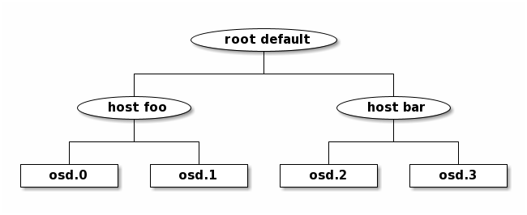

# 管理 CRUSH Map

官方文档：https://ceph.readthedocs.io/en/latest/rados/operations/crush-map/

CRUSH 算法通过计算数据存储位置来确定如何存储和检索数据。CRUSH使Ceph客户端能够直接与OSD通信，而不是通过 Monitor 进行通信。

通过算法确定的存储和检索数据的方法，Ceph避免了单点故障，性能瓶颈以及对其可扩展性的物理限制。

CRUSH需要群集的映射，并使用CRUSH映射伪随机地存储和检索OSD中的数据，并使数据在整个群集中均匀分布。

CRUSH 论文：https://ceph.com/wp-content/uploads/2016/08/weil-crush-sc06.pdf


CRUSH Map 包含 OSD 列表、物理设备列表、及规则列表。通过对底层物理设备的组织，Crush 可以对潜在故障进行建模，典型的组织方式包括物理距离、共享的电源和共享的网络等。通过将此信息编码到群集映射中，CRUSH放置策略可以将对象副本复制到不同的故障域中。例如，为了解决并发故障的可能性，可能需要确保数据副本位于使用不同的机架，电源，控制器和/或物理位置的设备上。

部署OSD时，它们会自动放置在CRUSH映射中的主机节点下，该主机节点以其运行的主机的主机名命名。这与默认的CRUSH故障域结合在一起，可确保副本或纠删码在主机之间是分开的，并且单个主机故障不会影响可用性。但是，对于较大的群集，管理员应仔细考虑他们对故障域的选择。例如，在中大型集群中，跨机架分隔副本很常见。


## Crush 位置

OSD在CRUSH Map层次结构方面的位置称为“crush location”。该位置说明符采用描述位置的键和值对列表的形式。例如，如果一个OSD位于特定的行，机架，机箱和主机中，并且是“默认” CRUSH树的一部分（绝大多数集群就是这种情况），则其损坏位置可以描述为：

```
root=default row=a rack=a2 chassis=a2a host=a2a1
```

- key：key需要为有效的 CRUSH 类型，默认情况下，有  root, datacenter, room, row, pod, pdu, rack, chassis and host, 但是可以通过修改CRUSH Map将这些类型自定义为任何合适的类型。
- 并非所有 key 都需要指定，默认情况下，ceph 会自动将 OSD 守护进程的位置设置为 root=default host=HOSTNAME

OSD 的 CRUSH 位置在配置中用 `crush location` 表示，每次 OSD 启动时，它都会验证它自己是否处于正确的位置，如果没有，它会自行移动。要禁用自动 CRUSH Map 管理，请在配置文件的 [osd] 部分写入如下配置：

```bash
$ osd crush update on start = false
```


## crush location hook 

`crush location hook ` 可用于在启动时生成更完整的位置。 位置是根据以下优先顺序：

- ceph.conf中的某个 `crush location` 选项。
- 缺省值 root = default host = HOSTNAME，其中主机名是使用hostname -s命令生成的。

它本身没有用，因为OSD本身具有完全相同的行为。 但是，可以编写脚本来提供其他位置字段（例如机架或数据中心），然后通过config选项启用挂钩：

```
crush location hook = /path/to/customized-ceph-crush-location
```

`customized-ceph-crush-location` 是一个脚本，在其他时，如果使用以下参数：

```
--cluster CLUSTER --id ID --type TYPE
```

其中群集名称通常为“ ceph”，id为守护程序标识符（例如OSD号或守护程序标识符），守护程序类型为osd，mds或类似名称。

例如，根据假想文件 /etc/rack 额外指定机架位置的简单挂钩可能是：

```bash
#!/bin/sh
echo "host=$(hostname -s) rack=$(cat /etc/rack) root=default"
```


## CRUSH 结构

CRUSH Map 由描述群集物理拓扑的层次结构和一组规则定义，这些规则定义了有关如何在这些设备上放置数据的策略。 层次结构在叶子上具有设备（ceph-osd守护程序），以及与其他物理功能或分组相对应的内部节点：主机，机架，行，数据中心等。 规则描述了如何按照该层次结构放置副本（例如“不同机架中的三个副本”）。


#### 设备

设备是可以存储数据的单个ceph-osd守护程序。 通常，将为集群中的每个OSD守护程序定义一个。 设备由ID（非负整数）和名称（通常为osd.N）标识，其中N是设备ID。

设备还可能具有与之关联的设备类（例如hdd或ssd），从而使 CRUSH 规则可以方便地将它们作为目标。


#### TYPES 和 BUCKETS

bucket 是层次结构中内部节点（主机，机架，行等）的CRUSH术语。CRUSH映射定义了一系列用于描述这些节点的类型。 默认情况下，这些类型包括：

- osd (or device)
- host
- chassis
- rack
- row
- pdu
- pod
- room
- datacenter
- zone
- region
- root

大多数群集仅使用其中少数几个类型，可以根据需要定义其他类型。

该层次结构是在叶子处使用设备（通常为osd类型），具有非设备类型的内部节点以及根类型为root的根节点构建的。 例如，



层次结构中的每个节点（设备或存储桶）都具有与之关联的权重，指示设备或层次结构子树应存储的总数据中的相对比例。 权重设置在叶子上，指示设备的大小，并从那里自动对树进行求和，这样默认节点的权重将是它下面包含的所有设备的总和。 通常，权重以TB为单位。

您可以使用以下方法简单查看群集的CRUSH层次结构，包括权重：

```bash
$ ceph osd crush tree
```


## 规则

规则定义了有关如何在层次结构中的设备之间分配数据的策略。

CRUSH规则定义了放置和复制策略或分发策略，可确切指定CRUSH如何放置对象副本。 例如，您可能创建一条规则，该规则选择一对目标以进行2路镜像，另一条规则在两个不同的数据中心中选择三个目标以进行3路镜像，再创建一条规则以擦除六个存储设备上的编码。 

在几乎所有情况下，都可以通过CLI来指定CRUSH规则，方法是指定规则所用的池类型（复制或擦除编码），故障域以及设备类（可选）。 在极少数情况下，必须通过手动编辑CRUSH映射来手工编写规则。

查看规则列表：

```bash
$ ceph osd crush rule ls
```

查看规则内容：

```bash
$ ceph osd crush rule dump
```


## 设备类型

每个设备可以选择具有与之关联的类。默认情况下，OSD在启动时会根据其支持的设备类型自动将其类设置为hdd，ssd或nvme。

可以使用以下命令显式设置一个或多个OSD的设备类型：

```bash
$ ceph osd crush set-device-class <class> <osd-name> [...]
```

设置设备类别后，除非使用以下方法取消设置旧类别，否则无法将其更改为另一个类别：

```bash
$ ceph osd crush rm-device-class <osd-name> [...]
```

这使管理员可以设置设备类，而无需在OSD重新启动时或通过其他脚本更改类。 可以使用以下方式创建针对特定设备类别的放置规则：

```bash
$ ceph osd crush rule create-replicated <rule-name> <root> <failure-domain> <class>
```

然后可以将池更改为在以下情况下使用新规则：

```bash
$ ceph osd pool set <pool-name> crush_rule <rule-name>
```

通过为使用中的每个仅包含该类设备的设备类创建“影子” CRUSH层次结构来实现设备类。 然后，规则可以在影子层次结构上分布数据。 这种方法的优点是它与旧的Ceph客户端完全向后兼容。 您可以使用以下阴影项目查看CRUSH层次结构：

```bash
$ ceph osd crush tree --show-shadow
```


## 权重

权重集是计算数据放置时要使用的另一组权重。与CRUSH映射中的每个设备关联的正常权重是根据设备大小设置的，并指示我们应该在哪里存储多少数据。但是，由于CRUSH基于伪随机放置过程，因此与理想分布总是存在一些差异，就像掷骰子60次不会导致准确掷出10个1和10个6一样。权重集使群集可以根据群集的详细信息（层次结构，池等）进行数值优化，以实现平衡的分布。

尽管可以手动设置和操作砝码组，但建议启用平衡器模块以自动进行设置。


# 修改 CRUSH Map

## 添加 OSD

在一个运行中的集群中，添加 OSD 到 CRUSH Map：

```bash
$ ceph osd crush set {name} {weight} root={root} [{bucket-type}={bucket-name} ...]
```

name 是 osd 的名字，weight 表示权重，root 指定根节点，默认是 default，bucket-type 桶类型，上边有说明，比如机架、主机等。

例如：

```bash
$ ceph osd crush set osd.0 1.0 root=default datacenter=dc1 room=room1 row=foo rack=bar host=foo-bar-1
```


## 修改 OSD 的权重

```bash
$ ceph osd crush reweight {name} {weight}
```


## 删除 OSD

```bash
$ ceph osd crush remove {name}
```


## 添加一个桶

```bash
$ ceph osd crush add-bucket {bucket-name} {bucket-type}
```

例如：

```bash
$ ceph osd crush add-bucket rack12 rack
```


## 删除桶

```bash
$ ceph osd crush remove {bucket-name}
```


